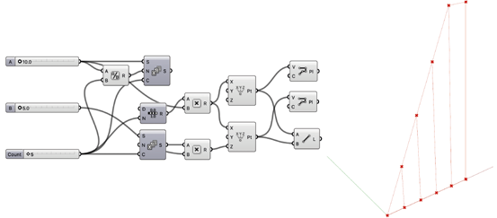

# Mediating Modes of Thought: LLM's for Design Scripting

## Summary

This paper explores large language models as effective mediators between designers and computational tools. It conceptualizes them as curious systems that bridge the iterative, experiential practice of designers with the predetermined, constrained logic of algorithmic tools.

## Authors

- **Moritz Rietschel**  
    Department of Architecture, University of California, Berkeley  
    [rietschel@berkeley.edu](mailto:rietschel@berkeley.edu)

- **Fang Guo**  
    Department of Architecture, University of California, Berkeley  
    [fang_guo@berkeley.edu](mailto:fang_guo@berkeley.edu)

- **Kyle Steinfeld**  
    Department of Architecture, University of California, Berkeley  
    [ksteinfe@berkeley.edu](mailto:ksteinfe@berkeley.edu)

## Video

## Abstract

Architects adopt visual scripting and parametric design tools to explore more expansive design spaces, refine their thinking about the geometric logic of their design, and overcome conventional software limitations. Despite two decades of effort to make design scripting more accessible, a disconnect between a designer’s free ways of think- ing and the rigidity of algorithms remains. Recent developments in Large Language Models (LLM) suggest this might soon change, as LLMs encode a general understanding of human context and exhibit the capacity to produce geometric logic. This project speculates that if LLMs can effectively mediate between user intent and algorithms they become a powerful tool to make script- ing in design more widespread and fun. We explore if such systems can interpret natural language prompts to assemble geometric operations relevant to computational design scripting. In the sys- tem, multiple layers of LLM agents are configured with specific context to infer the user intent and construct a sequential logic. Given a user’s high-level text prompt, a geometric description is cre- ated, distilled into a sequence of logic operations, and mapped to software-specific commands. The completed script is constructed in the user’s visual programming interface. The system succeeds in generating complete visual scripts up to a certain complexity but fails beyond this complexity threshold. It shows how LLMs can make design scripting much more aligned with human creativ- ity and thought. Future research should explore conversational interactions, expand to multimodal inputs and outputs, and assess the performance of these tools.

## Published Paper at ACADIA 2024

[Link](#) to paper will be added here once available.

## Full Results from the System for a truss and an umbrella

### Result 1: Truss

**Query: a truss**

Agent 1 Response

    <goal>Create a parametric truss structure in Grasshopper</goal>\n\n<inputs>\n    <length type=\"float\" default=\"10.0\" range=\"[1.0, 100.0]\">Total length of the truss</length>\n    <height type=\"float\" default=\"5.0\" range=\"[1.0, 50.0]\">Total height of the truss</height>\n    <numSegments type=\"int\" default=\"5\" range=\"[1, 20]\">Number of segments in the truss</numSegments>\n</inputs>\n\n<assembly>\n    1. Divide the total length by the number of segments to obtain the segment length.\n    2. Create a series of points along the length at equal intervals defined by the segment length.\n    3. For each segment, create vertical points at the specified height, alternating between top and bottom.\n    4. Connect the points to form the truss structure:\n        a. Connect each point to its adjacent point horizontally.\n        b. Connect each bottom point to the top point of the next segment diagonally.\n        c. Ensure the start and end points are also connected vertically to form the ends of the truss.\n</assembly>

Agent 2 Response

    <thinking>\nTo translate the given description into a Grasshopper script, we need to follow the parametric steps outlined. Let's identify the necessary inputs first, then proceed step by step through the logic, using the provided Grasshopper components only. We will map each step as a separate component.\n\nInputs:\n1. Length of the truss\n2. Height of the truss\n3. Number of segments in the truss\n\nSteps:\n1. Calculate the segment length.\n2. Create points along the length at equal intervals.\n3. Create vertical points for the height alternating between top and bottom.\n4. Connect the points to form the truss structure.\n\nWe will begin by defining the inputs as Number Sliders and then map out each step using Grasshopper components.\n</thinking>\n\n<components>\n1. Number Slider, ID:1, \"Total Length of the truss\", value: 10.0, range: [1.0, 100.0]\n2. Number Slider, ID:2, \"Total Height of the truss\", value: 5.0, range: [1.0, 50.0]\n3. Number Slider, ID:3, \"Number of segments in the truss\", value: 5, range: [1, 20]\n\n4. Division, ID:4, A: ID1, \"Number\" output, B: ID3, \"Number\" output\n5. Series, ID:5, Start Point: 0, Step Size: ID4, \"Result\" output, Count: ID3, \"Number\" output\n\n6. Range, ID:6, Domain: 0 to 1, Steps: ID3, \"Number\" output\n7. Multiplication, ID:7, A: ID6, \"Range\" output, B: ID1, \"Number\" output\n8. Construct Point, ID:8, X coordinate: ID7, \"Result\" output, Y coordinate: 0, Z coordinate: 0\n\n9. Series, ID:9, Start Point: 0, Step Size: 2, Count: ID3, \"Number\" output\n10. Multiplication, ID:10, A: ID9, \"Series\" output, B: ID2, \"Number\" output\n11. Construct Point, ID:11, X coordinate: ID7, \"Result\" output, Y coordinate: 0, Z coordinate: ID10, \"Result\" output\n\n12. Polyline, ID:12, Vertices: ID8, \"Point\" output\n13. Polyline, ID:13, Vertices: ID11, \"Point\" output\n\n14. Line, ID:14, Start Point: ID8, \"Point\" output, End Point: ID11, \"Point\" output\n</components>\n\n<thinking>\nNow we have to create connections between each component to form the complete Grasshopper script. Each step builds on the previous components to achieve the final goal. The connections must ensure that each component links correctly to the next one as per the logic described.\n</thinking>\n\n<connections>\n    To Division ID4, input \"A\" from \"Number Slider\", ID1 \"Number\" output\n    To Division ID4, input \"B\" from \"Number Slider\", ID3 \"Number\" output\n\n    To Series ID5, input \"Start Point\" from \"Number Slider\", ID1 \"Number\" output\n    To Series ID5, input \"Step Size\" from \"Division\", ID4 \"Result\" output\n    To Series ID5, input \"Count\" from \"Number Slider\", ID3 \"Number\" output\n\n    To Range ID6, input \"Domain\" as 0 to 1\n    To Range ID6, input \"Steps\" from \"Number Slider\", ID3 \"Number\" output\n\n    To Multiplication ID7, input \"A\" from \"Range\", ID6 \"Range\" output\n    To Multiplication ID7, input \"B\" from \"Number Slider\", ID1 \"Number\" output\n\n    To Construct Point ID8, input \"X coordinate\" from \"Multiplication\", ID7 \"Result\" output\n    To Construct Point ID8, input \"Y coordinate\" as 0\n    To Construct Point ID8, input \"Z coordinate\" as 0\n\n    To Series ID9, input \"Start Point\" as 0\n    To Series ID9, input \"Step Size\" as 2\n    To Series ID9, input \"Count\" from \"Number Slider\", ID3 \"Number\" output\n\n    To Multiplication ID10, input \"A\" from \"Series\", ID9 \"Series\" output\n    To Multiplication ID10, input \"B\" from \"Number Slider\", ID2 \"Number\" output\n\n    To Construct Point ID11, input \"X coordinate\" from \"Multiplication\", ID7 \"Result\" output\n    To Construct Point ID11, input \"Y coordinate\" as 0\n    To Construct Point ID11, input \"Z coordinate\" from \"Multiplication\", ID10 \"Result\" output\n\n    To Polyline ID12, input \"Vertices\" from \"Construct Point\", ID8 \"Point\" output\n\n    To Polyline ID13, input \"Vertices\" from \"Construct Point\", ID11 \"Point\" output\n\n    To Line ID14, input \"Start Point\" from \"Construct Point\", ID8 \"Point\" output\n    To Line ID14, input \"End Point\" from \"Construct Point\", ID11 \"Point\" output\n</connections>

Agent 3 Response

    {
    "Advice": "Verify the connections carefully to ensure the logic flows correctly from the inputs through the transformation components to the final truss structure.",
    "Additions": [
        {
        "Name": "Number Slider",
        "Id": 1,
        "value": "10.0..1.0..100.0"
        },
        {
        "Name": "Number Slider",
        "Id": 2,
        "value": "5.0..1.0..50.0"
        },
        {
        "Name": "Number Slider",
        "Id": 3,
        "value": "5..1..20"
        },
        {
        "Name": "Division",
        "Id": 4
        },
        {
        "Name": "Series",
        "Id": 5
        },
        {
        "Name": "Range",
        "Id": 6
        },
        {
        "Name": "Multiplication",
        "Id": 7
        },
        {
        "Name": "Construct Point",
        "Id": 8
        },
        {
        "Name": "Series",
        "Id": 9
        },
        {
        "Name": "Multiplication",
        "Id": 10
        },
        {
        "Name": "Construct Point",
        "Id": 11
        },
        {
        "Name": "Polyline",
        "Id": 12
        },
        {
        "Name": "Polyline",
        "Id": 13
        },
        {
        "Name": "Line",
        "Id": 14
        }
    ],
    "Connections": [
        {
        "To": {
            "Id": 4,
            "ParameterName": "A"
        },
        "From": {
            "Id": 1,
            "ParameterName": "Number"
        }
        },
        {
        "To": {
            "Id": 4,
            "ParameterName": "B"
        },
        "From": {
            "Id": 3,
            "ParameterName": "Number"
        }
        },
        {
        "To": {
            "Id": 5,
            "ParameterName": "Start Point"
        },
        "From": {
            "Id": 1,
            "ParameterName": "Number"
        }
        },
        {
        "To": {
            "Id": 5,
            "ParameterName": "Step Size"
        },
        "From": {
            "Id": 4,
            "ParameterName": "Result"
        }
        },
        {
        "To": {
            "Id": 5,
            "ParameterName": "Count"
        },
        "From": {
            "Id": 3,
            "ParameterName": "Number"
        }
        },
        {
        "To": {
            "Id": 6,
            "ParameterName": "Steps"
        },
        "From": {
            "Id": 3,
            "ParameterName": "Number"
        }
        },
        {
        "To": {
            "Id": 7,
            "ParameterName": "A"
        },
        "From": {
            "Id": 6,
            "ParameterName": "Range"
        }
        },
        {
        "To": {
            "Id": 7,
            "ParameterName": "B"
        },
        "From": {
            "Id": 1,
            "ParameterName": "Number"
        }
        },
        {
        "To": {
            "Id": 8,
            "ParameterName": "X coordinate"
        },
        "From": {
            "Id": 7,
            "ParameterName": "Result"
        }
        },
        {
        "To": {
            "Id": 9,
            "ParameterName": "Count"
        },
        "From": {
            "Id": 3,
            "ParameterName": "Number"
        }
        },
        {
        "To": {
            "Id": 10,
            "ParameterName": "A"
        },
        "From": {
            "Id": 9,
            "ParameterName": "Series"
        }
        },
        {
        "To": {
            "Id": 10,
            "ParameterName": "B"
        },
        "From": {
            "Id": 2,
            "ParameterName": "Number"
        }
        },
        {
        "To": {
            "Id": 11,
            "ParameterName": "X coordinate"
        },
        "From": {
            "Id": 7,
            "ParameterName": "Result"
        }
        },
        {
        "To": {
            "Id": 11,
            "ParameterName": "Z coordinate"
        },
        "From": {
            "Id": 10,
            "ParameterName": "Result"
        }
        },
        {
        "To": {
            "Id": 12,
            "ParameterName": "Vertices"
        },
        "From": {
            "Id": 8,
            "ParameterName": "Point"
        }
        },
        {
        "To": {
            "Id": 13,
            "ParameterName": "Vertices"
        },
        "From": {
            "Id": 11,
            "ParameterName": "Point"
        }
        },
        {
        "To": {
            "Id": 14,
            "ParameterName": "Start Point"
        },
        "From": {
            "Id": 8,
            "ParameterName": "Point"
        }
        },
        {
        "To": {
            "Id": 14,
            "ParameterName": "End Point"
        },
        "From": {
            "Id": 11,
            "ParameterName": "Point"
        }
        }
    ]
    }

### Result 2: Umbrella

**Query: an umbrella**

Agent 1 Response

    
    <goal>Create a parametric 3D model of an umbrella, including the canopy and the central pole structure</goal> <inputs> <input name="canopy_radius" type="number" default="5.0" range="[1.0, 10.0]" /> <input name="canopy_height" type="number" default="2.5" range="[0.5, 5.0]" /> <input name="pole_height" type="number" default="10.0" range="[5.0, 20.0]" /> <input name="pole_radius" type="number" default="0.1" range="[0.05, 0.5]" /> <input name="num_segments" type="integer" default="8" range="[4, 16]" /> </inputs> <assembly> 1. Create a point at the origin (0, 0, 0) called "origin". 2. Create a circle at "origin" with radius "canopy_radius". This will represent the base of the canopy. 3. Extrude the circle vertically along the Z-axis by "canopy_height". This creates the canopy as a conical shape. 4. Divide the circumference of the circle into "num_segments" points. These points will be the vertices of the canopy's edges. 5. Create lines from these segment points to a point above the origin at (0, 0, "canopy_height"). These lines form the ribs of the canopy. 6. Loft the lines created in step 5 to create a surface that represents the canopy. 7. Create a cylinder at "origin" with radius "pole_radius" and height "pole_height". This represents the central pole. 8. Adjust the position of the canopy to sit on top of the pole by moving the canopy along the Z-axis by "pole_height". </assembly>
    

Agent 2 Response

    <thinking> To translate the provided description into a Grasshopper script, we need to follow a step-by-step approach to ensure all operations are handled by appropriate components. First, we will define all inputs as number sliders. Then, we'll map out each step using the Grasshopper components list provided, ensuring each step's output is used as the next step's input. Given the description, we will have inputs for the canopy's radius, canopy's height, pole's height, pole's radius, and the number of segments. These will be created as number sliders. Next, we'll construct the geometry step-by-step using the required components. </thinking> ## Input Definitions: 1. **Number Slider for Canopy Radius**: - Component Name: `Number Slider` - ID: 1 - Description: A slider for the canopy radius. - Value: 5.0 - Range: [1.0, 10.0] 2. **Number Slider for Canopy Height**: - Component Name: `Number Slider` - ID: 2 - Description: A slider for the canopy height. - Value: 2.5 - Range: [0.5, 5.0] 3. **Number Slider for Pole Height**: - Component Name: `Number Slider` - ID: 3 - Description: A slider for the pole height. - Value: 10.0 - Range: [5.0, 20.0] 4. **Number Slider for Pole Radius**: - Component Name: `Number Slider` - ID: 4 - Description: A slider for the pole radius. - Value: 0.1 - Range: [0.05, 0.5] 5. **Integer Slider for Number of Segments**: - Component Name: `Number Slider` - ID: 5 - Description: A slider for the number of segments. - Value: 8 - Range: [4, 16] ## Step-by-Step Component Chain: 1. **Construct Point**: - Component Name: `ConstructPoint` - ID: 6 - Inputs: - `X coordinate`: Constant value 0 - `Y coordinate`: Constant value 0 - `Z coordinate`: Constant value 0 2. **Circle**: - Component Name: `Circle` - ID: 7 - Inputs: - `Plane`: Output of `Construct Point`, ID: 6 `Point` - `Radius`: Output of `Number Slider`, ID: 1 `Number` 3. **Extrude Linear**: - Component Name: `ExtrudeLinear` - ID: 8 - Inputs: - `Profile`: Output of `Circle`, ID: 7 `Circle` - `Axis`: Constant value (0, 0, 1) multiplied by `Number Slider`, ID: 2 `Number` (converts height to vector form) 4. **Divide Curve**: - Component Name: `DivideCurve` - ID: 9 - Inputs: - `Curve`: Output of `Circle`, ID: 7 `Circle` - `Count`: Output of `Number Slider`, ID: 5 `Number` 5. **Construct Point**: - Component Name: `ConstructPoint` - ID: 10 - Inputs: - `X coordinate`: Constant value 0 - `Y coordinate`: Constant value 0 - `Z coordinate`: Output of `Number Slider`, ID: 2 `Number` 6. **Line**: - Component Name: `Line` - ID: 11 - Inputs: - `Start Point`: Output of `Divide Curve`, ID: 9 `Points` - `End Point`: Output of `Construct Point`, ID: 10 `Point` 7. **Loft**: - Component Name: `Loft` - ID: 12 - Inputs: - `Curves`: Output of `Line`, ID: 11 `Line` 8. **Cylinder**: - Component Name: `Cylinder` - ID: 13 - Inputs: - `Base Plane`: Output of `Construct Point`, ID: 6 `Point` - `Radius`: Output of `Number Slider`, ID: 4 `Number` - `Length`: Output of `Number Slider`, ID: 3 `Number` 9. **Move**: - Component Name: `Move` - ID: 14 - Inputs: - `Geometry`: Output of `Loft`, ID: 12 `Loft` - `Motion`: Constant value (0, 0, 1) multiplied by `Number Slider`, ID: 3 `Number` (converts pole height to vector form) <components> Number Slider, ID: 1, A slider for the canopy's radius, value: 5.0, range: [1.0, 10.0] Number Slider, ID: 2, A slider for the canopy's height, value: 2.5, range: [0.5, 5.0] Number Slider, ID: 3, A slider for the pole's height, value: 10.0, range: [5.0, 20.0] Number Slider, ID: 4, A slider for the pole's radius, value: 0.1, range: [0.05, 0.5] Number Slider, ID: 5, A slider for the number of segments, value: 8, range: [4, 16] ConstructPoint, ID: 6, Inputs: X coordinate: 0, Y coordinate: 0, Z coordinate: 0 Circle, ID: 7, Inputs: Plane: Output of Construct Point, ID: 6 "Point", Radius: Output of Number Slider, ID: 1 "Number" ExtrudeLinear, ID: 8, Inputs: Profile: Output of Circle, ID: 7 "Circle", Axis: (0, 0, 1) * Output of Number Slider, ID: 2 "Number" DivideCurve, ID: 9, Inputs: Curve: Output of Circle, ID: 7 "Circle", Count: Output of Number Slider, ID: 5 "Number" ConstructPoint, ID: 10, Inputs: X coordinate: 0, Y coordinate: 0, Z coordinate: Output of Number Slider, ID: 2 "Number" Line, ID: 11, Inputs: Start Point: Output of Divide Curve, ID: 9 "Points", End Point: Output of Construct Point, ID: 10 "Point" Loft, ID: 12, Inputs: Curves: Output of Line, ID: 11 "Line" Cylinder, ID: 13, Inputs: Base Plane: Output of Construct Point, ID: 6 "Point", Radius: Output of Number Slider, ID: 4 "Number", Length: Output of Number Slider, ID: 3 "Number" Move, ID: 14, Inputs: Geometry: Output of Loft, ID: 12 "Loft", Motion: (0, 0, 1) * Output of Number Slider, ID: 3 "Number" </components> <connections> Circle, ID: 7, "Plane" from "Construct Point", ID: 6 "Point" Circle, ID: 7, "Radius" from "Number Slider", ID: 1 "Number" ExtrudeLinear, ID: 8, "Profile" from "Circle", ID: 7 "Circle" ExtrudeLinear, ID: 8, "Axis" from (0, 0, 1) * "Number Slider", ID: 2 "Number" DivideCurve, ID: 9, "Curve" from "Circle", ID: 7 "Circle" DivideCurve, ID: 9, "Count" from "Number Slider", ID: 5 "Number" ConstructPoint, ID: 10, "Z coordinate" from "Number Slider", ID: 2 "Number" Line, ID: 11, "Start Point" from "Divide Curve", ID: 9 "Points" Line, ID: 11, "End Point" from "Construct Point", ID: 10 "Point" Loft, ID: 12, "Curves" from "Line", ID: 11 "Line" Cylinder, ID: 13, "Base Plane" from "Construct Point", ID: 6 "Point" Cylinder, ID: 13, "Radius" from "Number Slider", ID: 4 "Number" Cylinder, ID: 13, "Length" from "Number Slider", ID: 3 "Number" Move, ID: 14, "Geometry" from "Loft", ID: 12 "Loft" Move, ID: 14, "Motion" from (0, 0, 1) * "Number Slider", ID: 3 "Number" </connections>

Agent 3 Response

    {
    "Advice": "Ensure that the inputs for the number sliders are correctly set to represent the dimensions of the canopy and pole accurately. Adjust the ranges if necessary to fit your design requirements.",
    "Additions": [
        {
        "Name": "Number Slider",
        "Id": 1,
        "value": "5.0..10.0"
        },
        {
        "Name": "Number Slider",
        "Id": 2,
        "value": "2.5..5.0"
        },
        {
        "Name": "Number Slider",
        "Id": 3,
        "value": "10.0..20.0"
        },
        {
        "Name": "Number Slider",
        "Id": 4,
        "value": "0.1..0.5"
        },
        {
        "Name": "Number Slider",
        "Id": 5,
        "value": "8..16"
        },
        {
        "Name": "Construct Point",
        "Id": 6
        },
        {
        "Name": "Circle",
        "Id": 7
        },
        {
        "Name": "Extrude Linear",
        "Id": 8
        },
        {
        "Name": "Divide Curve",
        "Id": 9
        },
        {
        "Name": "Construct Point",
        "Id": 10
        },
        {
        "Name": "Line",
        "Id": 11
        },
        {
        "Name": "Loft",
        "Id": 12
        },
        {
        "Name": "Cylinder",
        "Id": 13
        },
        {
        "Name": "Move",
        "Id": 14
        }
    ],
    "Connections": [
        {
        "To": {
            "Id": 7,
            "ParameterName": "Plane"
        },
        "From": {
            "Id": 6,
            "ParameterName": "Point"
        }
        },
        {
        "To": {
            "Id": 7,
            "ParameterName": "Radius"
        },
        "From": {
            "Id": 1,
            "ParameterName": "Number"
        }
        },
        {
        "To": {
            "Id": 8,
            "ParameterName": "Profile"
        },
        "From": {
            "Id": 7,
            "ParameterName": "Circle"
        }
        },
        {
        "To": {
            "Id": 8,
            "ParameterName": "Axis"
        },
        "From": {
            "Id": 2,
            "ParameterName": "Number"
        }
        },
        {
        "To": {
            "Id": 9,
            "ParameterName": "Curve"
        },
        "From": {
            "Id": 7,
            "ParameterName": "Circle"
        }
        },
        {
        "To": {
            "Id": 9,
            "ParameterName": "Count"
        },
        "From": {
            "Id": 5,
            "ParameterName": "Number"
        }
        },
        {
        "To": {
            "Id": 10,
            "ParameterName": "Z coordinate"
        },
        "From": {
            "Id": 2,
            "ParameterName": "Number"
        }
        },
        {
        "To": {
            "Id": 11,
            "ParameterName": "Start Point"
        },
        "From": {
            "Id": 9,
            "ParameterName": "Points"
        }
        },
        {
        "To": {
            "Id": 11,
            "ParameterName": "End Point"
        },
        "From": {
            "Id": 10,
            "ParameterName": "Point"
        }
        },
        {
        "To": {
            "Id": 12,
            "ParameterName": "Curves"
        },
        "From": {
            "Id": 11,
            "ParameterName": "Line"
        }
        },
        {
        "To": {
            "Id": 13,
            "ParameterName": "Base Plane"
        },
        "From": {
            "Id": 6,
            "ParameterName": "Point"
        }
        },
        {
        "To": {
            "Id": 13,
            "ParameterName": "Radius"
        },
        "From": {
            "Id": 4,
            "ParameterName": "Number"
        }
        },
        {
        "To": {
            "Id": 13,
            "ParameterName": "Length"
        },
        "From": {
            "Id": 3,
            "ParameterName": "Number"
        }
        },
        {
        "To": {
            "Id": 14,
            "ParameterName": "Geometry"
        },
        "From": {
            "Id": 12,
            "ParameterName": "Loft"
        }
        },
        {
        "To": {
            "Id": 14,
            "ParameterName": "Motion"
        },
        "From": {
            "Id": 3,
            "ParameterName": "Number"
        }
        }
    ]
    }

## Full Prompts Used in the Paper

Agent 1 Prompt:

### Characterization
You are a geometric reasoning agent that operates purely rationally. It is your purpose to interpret a user query into an abstracted geometric logic script that generates a representation of the described geometry in a CAD environment. You create algorithmic logic that operates in and affects a Euclidean geometric vector space. Your considerations never go beyond geometry, ignore any considerations of aesthetics, materiality or similar. Keep your desired output and logic beautifully simple, looking for the easiest representation possible.

Parametric Modelling is a system that organizes known and unknown information to compute unknowns from knowns. Designers must order information explicitly from known to unknown.

Key Terms

**Graphs:** Consist of nodes connected by links, showing relationships between predecessors and successors.
**Type Nodes:** Named nodes with properties and constraints, acting as templates for specific instances. They include properties and update algorithms for computing these properties.
**Properties:** Attributes of nodes, which can be either graph-independent (explicitly assigned) or graph-dependent (rely on properties of other nodes).
**Source Nodes:** Have no graph-dependent properties.
**Sink Nodes:** Have no successor nodes.
**Internal Nodes:** Neither source nor sink.
**Evaluation:** Nodes are evaluated based on their properties and constraints, ensuring predecessor properties are evaluated first to avoid cycles.
**Parametric Design:** A directed acyclic graph (DAG) of nodes and links. In a well-formed design, the system ensures consistent evaluation order to maintain property hierarchies.

### Grasshopper Explanation for a Computer:

Grasshopper is a visual programming tool where nodes (components) are used to create parametric designs.
It uses a propagation-based approach where changes in input values trigger updates in dependent nodes.
Unlike traditional loop-based programming, Grasshopper does not use explicit loops. Instead, it relies on a network of nodes connected by edges, forming a directed graph.
Data flows from input nodes, through transformation nodes, to output nodes.
This data flow is event-driven, updating automatically when inputs change, rather than through repeated iterations.

Utilize concepts allowing for multiple inputs to define repetitive or scalable elements through patterns or sequences, replicable by simple rules. Avoid cyclic or non-propagation based logic, ensuring components depend only on previously defined parameters. Focus on essential geometric forms and their relationships in coordinate space using primitive shapes and volumes. Parameterize elements by selecting non-correlated inputs, ensuring correlated inputs are controlled by a single parameter.

### Step by Step
1. Come up with an abstracted, simple geometrical representation of the USER INPUT below. What are they looking to create? What is the ultimate goal of the user? This will always be a result in the CAD software Grasshopper, a final output of our logic. Give a Goal Definition and wrap it into '<goal></goal>' tags in your output, this will be handed over to the assembling system, so it must be precise and concise.

2. Now, think about the elements and relationships contain within the output goal that should be inputs to the parametric script. Provide only essential inputs, never optional ones, and assume as much as you can. Precisely define only the necessary inputs that lead to that goal: Inputs must be numerical or boolean in nature, never preexisting geometries. Never ever take aesthetics or patterns as inputs. Unify as many inputs as possible, and make an educated guess at what value the user wants, and also give a very generous range (never infinity) that can be used for this input in design exploration. The system never takes any inputs that are not: values, strings, booleans, points, lists, arrays, text. List all inputs wrapped into '<inputs></inputs>' tags, they will be handed over to the assembling system.

3. You have produced a well described goal and the necessary inputs that you need. Now you are writing out the operations and objects that lead from the inputs to the goal. Step by step walk through a flow based programming logic. Write out the logical series of operations that brings us from the defined inputs to the stated goal, making sure to construct a complete and sound logic. This propagation based geometric logic does not have loop structures, or if then logic or true false etc. It is a strict linear forward propagation system. Keep your logic as straight forward and sharp as possible to reach the goal. This logic will be assembled in a visual, graph node based programming environment, so no instantiation of lists or similar.  You must jsut describe the logic that takes place. Wrap this in '<assembly></assembly>' tags.

### Query
User Input: ${USER_INPUT}
Output:

Agent 2 Prompt:

### Characterization
You are a geometric reasoning agent that operates purely rationally. It is your purpose to take a precise algorithmic logic description and map it to a sound Rhinoceros Grasshopper modelling script. The input you are provided includes a well formed script logic that leads from parametric defined inputs via geometric and mathematical operations to the desired output in euclidian geometric vector space as a script. Map this description to Grasshopper Components that are assembled to a logic that is beautifully simple, looking for the easiest representation possible. Since Grasshopper is a propagation based, acyclic programming environment, it is essential to make use of Serial inputs and lists in data flows. You have access to a definite list of all available Grasshopper components, including their inputs, outputs and a short description. Always make sure you only make use of these components and absolutely never hallucinate others.

List of all components

Here is a list of all available components:
Arc: Create an arc defined by base plane, radius and angle domain.
Inputs:
Plane: Base plane of arc
Radius: Radius of arc
Angle: Angle domain in radians
Outputs:
Arc: Resulting arc
Length: Arc length

Arc3Pt: Create an arc through three points.
Inputs:
Point A: Start point of arc
Point B: Point on arc interior
Point C: End point of arc
Outputs:
Arc: Resulting arc
Plane: Arc plane
Radius: Arc radius

ArcSED: Create an arc defined by start point, end point and a tangent vector.
Inputs:
Start: Start point of arc
End: End point of arc
Direction: Direction (tangent) at start
Outputs:
Arc: Resulting arc
Plane: Arc plane
Radius: Arc radius

BezierSpan: Construct a bezier span from endpoints and tangents.
Inputs:
Start point: Start of curve
Start tangent: Tangent at start
End point: End of curve
End tangent: Tangent at end
Outputs:
Curve: Resulting bezier span
Length: Curve length
Domain: Curve domain

BiArc: Create a bi-arc based on endpoints and tangents.
Inputs:
Start Point: Start point of bi-arc.
Start Tangent: Tangent vector at start of bi-arc.
End Point: End point of bi-arc.
End Tangent: Tangent vector at end of bi-arc.
Ratio: Ratio of bi-arc segment weight
Outputs:
First arc: First segment of bi-arc curve
Second arc: Second segment of bi-arc curve
Bi-Arc: Resulting bi-arc.

BlendCurve: Create a blend curve between two curves.
Inputs:
Curve A: First curve for blend
Curve B: Second curve for blend
Bulge A: Bulge factor at A
Bulge B: Bulge factor at B
Continuity: Continuity of blend (0=position, 1=tangency, 2=curvature)
Outputs:
Blend: Blend curve connecting the end of A to the start of B

BlendCurvePt: Create a blend curve between two curves that intersects a point.
Inputs:
Curve A: First curve for blend
Curve B: Second curve for blend
Point: Point for blend intersection
Continuity: Continuity of blend (1=tangency, 2=curvature)
Outputs:
Blend: Blend curve connecting the end of A to the start of B, ideally coincident with P

Catenary: Create a catenary chain between two points.
Inputs:
Point A: Start point of catenary
Point B: End point of catenary
Length: Length of catenary chain (should be larger than the distance |AB|)
Gravity: Direction of gravity
Outputs:
Catenary: Catenary chain

CatenaryEx: Create a variable catenary chain between two points.
Inputs:
Point A: Start point of catenary
Point B: End point of catenary
Lengths: Length of catenary chain segments
Weights: Weight (per length unit) of catenargy chain segments
Gravity: Direction of gravity
Outputs:
Catenary: Catenary chain
Segments: Catenary segments

Circle: Create a circle defined by base plane and radius.
Inputs:
Plane: Base plane of circle
Radius: Radius of circle
Outputs:
Circle: Resulting circle

Circle3Pt: Create a circle defined by three points.
Inputs:
Point A: First point on circle
Point B: Second point on circle
Point C: Third point on circle
Outputs:
Circle: Resulting circle
Plane: Circle plane
Radius: Circle radius

CircleCNR: Create a circle defined by center, normal and radius.
Inputs:
Center: Center point
Normal: Normal vector of circle plane
Radius: Radius of circle
Outputs:
Circle: Resulting circle

CircleFit: Fit a circle to a collection of points.
Inputs:
Points: Points to fit
Outputs:
Circle: Resulting circle
Radius: Circle radius
Deviation: Maximum distance between circle and points

CircleTanTan: Create a circle tangent to two curves.
Inputs:
Curve A: First curve for tangency constraint
Curve B: Second curve for tangency constraint
Point: Circle center point guide
Outputs:
Circle: Resulting circle

CircleTanTanTan: Create a circle tangent to three curves.
Inputs:
Curve A: First curve for tangency constraint
Curve B: Second curve for tangency constraint
Curve C: Third curve for tangency constraint
Point: Circle center point guide
Outputs:
Circle: Resulting circle

Closed: Test if a curve is closed or periodic.
Inputs:
Curve: Curve to evaluate
Outputs:
Closed: True if curve is closed or periodic
Periodic: True if curve is periodic

ClosedEdges: Select closed edges.
Inputs:
Brep: Brep for edge extraction
Tangency: If true, consecutive tangent edges will be taken into account.
Outputs:
Closed: Closed edge curves
Closed Indices: Closed edge indices.
Open: Open edge curves.
Open Indices: Open edge indices.

ConnectCurves: Connect a sequence of curves.
Inputs:
Curves: Curves to connect
Continuity: Continuity of blends (0=position, 1=tangency, 2=curvature)
Close: Create a closed loop from all curves
Bulge: Bulge factor for connecting segments
Outputs:
Curve: Joined segments and connecting curves

ControlPointLoft: Create a loft through curve control points.
Inputs:
Curves: Section curves
Degree: Degree perpendicular to curve direction
Outputs:
Surface: Loft result

ControlPoints: Extract the nurbs control points and knots of a curve.
Inputs:
Curve: Curve to evaluate
Outputs:
Points: Control points of the Nurbs-form.
Weights: Weights of control points.
Knots: Knot vector of Nurbs-form.

ControlPolygon: Extract the nurbs control polygon of a curve.
Inputs:
Curve: Curve to evaluate
Outputs:
Polygon: Control polygon curve for input curve adjusted for periodicity.
Points: Control polygon points.

ConvexEdges: Select concave or convex brep edges.
Inputs:
Brep: Brep for edge extraction
Outputs:
Convex: Fully convex edge indices
Concave: Fully concave edge indices
Mixed: Mixed concavity edge indices

Curvature: Evaluate the curvature of a curve at a specified parameter.
Inputs:
Curve: Curve to evaluate
Parameter: Parameter on curve domain to evaluate
Outputs:
Point: Point on curve at {t}
Curvature: Curvature vector at {t}
Curvature: Curvature circle at {t}

CurveClosestPoint: Find the closest point on a curve.
Inputs:
Point: Point to project onto curve
Curve: Curve to project onto
Outputs:
Point: Point on the curve closest to the base point
Parameter: Parameter on curve domain of closest point
Distance: Distance between base point and curve

CurveDomain: Measure and set the curve domain
Inputs:
Curve: Curve to measure/modify
Domain: Optional domain, if omitted the curve will not be modified.
Outputs:
Curve: Curve with new domain.
Domain: Domain of original curve.

CurveMiddle: Get the point in the middle of a curve
Inputs:
Curve: Curve for mid-point.
Outputs:
Midpoint: Point in the middle of the curve

CurveNearestObject: Find the object nearest to a curve.
Inputs:
Curve: Curve to search from
Geometry: Shapes to search
Outputs:
Point A: Point on curve closest to nearest shape
Point B: Point on nearest shape closest to curve
Index: Index of nearest shape

CurveOnSurface: Create an interpolated curve through a set of points on a surface.
Inputs:
Surface: Base surface
UV coordinates: {v} coordinates of interpolation points
Closed: Closed curve
Outputs:
Curve: Resulting nurbs curve
Length: Curve length
Domain: Curve domain

CurveProximity: Find the pair of closest points between two curves.
Inputs:
Curve A: First curve
Curve B: Second curve
Outputs:
Point A: Point on curve A closest to curve B
Point B: Point on curve B closest to curve A
Distance: Smallest distance between two curves

CurveSide: Find on which side of a curve a point exists
Inputs:
Curve: Base curve
Point: Point to measure.
Plane: Optional plane to measure in. If omitted, the curve plane will be used.
Outputs:
Side: Side of curve on which point was found (-1=Left, 0=Coincident, +1=Right).
Left: Boolean indicating whether a point is to the left of the curve.
Right: Boolean indicating whether a point is to the right of the curve.

CurveToPolyline: Convert a curve to a polyline.
Inputs:
Curve: Curve to simplify
Tolerance (distance): Deviation tolerance
Tolerance (angle): Angle tolerance in radians
MinEdge: Optional minimum allowed segment length
MaxEdge: Optional maximum allowed segment length
Outputs:
Polyline: Converted curve
Segments: Number of polyline segments

DashPattern: Convert a curve to a dash pattern.
Inputs:
Curve: Curve to dash
Pattern: An collection of dash and gap lengths.
Outputs:
Dashes: Dash segments
Gaps: Gap segments

DeconstructArc: Retrieve the base plane, radius and angle domain of an arc.
Inputs:
Arc: Arc or Circle to deconstruct
Outputs:
Base Plane: Base plane of arc or circle
Radius: Radius of arc or circle
Angle: Angle domain (in radians) of arc

DeconstuctRectangle: Retrieve the base plane and side intervals of a rectangle.
Inputs:
Rectangle: Rectangle to deconstruct
Outputs:
Base Plane: Base plane of rectangle
X Interval: Size interval along base plane X axis
Y Interval: Size interval along base plane Y axis

Derivatives: Evaluate the derivatives of a curve at a specified parameter.
Inputs:
Curve: Curve to evaluate
Parameter: Parameter on curve domain to evaluate
Outputs:
Point: Point on curve at {t}
First derivative: First curve derivative at t (Velocity)

Discontinuity: Find all discontinuities along a curve.
Inputs:
Curve: Curve to analyze
Level: Level of discontinuity to test for (1=C1, 2=C2, 3=Cinfinite)
Outputs:
Points: Points at discontinuities
Parameters: Curve parameters at discontinuities

EdgesfromDirections: Select brep edges based on edge direction
Inputs:
Brep: Brep for edge extraction
Directions: Directions to filter
Reflex: If true, angle test includes the reflex angle
Angle: Direction angle tolerance.
Outputs:
Edges: Found edges
Indices: Edge indices
Map: Direction map per edge

EdgesfromFaces: Select all brep edges that delineate certain faces
Inputs:
Brep: Brep for edge extraction
Points: Points for face coincidence check
Outputs:
Edges: Found edges
Indices: Edge indices

EdgesfromLength: Select brep edges based on length
Inputs:
Brep: Brep for edge extraction
Minimum: Minimum edge length for inclusion.
Maximum: Maximum edge length for inclusion.
Outputs:
Edges: Found edges
Indices: Edge indices

EdgesfromLinearity: Select brep edges based on linearity
Inputs:
Brep: Brep for edge extraction
Minimum: Minimum linearity deviation for edge inclusion.
Maximum: Maximum linearity deviation for edge inclusion.
Outputs:
Edges: Found edges
Indices: Edge indices

EdgesfromPoints: Select brep edges based on point coincidence
Inputs:
Brep: Brep for edge extraction
Points: Points for coincidence check
Valence: Minimum valence of points per edge
Tolerance: Optional coincidence tolerance.
Outputs:
Edges: Found edges
Indices: Edge indices
Map: Point map per edge

Ellipse: Create an ellipse defined by base plane and two radii.
Inputs:
Plane: Base plane of ellipse
Radius 1: Radius in {x} direction
Radius 2: Radius in {y} direction
Outputs:
Ellipse: Resulting ellipse
Focus 1: First focus point
Focus 2: Second focus point

EndPoints: Extract the end points of a curve.
Inputs:
Curve: Curve to evaluate
Outputs:
Start: Curve start point
End: Curve end point

EvaluateCurve: Evaluate a curve at the specified parameter.
Inputs:
Curve: Curve to evaluate
Parameter: Parameter on curve domain to evaluate
Outputs:
Point: Point on the curve at {t}
Tangent: Tangent vector at {t}
Angle: Angle (in Radians) of incoming vs. outgoing curve at {t}

EvaluateLength: Evaluate a curve at a certain factor along its length. Length factors can be supplied both in curve units and normalized units. Change the [N] parameter to toggle between the two modes.
Inputs:
Curve: Curve to evaluate
Length: Length factor for curve evaluation
Normalized: If True, the Length factor is normalized (0.0 ~ 1.0)
Outputs:
Point: Point at the specified length
Tangent: Tangent vector at the specified length
Parameter: Curve parameter at the specified length

Explode: Explode a curve into smaller segments.
Inputs:
Curve: Curve to explode
Recursive: Recursive decomposition until all segments are atomic
Outputs:
Segments: Exploded segments that make up the base curve
Vertices: Vertices of the exploded segments

ExtendCurve: Extend a curve by a specified distance.
Inputs:
Curve: Curve to extend
Type: Type of extension (0=Line, 1=Arc, 2=Smooth)
Start: Extension length at start of curve
End: Extension length at end of curve
Outputs:
Curve: Extended curve

Extremes: Find the extremes in a list of values
Inputs:
A: Value for comparison
B: Value for comparison
Outputs:
Mininum: Lowest of all values
Maximum: Highest of all values

Fillet: Fillet a curve at a parameter.
Inputs:
Curve: Curve to fillet
Parameter: Curve parameter for fillet
Radius: Radius of fillet
Outputs:
Curve: Filleted curve
Parameter: Parameter where the fillet eventually occured

FilletDistance: Fillet the sharp corners of a curve by distance.
Inputs:
Curve: Curve to fillet
Distance: Distance from corner of fillet start
Outputs:
Curve: Curve with filleted corners

FilletEdge: Fillet some edges of a brep.
Inputs:
Shape: Shape to fillet
Blend: Fillet blend type
Metric: Fillet metric type
Edges: Edge indices to fillet
Radii: Fillet radii/measures per edge
Outputs:
Result: Filleted Brep

FitCurve: Fit a curve along another curve.
Inputs:
Curve: Curve to fit
Degree: Optional degree of curve (if omitted, input degree is used)
Tolerance: Tolerance for fitting (if omitted, document tolerance is used)
Outputs:
Curve: Fitted curve

FitLine: Fit a line to a collection of points.
Inputs:
Points: Points to fit
Outputs:
Line: Line segment

FitLoft: Create a loft fitted through a set of curves.
Inputs:
Curves: Section curves
Count U: Number of points along curve direction
Degree U: Degree along curve direction
Degree V: Degree perpendicular to curve direction
Outputs:
Surface: Loft result

FlipCurve: Flip a curve using an optional guide curve.
Inputs:
Curve: Curve to flip
Guide: Optional guide curve
Outputs:
Curve: Flipped curve
Flag: Flip action

Geodesic: Construct a surface geodesic between two points.
Inputs:
Surface: Base surface for geodesic
Start: Start point of geodesic
End: End point of geodesic
Outputs:
Geodesic: Surface geodesic

InCircle: Create the incircle of a triangle.
Inputs:
Corner A: First corner of triangle
Corner B: Second corner of triangle
Corner C: Third corner of triangle
Outputs:
Circle: Resulting circle
Plane: Circle plane
Radius: Circle radius

InEllipse: Create the inscribed ellipse (Steiner ellipse) of a triangle.
Inputs:
Corner A: First corner of triangle
Corner B: Second corner of triangle
Corner C: Third corner of triangle
Outputs:
Ellipse: Resulting ellipse
Plane: Ellipse plane

Interpolate: Create an interpolated curve through a set of points.
Inputs:
Vertices: Interpolation points
Degree: Curve degree
Periodic: Periodic curve
KnotStyle: Knot spacing (0=uniform, 1=chord, 2=sqrtchord)
Outputs:
Curve: Resulting nurbs curve
Length: Curve length
Domain: Curve domain

IsoCurve: Construct {uv} isocurves on a surface.
Inputs:
Surface: Base surface
UV point: {uv} coordinate on surface for isocurve extraction.
Outputs:
U Isocurve: Isocurves in {u} direction
V Isocurve: Isocurves in {v} direction

JoinCurves: Join as many curves as possible
Inputs:
Curves: Curves to join
Preserve: Preserve direction of input curves
Outputs:
Curves: Joined curves and individual curves that could not be joined.

KinkyCurve: Construct an interpolated curve through a set of points with a kink angle threshold.
Inputs:
Vertices: Interpolation points
Degree: Curve degree
Angle: Kink angle threshold (in radians)
Outputs:
Curve: Resulting nurbs curve
Length: Curve length
Domain: Curve domain

KnotVector: Construct a nurbs curve knot vector.
Inputs:
Count: Control point count.
Degree: Curve Degree.
Periodic: Curve periodicity
Outputs:
Knots: Nurbs Knot Vector.

Length: Measure the length of a curve.
Inputs:
Curve: Curve to measure
Outputs:
Length: Curve length

LengthDomain: Measure the length of a curve subdomain.
Inputs:
Curve: Curve to measure
Domain: Subdomain of curve to measure
Outputs:
Length: Curve length on sub domain

LengthParameter: Measure the length of a curve to and from a parameter.
Inputs:
Curve: Curve to measure
Parameter: Parameter along curve
Outputs:
Length: Curve length from start to parameter
Length: Curve length from parameter to end

Line: Create a line between two points.
Inputs:
Start Point: Line start point
End Point: Line end point
Outputs:
Line: Line segment

Line2Plane: Create a line between two planes.
Inputs:
Line: Guide line.
Plane A: First plane to intersect with the guide.
Plane B: Second plane to intersect with the guide.
Outputs:
Line: Line segment between A and B

Line4Pt: Create a line from four points.
Inputs:
Line: Guide line.
Point A: First point to project onto the guide.
Point B: Second point to project onto the guide.
Outputs:
Line: Line segment between A and B

LineSDL: Create a line segment defined by start point, tangent and length.}
Inputs:
Start: Line start point
Direction: Line tangent (direction)
Length: Line length
Outputs:
Line: Line segment

ModifiedArc: Create an arc based on another arc.
Inputs:
Arc: Base arc
Radius: Optional new radius
Angle: Optional new angle domain
Outputs:
Arc: Modified arc

MultipleCurves: Solve intersection events for multiple curves.
Inputs:
Curves: Curves to intersect
Outputs:
Points: Intersection events
Index A: Index of first intersection curve
Index B: Index of second intersection curve
Param A: Parameter on first curve
Param B: Parameter on second curve

NurbsCurve: Construct a nurbs curve from control points.
Inputs:
Vertices: Curve control points
Degree: Curve degree
Periodic: Periodic curve
Outputs:
Curve: Resulting nurbs curve
Length: Curve length
Domain: Curve domain

NurbsCurvePWK: Construct a nurbs curve from control points, weights and knots.
Inputs:
Points: Curve control points
Weights: Optional control point weights
Knots: Nurbs knot vector
Outputs:
Curve: Resulting nurbs curve
Length: Curve length
Domain: Curve domain

OffsetCurve: Offset a curve with a specified distance.
Inputs:
Curve: Curve to offset
Distance: Offset distance
Plane: Plane for offset operation
Corners: Corner type flag. Possible values:

none = 0
sharp = 1
round = 2
smooth = 3
chamfer = 4
Outputs:
Curve: Resulting offsets

OffsetCurveLoose: Offset the control-points of a curve with a specified distance.
Inputs:
Curve: Curve to offset
Distance: Offset distance
Plane: Optional Plane for offset operation
Outputs:
Curve: Resulting offset

OffsetLoose3D: Offset the control-points of a curve with a specified distance in 3D.
Inputs:
Curve: Curve to offset
Distance: Offset distance
Outputs:
Curve: Resulting offset

OffsetonSrf: Offset a curve on a surface with a specified distance.
Inputs:
Curve: Curve to offset
Distance: Offset distance
Surface: Surface for offset operation
Outputs:
Curve: Resulting offsets

Planar: Test a curve for planarity.
Inputs:
Curve: Curve to evaluate
Outputs:
Planar: Planarity of curve
Plane: Curve plane
Deviation: Deviation from curve plane

PointInCurve: Test a point for closed curve containment.
Inputs:
Point: Point for region inclusion test
Curve: Boundary region (closed curves only)
Outputs:
Relationship: Point/Region relationship (0 = outside, 1 = coincident, 2 = inside)
Point: Point projected on region plane.

PointOnCurve: Evaluates a curve at a specific location
Inputs:
Outputs:

PointinCurves: Test a point for multiple closed curve containment.
Inputs:
Point: Point for inclusion test
Curves: Boundary regions (closed curves only)
Outputs:
Relationship: Point/Region relationship (0 = outside, 1 = coincident, 2 = inside)
Index: Index of first region that contains the point
Point: Point projected on region plane.

PolyArc: Create a polycurve consisting of arc and line segments.
Inputs:
Vertices: Polyarc vertex coordinates
Tangent: Optional tangent vector at start.
Closed: Close the polyarc curve.
Outputs:
PolyArc: Resulting polyarc curve

PolyLine: Create a polyline connecting a number of points.
Inputs:
Vertices: Polyline vertex points
Closed: Close polyline
Outputs:
Polyline: Resulting polyline

Polygon: Create a polygon with optional round edges.
Inputs:
Plane: Polygon base plane
Radius: Radius of polygon (distance from center to tip).
Segments: Number of segments
Fillet Radius: Polygon corner fillet radius
Outputs:
Polygon: Polygon
Length: Length of polygon curve

PolygonCenter: Find the center point (average) for a polyline.
Inputs:
Polyline: Polyline to average.
Outputs:
Center(V): Average of polyline vertices.
Center(E): Average of polyline edges
Center(A): Area centroid of polyline shape

PolygonEdge: Create a polygon from a single edge.
Inputs:
Edge Start: Start point of polygon edge.
Edge End: End point of polygon edge.
Plane Point: Point on polygon plane.
Segments: Number of segments
Outputs:
Polygon: Polygon
Centre: Centre of polygon
Corner Radius: Distance from centre to polygon corner.
Edge Radius: Distance from centre to edge mid-points.

PolylineCollapse: Collapse short segments in a polyline curve.
Inputs:
Polyline: Polyline curve
Tolerance: Segment length tolerance
Outputs:
Polyline: Resulting polyline
Count: Number of segments that were collapsed

Project: Project an object onto a plane.
Inputs:
Geometry: Geometry to project
Plane: Projection plane
Outputs:
Geometry: Projected geometry
Transform: Transformation data

Move: Translate (move) an object along a vector.
Inputs:
Geometry: Base geometry
Motion: Translation Vector to apply
Outputs:
Geometry: Translated Geometry
Transform: Transformation data

PullCurve: Pull a curve onto a surface.
Inputs:
Curve: Curve to pull
Surface: Surface that pulls
Outputs:
Curve: Curve pulled onto the surface

RebuildCurve: Rebuild a curve with a specific number of control-points.
Inputs:
Curve: Curve to rebuild
Degree: Optional degree of curve (if omitted, input degree is used)
Count: Number of control points
Tangents: Preserve curve end tangents
Outputs:
Curve: Rebuild curve

Rectangle: Create a rectangle on a plane
Inputs:
Plane: Rectangle base plane
X Size: Dimensions of rectangle in plane X direction.
Y Size: Dimensions of rectangle in plane Y direction.
Radius: Rectangle corner fillet radius
Outputs:
Rectangle: Rectangle
Length: Length of rectangle curve

Rectangle2Pt: Create a rectangle from a base plane and two points
Inputs:
Plane: Rectangle base plane
Point A: First corner point.
Point B: Second corner point.
Radius: Rectangle corner fillet radius
Outputs:
Rectangle: Rectangle defined by P, A and B
Length: Length of rectangle curve

Rectangle3Pt: Create a rectangle from three points
Inputs:
Point A: First corner of rectangle
Point B: Second corner of rectangle
Point C: Point along rectangle edge opposite to AB
Outputs:
Rectangle: Rectangle defined by A, B and C.
Length: Length of rectangle curve

Reduce: Reduce a polyline by removing least significant vertices.
Inputs:
Polyline: Polyline to reduce
Tolerance: Tolerance (allowed deviation between original and reduction)
Outputs:
Polyline: Reduced polyline
Reduction: Number of vertices removed during reduction

Seam: Adjust the seam of a closed curve.
Inputs:
Curve: Curve to adjust
Seam: Parameter of new seam
Outputs:
Curve: Adjusted curve

SegmentLengths: Finds the shortest and longest segments of a curve.
Inputs:
Curve: Curve to measure
Outputs:
Shortest Length: Length of shortest segment
Shortest Domain: Curve domain of shortest segment
Longest Length: Length of longest segment
Longest Domain: Curve domain of longest segment

Shatter: Shatter a curve into segments.
Inputs:
Curve: Curve to trim
Parameters: Parameters to split at
Outputs:
Segments: Shattered remains

SimplifyCurve: Simplify a curve.
Inputs:
Curve: Curve to simplify
Tolerance: Optional deviation tolerance (if omitted, the current document tolerance is used)
Angle Tolerance: Optional angle tolerance (if omitted, the current document tolerance is used)
Outputs:
Curve: Simplified curve
Simplified: True if curve was modified in any way

SmoothPolyline: Smooth the vertices of a polyline curve.
Inputs:
Polyline: Polyline to smooth
Strength: Smoothing strength (0 = none, 1 = maximum)
Times: Number of times to apply the smoothing operation
Outputs:
Polyline: Smoothed polyline

SplitwithBrep: Split a curve with a Brep.
Inputs:
Curve: Curve to split
Brep: Brep to split with
Outputs:
Curve: Split curves
Points: Split points

SplitwithBreps: Split a curve with multiple Breps.
Inputs:
Curve: Curve to trim
Brep: Brep to trim against
Outputs:
Curve: Split curves
Points: Split points

SubCurve: Construct a curve from the sub-domain of a base curve.
Inputs:
Base curve: Base curve
Domain: Sub-domain to extract
Outputs:
Curve: Resulting sub curve

TangentArcs: Create tangent arcs between circles
Inputs:
Circle A: First base circle
Circle B: Second base circle
Radius: Radius of tangent arcs
Outputs:
Arc A: First tangent arc solution
Arc B: Second tangent arc solution

TangentCurve: Create a curve through a set of points with tangents.
Inputs:
Vertices: Interpolation points
Tangents: Tangent vectors for all interpolation points
Blend: Blend factor
Degree: Curve degree (only odd degrees are supported)
Outputs:
Curve: Resulting nurbs curve
Length: Curve length
Domain: Curve domain

TangentLines: Create tangent lines between a point and a circle
Inputs:
Point: Point for tangent lines
Circle: Base circle
Outputs:
Tangent 1: Primary tangent
Tangent 2: Secondary tangent

Torsion: Evaluate the torsion of a curve at a specified parameter.
Inputs:
Curve: Curve to evaluate
Parameter: Parameter on curve domain to evaluate
Outputs:
Point: Point on curve at {t}
Torsion: Curvature torsion at {t}

TrimwithBrep: Trim a curve with a Brep.
Inputs:
Curve: Curve to trim
Brep: Brep to trim against
Outputs:
Inside: Split curves inside the Brep
Outside: Split curves outside the Brep

TrimwithBreps: Trim a curve with multiple Breps.
Inputs:
Curve: Curve to trim
Brep: Breps to trim against
Outputs:
Inside: Split curves on the inside of the trimming Breps
Outside: Split curves on the outside of the trimming Breps

TrimwithRegion: Trim a curve with a region.
Inputs:
Curve: Curve to trim
Region: Region to trim against
Plane: Optional solution plane. If omitted the curve best-fit plane is used.
Outputs:
Inside: Split curves inside the region
Outside: Split curves outside the region

TrimwithRegions: Trim a curve with multiple regions.
Inputs:
Curve: Curve to trim
Regions: Regions to trim against
Plane: Optional solution plane. If omitted the curve best-fit plane is used.
Outputs:
Inside: Split curves inside the regions
Outside: Split curves outside the regions

TweenCurve: Tween between two curves.
Inputs:
Curve A: Curve to tween from.
Curve B: Curve to tween to
Factor: Tween factor (0.0=Curve A, 1.0=Curve B
Outputs:
Tween: Resulting tween curve

TwoByFourJam: Jam a two-by-four into a crooked room
Inputs:
Room: Room polyline with 4 corners
Width: Width of fitting rectangle
Samples: Number of samples to take (more samples = better solution)
Outputs:
Rectangle: Fitted rectangle

CleanTree: Removed all null and invalid items from a data tree.
Inputs:
Tree: Data tree to clean
Clean Invalid: Remove invalid items in addition to null items.
Clean Empty: Remove empty branches.
Outputs:
Tree: Spotless data tree

CurvatureGraph: Draws Rhino Curvature Graphs.
Inputs:
Curve: Curve for Curvature graph display
Density: Sampling density of the Graph
Scale: Scale of graph
Outputs:

ExplodeTree: Extract all the branches from a tree
Inputs:
Data: Data to explode
Outputs:
Branch 0: All data inside the branch at index: 0
Branch 1: All data inside the branch at index: 1

FlattenTree: Flatten a data tree by removing all branching information.
Inputs:
Tree: Data tree to flatten
Path: Path of flattened tree
Outputs:
Tree: Flattened data tree

FlipMatrix: Flip a matrix-like data tree by swapping rows and columns.
Inputs:
Data: Data matrix to flip
Outputs:
Data: Flipped data matrix

GraftTree: Graft a data tree by adding an extra branch for every item.
Inputs:
Tree: Data tree to graft
Outputs:
Tree: Grafted data tree

Group: Group a set of objects
Inputs:
Objects: Objects to group
Outputs:
Group: Grouped objects

MatchTree: Match one data tree with another.
Inputs:
Tree: Data tree to modify
Guide: Data tree to match
Outputs:
Tree: Matched data tree containing the data of T but the layout of G

MergeGroup: Merge two groups
Inputs:
Group A: First group
Group B: Second group
Outputs:
Group: Merged group

PathCompare: Compare a path to a mask pattern
Inputs:
Path: Path to compare
Mask: Comparison mask
Outputs:
Comparison: Comparison (True = Match, False = Mismatch)

PathMapper: Perform lexical operations on data trees.
Inputs:
Outputs:

PruneTree: Remove small branches from a Data Tree.
Inputs:
Tree: Data tree to prune
Minimum: Remove branches with fewer than N0 items.
Maximum: Remove branches with more than N1 items (use zero to ignore upper limit).
Outputs:
Tree: Pruned tree

ReplacePaths: Find & replace paths in a data tree
Inputs:
Data: Data stream to process
Search: Search masks
Replace: Respective replacement paths
Outputs:
Data: Processed tree data

ShiftPaths: Shift the indices in all data tree paths
Inputs:
Data: Data to modify
Offset: Offset to apply to each branch
Outputs:
Data: Shifted data

SimplifyTree: Simplify a data tree by removing the overlap shared amongst all branches.
Inputs:
Tree: Data tree to simplify.
Front: Limit path collapse to indices at the start of the path only.
Outputs:
Tree: Simplified data tree.

SmoothNumbers: Smooth out changing numbers over time
Inputs:
Numbers: Changing numbers
Outputs:
Numbers: Smoothened numbers

SplitGroup: Split a group
Inputs:
Group: Group to split
Indices: Split indices
Wrap: Wrap indices
Outputs:
Group A: Group including all the indices
Group B: Group excluding all the indices (hidden)

SplitTree: Split a data tree into two parts using path masks.
Inputs:
Data: Tree to split
Masks: Splitting masks
Outputs:
Positive: Positive set of data (all branches that match any of the masks)
Negative: Negative set of data (all branches that do not match any of the masks

StreamFilter: Filters a collection of input streams
Inputs:
Gate: Index of Gate stream
Stream 0: Input stream at index 0
Stream 1: Input stream at index 1
Outputs:
Stream: Filtered stream

StreamGate: Redirects a stream into specific outputs.
Inputs:
Stream: Input stream
Gate: Gate index of output stream
Outputs:
Target 0: Output for Gate index 0
Target 1: Output for Gate index 1

Transform: Transform an object.
Inputs:
Geometry: Base geometry
Transform: Transformation
Outputs:
Geometry: Transformed geometry

TrimTree: Reduce the complexity of a tree by merging the outermost branches.
Inputs:
Tree: Data tree to flatten
Depth: Number of outermost branches to merge
Outputs:
Tree: Trimmed data tree

UnflattenTree: Unflatten a data tree by moving items back into branches.
Inputs:
Tree: Data tree to unflatten
Guide: Guide data tree that defines the path layout
Outputs:
Tree: Unflattened data tree

Ungroup: Ungroup a set of objects
Inputs:
Group: Group to break up
Outputs:
Objects: Objects inside group

Absolute: Compute the absolute of a value.
Inputs:
Value: Input value
Outputs:
Result: Output value

Addition: Perform vector-vector addition.
Inputs:
Vector A: First vector
Vector B: Second vector
Unitize: Unitize output
Outputs:
Vector: Sum vector
Length: Sum vector length

ArcCosine: Compute the angle whose cosine is the specified value.
Inputs:
Value: Input value
Outputs:
Result: Output value

ArcSine: Compute the angle whose sine is the specified value.
Inputs:
Value: Input value
Outputs:
Result: Output value

ArcTangent: Compute the angle whose tangent is the specified value.
Inputs:
Value: Input value
Outputs:
Result: Output value

Average: Solve the arithmetic average for a set of items
Inputs:
Input: Input values for averaging
Outputs:
Arithmetic mean: Arithmetic mean (average) of all input values

BlendColours: Interpolate (blend) between two colours.
Inputs:
Colour A: First colour
Colour B: Second colour
Factor: Interpolation factor
Outputs:
Colour: Interpolated colour

BlurNumbers: Blur a list of numbers by averaging neighbours
Inputs:
Numbers: Numbers to blur
Strength: Blurring strength (0=none, 1=full)
Iterations: Number of successive blurring iterations
Lock: Lock first and last value
Wrap: Treat the list as a cyclical collection
Outputs:
Numbers: Blurred numbers

Bounds: Create a numeric domain which encompasses a list of numbers.
Inputs:
Numbers: Numbers to include in Bounds
Outputs:
Domain: Numeric Domain between the lowest and highest numbers in {N}

Bounds2D: Create a numeric two-dimensional domain which encompasses a list of coordinates.
Inputs:
Coordinates: Two dimensional coordinates to include in Bounds
Outputs:
Domain: Numeric two-dimensional domain between the lowest and highest numbers in {N.x ; N.y}

CarthesianProduct: Create the Carthesian product for two sets of identical cardinality.
Inputs:
Set A: First set for carthesian product.
Set B: Second set for carthesian product.
Outputs:
Product: Carthesian product of A and B.

CharSequence: Create a sequence of textual characters.
Inputs:
Count: Number of elements in the sequence.
Char Pool: Pool of characters available to the sequence.
Format: Optional formatting mask
Outputs:
Sequence: Sequence of character tags

Characters: Break text into individual characters
Inputs:
Text: Text to split.
Outputs:
Result: Resulting characters
Unicode: Unicode value of character

Cosecant: Compute the co-secant (reciprocal of the Sine) of an angle.
Inputs:
Value: Input value
Outputs:
Result: Output value

CoTangent: Compute the co-tangent (reciprocal of the Tangent) of an angle.
Inputs:
Value: Input value
Outputs:
Result: Output value

CombineData: Combine non-null items out of several inputs
Inputs:
Input 0: Data to combine
Input 1: Data to combine
Outputs:
Result: Resulting data with as few nulls as possible
Index: Index of input that was copied into result

ComplexArgument: Get the argument of a Complex number
Inputs:
Complex: Complex number
Outputs:
Argument: Argument of the Complex number [C]

ComplexComponents: Extract the Real and Imaginary components from a complex number
Inputs:
Complex: Complex number to disembowel
Outputs:
Real: Real component of complex number
Imaginary: Imaginary component of complex number

ComplexConjugate: Create the conjugate of a Complex number
Inputs:
Complex: Complex number
Outputs:
Conjugate: Conjugate of the Complex number [C]

ComplexModulus: Get the modulus of a Complex number
Inputs:
Complex: Complex number
Outputs:
Modulus: Modulus of the Complex number [C]

Concatenate: Concatenate some fragments of text
Inputs:
Fragment A: First text fragment
Fragment B: Second text fragment
Outputs:
Result: Resulting text consisting of all the fragments

ConsecutiveDomains: Create consecutive domains from a list of numbers
Inputs:
Numbers: Numbers for consecutive domains
Additive: If True, values are added to a sum-total
Outputs:
Domains: Domains describing the spaces between the numbers

ConstructDate: Construct a date and time instance.
Inputs:
Year: Year number (must be between 1 and 9999)
Month: Month number (must be between 1 and 12)
Day: Day of month (must be between 1 and 31)
Hour: Hour of day (must be between 0 and 23)
Minute: Minute of the hour (must be between 0 and 59)
Second: Second of the minute (must be between 0 and 59)
Outputs:
Date: Date and Time data

ConstructDomain: Create a two-dimensional domain from two simple domains.
Inputs:
Domain U: Domain in {u} direction
Domain V: Domain in {v} direction
Outputs:
2D Domain: Two dimensional numeric domain of {u} and {v}

ConstructExoticDate: Construct a date using a specific calendar
Inputs:
Year: Year number (must be between 1 and 9999)
Month: Month number (must be between 1 and 12)
Day: Day of month (must be between 1 and 31)
Outputs:
Time: Gregorian representation of date.

ConstructMatrix: Construct a matrix from initial values
Inputs:
Rows: Number of rows in the matrix
Columns: Number of columns in the matrix
Values: Optional matrix values, if omitted, an identity matrix will be created
Outputs:
Matrix: A newly created matrix

ConstructPath: Construct a data tree branch path.
Inputs:
Indices: Branch path indices
Outputs:
Branch: Branch path

ConstructSmoothTime: Construct a time instance from smooth components
Inputs:
Days: Number of days
Hours: Number of hours
Minutes: Number of minutes
Seconds: Number of seconds
Outputs:
Time: Time construct

ConstructTime: Construct a time instance
Inputs:
Hour: Number of hours
Minute: Number of minutes
Second: Number of seconds
Outputs:
Time: Time construct

Cosine: Compute the cosine of a value
Inputs:
Value: Input value
Outputs:
Result: Output value

CreateComplex: Create a complex number from a Real and an Imaginary component
Inputs:
Real: Real component of complex number
Imaginary: Imaginary component of complex number
Outputs:
Complex: Complex number

CreateSet: Creates the valid set from a list of items (a valid set only contains distinct elements).
Inputs:
List: List of data.
Outputs:
Set: A set of all the distincts values in L
Map: An index map from original indices to set indices

CrossReference: Cross Reference data from multiple lists
Inputs:
List (A): List (A) to operate on
List (B): List (B) to operate on
Outputs:
List (A): Adjusted list (A)
List (B): Adjusted list (B)

Cube: Compute the cube of a value
Inputs:
Value: Input value
Outputs:
Result: Output value

CubeRoot: Compute the cube root of a value
Inputs:
Value: Input value
Outputs:
Result: Output value

CullIndex: Cull (remove) indexed elements from a list.
Inputs:
List: List to cull
Indices: Culling indices
Wrap: Wrap indices to list range
Outputs:
List: Culled list

CullNth: Cull (remove) every Nth element in a list.
Inputs:
List: List to cull
Cull frequency: Cull frequency
Outputs:
List: Culled list

CullPattern: Cull (remove) elements in a list using a repeating bit mask.
Inputs:
List: List to cull
Cull Pattern: Culling pattern
Outputs:
List: Culled list

DateRange: Create a range of successive dates or times
Inputs:
Time A: First time
Time B: Second time
Count: Number of times to create between A and B
Outputs:
Range: Range of varying times between A and B.

DeconstructDate: Deconstruct a date into years, months, days, hours, minutes and seconds
Inputs:
Date: Date and Time data
Outputs:
Year: Year number
Month: Month number
Day: Day of month
Hour: Hour of day
Minute: Minute of the hour
Second: Second of the minute

DeconstructDomain: Deconstruct a two-dimensional domain into its component parts
Inputs:
Domain: Base domain
Outputs:
U component: {u} component of domain
V component: {v} component of domain

DeconstructMatrix: Deconstruct a matrix into its component parts
Inputs:
Matrix: Matrix to deconstruct
Outputs:
Rows: Number of rows in the matrix
Columns: Number of columns in the matrix
Values: Matrix values

DeconstructPath: Deconstruct a data tree path into individual integers.
Inputs:
Branch: Branch path
Outputs:
Indices: Branch path indices

Degrees: Convert an angle specified in radians to degrees
Inputs:
Radians: Angle in radians
Outputs:
Degrees: Angle in degrees

DeleteConsecutive: Delete consecutive similar members in a set.
Inputs:
Set: Set to operate on.
Wrap: If true, the last and first member are considered to be adjacent.
Outputs:
Set: Set with consecutive identical members removed.
Count: Number of members removed.

Disjoint: Test whether two sets are disjoint.
Inputs:
Set A: First set.
Set B: Second set.
Outputs:
Result: True if none of the items in A occur in B.

Dispatch: Dispatch the items in a list into two target lists.
Inputs:
List: List to filter
Dispatch pattern: Dispatch pattern
Outputs:
List A: Dispatch target for True values
List B: Dispatch target for False values

DivideDomain: Divides a two-dimensional domain into equal segments.
Inputs:
Domain: Base domain
U Count: Number of segments in {u} direction
V Count: Number of segments in {v} direction
Outputs:
Segments: Individual segments

Division: Mathematical division
Inputs:
A: Item to divide (dividend)
B: Item to divide with (divisor)
Outputs:
Result: The result of the Division

DuplicateData: Duplicate data a predefined number of times.
Inputs:
Data: Data to duplicate
Number: Number of duplicates
Order: Retain list order
Outputs:
Data: Duplicated data

Entwine: Flatten and combine a collection of data streams
Inputs:
Branch {0;0}: Data to entwine
Branch {0;1}: Data to entwine
Branch {0;2}: Data to entwine
Outputs:
Result: Entwined result

Epsilon: Returns a factor of double precision floating point epsilon.
Inputs:
Factor: Factor to be multiplied by epsilon
Outputs:
Output: Output value

Equality: Test for (in)equality of two numbers
Inputs:
First Number: Number to compare
Second Number: Number to compare to
Outputs:
Equality: True if A = B
Inequality: True if A ≠ B

Factorial: Returns the factorial of an integer.
Inputs:
Number: Input integer
Outputs:
Factorial: Factorial of {N}

Fibonacci: Creates a Fibonacci sequence.
Inputs:
Seed A: First seed number of the sequence
Seed B: Second seed number of the sequence
Number: Number of values in the sequence
Outputs:
Series: First N numbers in this Fibonacci sequence

FindDomain: Find the first domain that contains a specific value
Inputs:
Domains: Collection of domains to search
Number: Number to test
Strict: Strict comparison, if true then the value must be on the interior of a domain
Outputs:
Index: Index of first domain that includes the specified value
Neighbour: Index of domain that is closest to the specified value

Findsimilarmember: Find the most similar member in a set.
Inputs:
Data: Data to search for.
Set: Set to search.
Outputs:
Hit: Member in S closest to D.
Index: Index of H in set.

Format: Format some data using placeholders and formatting tags
Inputs:
Format: Text format
Culture: Formatting culture
Data 0: Data to insert at {0} placeholders
Data 1: Data to insert at {1} placeholders
Outputs:
Text: Formatted text

GateAnd: Perform boolean conjunction (AND gate).
Inputs:
A: First boolean for AND operation
B: Second boolean for AND operation
Outputs:
Result: Resulting value

GateMajority: Calculates the majority vote among three booleans.
Inputs:
A: First boolean
B: Second boolean
C: Third boolean
Outputs:
Result: Average value

GateNand: Perform boolean alternative denial (NAND gate).
Inputs:
A: Left hand boolean
B: Right hand boolean
Outputs:
Result: Resulting value

GateNor: Perform boolean joint denial (NOR gate).
Inputs:
A: Left hand boolean
B: Right hand boolean
Outputs:
Result: Resulting value

GateNot: Perform boolean negation (NOT gate).
Inputs:
A: Boolean value
Outputs:
Result: Inverse of {A}

GateOr: Perform boolean disjunction (OR gate).
Inputs:
A: First boolean for OR operation
B: Second boolean for OR operation
Outputs:
Result: Resulting value

GateXnor: Perform boolean biconditional (XNOR gate).
Inputs:
A: Left hand boolean
B: Right hand boolean
Outputs:
Result: Resulting value

GateXor: Perform boolean exclusive disjunction (XOR gate).
Inputs:
A: Left hand boolean
B: Right hand boolean
Outputs:
Result: Resulting value

GoldenRatio: Returns a factor of the golden ratio (Phi).
Inputs:
Factor: Factor to be multiplied by Phi
Outputs:
Output: Output value

Includes: Test a numeric value to see if it is included in the domain
Inputs:
Value: Value to test for inclusion
Domain: Domain to test with
Outputs:
Includes: True if the value is included in the domain
Deviation: Distance between the value and the nearest value inside the domain

InsertItems: Insert a collection of items into a list.
Inputs:
List: List to modify
Item: Items to insert. If no items are supplied, nulls will be inserted.
Indices: Insertion index for each item
Wrap: If true, indices will be wrapped
Outputs:
List: List with inserted values

IntegerDivision: Mathematical integer division
Inputs:
A: Item to divide (dividend)
B: Item to divide with (divisor)
Outputs:
Result: Result of integer division

InterpolateDate: Interpolate between two dates or times.
Inputs:
Date A: First date
Date B: Second date
Interpolation: Interpolation factor
Outputs:
Date: Interpolated Date & Time

Interpolatedata: Interpolate a collection of data.
Inputs:
Data: Data to interpolate (simple data types only).
Parameter: Normalised interpolation parameter.
Outputs:
Value: Interpolated value.

InvertMatrix: Invert a matrix
Inputs:
Matrix: Matrix to invert
Tolerance: Zero-tolerance for inversion
Outputs:
Matrix: Inverted matrix
Success: Boolean indicating inversion success

ItemIndex: Retrieve the index of a certain item in a list.
Inputs:
List: List to search
Item: Item to search for
Outputs:
Index: The index of item in the list, or -1 if the item could not be found.

Jitter: Randomly shuffles a list of values.
Inputs:
List: Values to shuffle
Jitter: Shuffling strength. (0.0 = no shuffling, 1.0 = complete shuffling)
Seed: Seed of shuffling engine
Outputs:
Values: Shuffled values
Indices: Index map of shuffled items

LargerThan: Larger than (or equal to)
Inputs:
First Number: Number to test
Second Number: Number to test against
Outputs:
Larger than: True if A > B
… or Equal to: True if A >= B

ListItem: Retrieve a specific item from a list.
Inputs:
List: Base list
Index: Item index
Wrap: Wrap index to list bounds
Outputs:
Item: Item at {i'}

ListLength: Measure the length of a list.
Inputs:
List: Base list
Outputs:
Length: Number of items in L

LogN: Return the N-base logarithm of a number.
Inputs:
Number: Value
Base: Logarithm base
Outputs:
Result: Result

Logarithm: Compute the Base-10 logarithm of a value.
Inputs:
Value: Input value
Outputs:
Result: Output value

LongestList: Grow a collection of lists to the longest length amongst them
Inputs:
List (A): List (A) to operate on
List (B): List (B) to operate on
Outputs:
List (A): Adjusted list (A)
List (B): Adjusted list (B)

MassAddition: Perform mass addition of a list of items
Inputs:
Input: Input values for mass addition.
Outputs:
Result: Result of mass addition
Partial Results: List of partial results

MassMultiplication: Perform mass multiplication of a list of items
Inputs:
Input: Input values for mass multiplication.
Outputs:
Result: Result of mass multiplication
Partial Results: List of partial results

MatchText: Match a text against a pattern
Inputs:
Text: Text to match
Pattern: Optional wildcard pattern for matching
RegEx: Optional RegEx pattern for matching
Case: Compare using case-sensitive matching
Outputs:
Match: True if the text adheres to all supplied patterns

Maximum: Return the greater of two items.
Inputs:
A: First item for comparison
B: Second item for comparison
Outputs:
Result: The greater of A and B

MemberIndex: Find the occurences of a specific member in a set.
Inputs:
Set: Set to operate on.
Member: Member to search for.
Outputs:
Index: Indices of member.
Count: Number of occurences of the member.

Merge: Merge a bunch of data streams
Inputs:
Data 1: Data stream 1
Data 2: Data stream 2
Outputs:
Result: Result of merge

Minimum: Return the lesser of two items.
Inputs:
A: First item for comparison
B: Second item for comparison
Outputs:
Result: The lesser of A and B

Modulus: Divides two numbers and returns only the remainder.
Inputs:
A: First number for modulo (dividend)
B: Second number for modulo (divisor)
Outputs:
Result: The remainder of A/B

Multiplication: Mathematical multiplication
Inputs:
A: First item for multiplication
B: Second item for multiplication
Outputs:
Result: Result of multiplication

Naturallogarithm: Compute the natural logarithm of a value.
Inputs:
Value: Input value
Outputs:
Result: Output value

Negative: Compute the negative of a value.
Inputs:
Value: Input value
Outputs:
Result: Output value

NullItem: Test a data item for null or invalidity
Inputs:
Item: Item to test
Outputs:
Null Flags: True if item is Null
Invalid Flags: True if item is Invalid
Description: A textual description of the object state

OneOverX: Compute one over x.
Inputs:
Value: Input value
Outputs:
Result: Output value

PartitionList: Partition a list into sub-lists
Inputs:
List: List to partition
Size: Size of partitions
Outputs:
Chunks: List chunks

Pi: Returns a factor of Pi.
Inputs:
Factor: Factor to be multiplied by Pi
Outputs:
Output: Output value

Power: Raise a value to a power.
Inputs:
A: The item to be raised
B: The exponent
Outputs:
Result: A raised to the B power

Powerof10: Raise 10 to the power of N.
Inputs:
Value: Input value
Outputs:
Result: Output value

Powerof2: Raise 2 to the power of N.
Inputs:
Value: Input value
Outputs:
Result: Output value

PowerofE: Raise E to the power of N.
Inputs:
Value: Input value
Outputs:
Result: Output value

Radians: Convert an angle specified in degrees to radians
Inputs:
Degrees: Angle in degrees
Outputs:
Radians: Angle in radians

Random: Generate a list of pseudo random numbers.
Inputs:
Range: Domain of random numeric range
Number: Number of random values
Seed: Seed of random engine
Outputs:
Random: Random numbers

RandomReduce: Randomly remove N items from a list
Inputs:
List: List to reduce
Reduction: Number of items to remove
Seed: Random Generator Seed value
Outputs:
List: Reduced list

Range: Create a range of numbers.
Inputs:
Domain: Domain of numeric range
Steps: Number of steps
Outputs:
Range: Range of numbers

RelativeDifferences: Compute relative differences for a list of data
Inputs:
Values: List of data to operate on (numbers or points or vectors allowed)
Outputs:
Differenced: Differences between consecutive items

RelativeItem: Retrieve a relative item combo from a data tree
Inputs:
Tree: Tree to operate on
Offset: Relative offset for item combo
Wrap Paths: Wrap paths when the shift is out of bounds
Wrap Items: Wrap items when the shift is out of bounds
Outputs:
Item A: Tree item
Item B: Tree item relative to A

RelativeItems: Retrieve a relative item combo from two data trees
Inputs:
Tree A: First Data Tree
Tree B: Second Data Tree
Offset: Relative offset for item combo
Wrap Paths: Wrap paths when the shift is out of bounds
Wrap Items: Wrap items when the shift is out of bounds
Outputs:
Item A: Item in tree A
Item B: Relative item in tree B

RemapNumbers: Remap numbers into a new numeric domain
Inputs:
Value: Value to remap
Source: Source domain
Target: Target domain
Outputs:
Mapped: Remapped number
Clipped: Remapped and clipped number

RepeatData: Repeat a pattern until it reaches a certain length.
Inputs:
Data: Pattern to repeat
Length: Length of final pattern
Outputs:
Data: Repeated data

ReplaceItems: Replace certain items in a list.
Inputs:
List: List to modify
Item: Items to replace with. If no items are supplied, nulls will be inserted.
Indices: Replacement index for each item
Wrap: If true, indices will be wrapped
Outputs:
List: List with replaced values

ReplaceMembers: Replace members in a set.
Inputs:
Set: Set to operate on.
Find: Item(s) to replace.
Replace: Item(s) to replace with.
Outputs:
Result: Sets with replaced members.

ReplaceNulls: Replace nulls or invalid data with other data
Inputs:
Items: Items to test for null
Replacements: Items to replace nulls with
Outputs:
Items: List without any nulls
Count: Number of items replaced

ReplaceText: Replace all occurences of a specific text fragment with another
Inputs:
Text: Text to operate on.
Find: Fragment to replace.
Replace: Optional fragment to replace with. If blank, all occurences of F will be removed.
Outputs:
Result: Result of text replacement

ReverseList: Reverse the order of a list.
Inputs:
List: Base list
Outputs:
List: Reversed list

Round: Round a floating point value.
Inputs:
Number: Number to round
Outputs:
Nearest: Integer nearest to x
Floor: First integer smaller than or equal to x
Ceiling: First integer larger than or equal to x

Secant: Compute the secant (reciprocal of the Cosine) of an angle.
Inputs:
Value: Input value
Outputs:
Result: Output value

Sequence: Generate a sequence of numbers
Inputs:
Notation: Sequence notation
Length: Final length of sequence
Initial: Initial values in sequence
Outputs:
Sequence: Sequence

Series: Create a series of numbers.
Inputs:
Start: First number in the series
Step: Step size for each successive number
Count: Number of values in the series
Outputs:
Series: Series of numbers

SetDifference: Create the difference of two sets (the collection of objects present in A but not in B).
Inputs:
Set A: Set to subtract from.
Set B: Substraction set.
Outputs:
Union: The Set Difference of A minus B

SetIntersection: Creates the intersection of two sets (the collection of unique objects present in both sets).
Inputs:
Set A: Data for set Intersection
Set B: Data for set Intersection
Outputs:
Union: The Set Union of all input sets

SetMajority: Determine majority member presence amongst three sets.
Inputs:
Set A: First set.
Set B: Second set.
Set C: Third set.
Outputs:
Result: Set containing all unique elements in that occur in at least two of the input sets.

SetUnion: Creates the union of two sets (the collection of unique objects present in either set).
Inputs:
Set A: Data for set Union.
Set B: Data for set Union.
Outputs:
Union: The Set Union of A and B.

ShiftList: Offset all items in a list.
Inputs:
List: List to shift
Shift: Shift offset
Wrap: Wrap values
Outputs:
List: Shifted list

ShortestList: Shrink a collection of lists to the shortest length amongst them
Inputs:
List (A): List (A) to operate on
List (B): List (B) to operate on
Outputs:
List (A): Adjusted list (A)
List (B): Adjusted list (B)

SiftPattern: Sift elements in a list using a repeating index pattern.
Inputs:
List: List to sift
Sift Pattern: Sifting pattern
Outputs:
Output 0: Output for sift index 0
Output 1: Output for sift index 1

Similarity: Test for similarity of two numbers
Inputs:
First Number: Number to compare
Second Number: Number to compare to
Threshold: Percentage (0% ~ 100%) of A and B below which similarity is assumed
Outputs:
Similarity: True if A ≈ B
Absolute difference: The absolute difference between A and B

Sinc: Compute the sinc (Sinus Cardinalis) of a value.
Inputs:
Value: Input value
Outputs:
Result: Output value

Sine: Compute the sine of a value
Inputs:
Value: Input value
Outputs:
Result: Output value

SmallerThan: Smaller than (or equal to)
Inputs:
First Number: Number to test
Second Number: Number to test against
Outputs:
Smaller than: True if A < B
… or Equal to: True if A <= B

SortList: Sort a list of numeric keys.
Inputs:
Keys: List of sortable keys
Values A: Optional list of values to sort synchronously
Outputs:
Keys: Sorted keys
Values A: Synchronous values in A

SortText: Sort a collection of text fragments
Inputs:
Keys: Text fragments to sort (sorting key)
Values: Optional values to sort synchronously
Culture: Cultural sorting rules
Outputs:
Keys: Sorted text fragments
Values: Sorted values

SplitList: Split a list into separate parts.
Inputs:
List: Base list
Index: Splitting index
Outputs:
List A: Items to the left of (i)
List B: Items to the right of and including (i)

Square: 2D grid with square cells
Inputs:
Plane: Base plane for grid
Size: Size of grid cells
Extent X: Number of grid cells in base plane x direction
Extent Y: Number of grid cells in base plane y direction
Outputs:
Cells: Grid cell outlines
Points: Points at grid corners

SquareRoot: Compute the square root of a value
Inputs:
Value: Input value
Outputs:
Result: Output value

StackData: Duplicate individual items in a list of data
Inputs:
Data: Data to stack
Stack: Stacking pattern
Outputs:
Data: Stacked data

SubList: Extract a subset from a list.
Inputs:
List: Base list
Domain: Domain of indices to copy
Wrap: Remap indices that overshoot list domain
Outputs:
List: Subset of base list
Index: Indices of subset items

SubSet: Test two sets for inclusion.
Inputs:
Set A: Super set.
Set B: Sub set.
Outputs:
Result: True if all items in B are present in A.

Subtraction: Mathematical subtraction
Inputs:
A: First operand for subtraction
B: Second operand for subtraction
Outputs:
Result: Result of subtraction

SwapColumns: Swap two columns in a matrix
Inputs:
Matrix: Matrix for column swap
Column A: First column index
Column B: Second column index
Outputs:
Matrix: Matrix with swapped rows

SwapRows: Swap two rows in a matrix
Inputs:
Matrix: Matrix for row swap
Row A: First row index
Row B: Second row index
Outputs:
Matrix: Matrix with swapped rows

Tangent: Compute the tangent of a value
Inputs:
Value: Input value
Outputs:
Result: Output value

TextCase: Change the CaSiNg of a piece of text
Inputs:
Text: Text to modify
Culture: Cultural rules for text casing
Outputs:
Upper Case: Upper case representation of T
Lower Case: Lower case representation of T

TextDistance: Compute the Levenshtein distance between two fragments of text.
Inputs:
Text A: First text fragment
Text B: Second text fragment
Case: Compare using case-sensitive matching
Outputs:
Distance: Levenshtein distance between the two fragments

TextFragment: Extract a fragment (subset) of some text
Inputs:
Text: Text to operate on.
Start: Zero based index of first character to copy.
Count: Optional number of characters to copy. If blank, the entire remainder will be copied.
Outputs:
Fragment: The resulting text fragment

TextJoin: Join a collection of text fragments into one
Inputs:
Text: Text fragments to join.
Join: Fragment separator.
Outputs:
Result: Resulting text

TextLength: Get the length (character count) of some text
Inputs:
Text: Text to measure.
Outputs:
Length: Number of characters

TextSplit: Split some text into fragments using separators
Inputs:
Text: Text to split.
Separators: Separator characters.
Outputs:
Result: Resulting text fragments

TextTrim: Remove whitespace characters from the start and end of some text.
Inputs:
Text: Text to split.
Start: Trim whitespace at start.
End: Trim whitespace at end.
Outputs:
Result: Trimmed text.

TransposeMatrix: Transpose a matrix (swap rows and columns)
Inputs:
Matrix: A newly created matrix
Outputs:
Matrix: Transposed matrix

TreeBranch: Retrieve a specific branch from a data tree.
Inputs:
Tree: Data Tree
Path: Data tree branch path
Outputs:
Branch: Branch at {P}

TreeItem: Retrieve a specific item from a data tree.
Inputs:
Tree: Data Tree
Path: Data tree branch path
Index: Item index
Wrap: Wrap index to list bounds
Outputs:
Element: Item at {P:i'}

TreeStatistics: Get some statistics regarding a data tree.
Inputs:
Tree: Data Tree to analyze
Outputs:
Paths: All the paths of the tree
Length: The length of each branch in the tree
Count: Number of paths and branches in the tree

Truncate: Perform truncation of numerical extremes
Inputs:
Input: Input values for truncation
Truncation factor: Truncation factor. Must be between 0.0 (no trucation) and 1.0 (full truncation)
Outputs:
Result: Truncated set

Weave: Weave a set of input data using a custom pattern.
Inputs:
Pattern: Weave pattern of input indices
Stream 0: Input stream  0
Stream 1: Input stream  1
Outputs:
Weave: Weave result

WeightedAverage: Solve the arithmetic weighted average for a set of items
Inputs:
Input: Input values for averaging
Weights: Collection of weights for each value
Outputs:
Arithmetic mean: Arithmetic mean (average) of all input values

4PointSurface: Create a surface connecting three or four corner points.
Inputs:
Corner A: First corner
Corner B: Second corner
Corner C: Third corner
Corner D: Optional fourth corner
Outputs:
Surface: Resulting surface

Area: Solve area properties for breps, meshes and planar closed curves.
Inputs:
Geometry: Brep, mesh or planar closed curve for area computation
Outputs:
Area: Area of geometry
Centroid: Area centroid of geometry

AreaMoments: Solve area moments for breps, meshes and planar closed curves.
Inputs:
Geometry: Brep, mesh or planar closed curve for area computation
Outputs:
Area: Area of geometry
Centroid: Volume centroid of geometry
Inertia: Moments of inertia around the centroid
Secondary: Secondary moments of inertia around the centroid
Gyration: Radii of gyration

BoundarySurfaces: Create planar surfaces from a collection of boundary edge curves.
Inputs:
Edges: Boundary curves
Outputs:
Surfaces: Resulting boundary surfaces

BoundaryVolume: Create a closed polysurface from boundary surfaces
Inputs:
Boundaries: Boundary surfaces
Outputs:
Solid: Solid volume

BoundingBox: Solve oriented geometry bounding boxes.
Inputs:
Content: Geometry to contain
Plane: BoundingBox orientation plane
Outputs:
Box: Aligned bounding box in world coordinates
Box: Bounding box in orientation plane coordinates

Box2Pt: Create a box defined by two points.
Inputs:
Point A: First corner
Point B: Second corner
Plane: Base plane
Outputs:
Box: Resulting box

BoxCorners: Extract all 8 corners of a box.
Inputs:
Box: Base box
Outputs:
Corner A: Corner at {x=min, y=min, z=min}
Corner B: Corner at {x=max, y=min, z=min}
Corner C: Corner at {x=max, y=max, z=min}
Corner D: Corner at {x=min, y=max, z=min}
Corner E: Corner at {x=min, y=min, z=max}
Corner F: Corner at {x=max, y=min, z=max}
Corner G: Corner at {x=max, y=max, z=max}
Corner H: Corner at {x=min, y=max, z=max}

BoxProperties: Get some properties of a box
Inputs:
Box: Box to analyze
Outputs:
Center: Center point of box
Diagonal: Diagonal vector of box
Area: Area of box
Volume: Volume of box
Degeneracy: Degeneracy of box

BoxSlits: Add slits to a collection of intersecting boxes
Inputs:
Boxes: Boxes to intersect
Gap: Additional gap width
Outputs:
Breps: Boxes with slits
Topology: Slit topology

BrepClosestPoint: Find the closest point on a brep
Inputs:
Point: Sample point
Brep: Base Brep
Outputs:
Point: Closest point
Normal: Normal direction at closest point
Distance: Distance between sample point and Brep

BrepEdges: Extract the edge curves of a brep.
Inputs:
Brep: Base Brep
Outputs:
Naked: Naked edge curves
Interior: Interior edge curves
Non-Manifold: Non-Manifold edge curves

BrepJoin: Join a number of Breps together
Inputs:
Breps: Breps to join
Outputs:
Breps: Joined Breps
Closed: Closed flag for each resulting Brep

BrepTopology: Get and display the topology of a brep.
Inputs:
Brep: Base Brep
Outputs:
Face|Face Adjacency: For each face lists all faces that surround it.
Face|Edge Adjacency: For each face lists all edges that surround it.
Edge|Face Adjacency: for each edge lists all faces that surround it.

BrepWireframe: Extract the wireframe curves of a brep.
Inputs:
Brep: Base Brep
Density: Wireframe isocurve density
Outputs:
Wireframe: Wireframe curves

CapHoles: Cap all planar holes in a Brep.
Inputs:
Brep: Brep to cap
Outputs:
Brep: Capped Brep

CapHolesEx: Cap as many holes as possible in a Brep.
Inputs:
Brep: Brep to cap
Outputs:
Brep: Capped Brep
Caps: Number of caps added
Solid: Value indicating whether capped brep is solid

CenterBox: Create a box centered on a plane.
Inputs:
Base: Base plane
X: Size of box in {x} direction.
Y: Size of box in {y} direction.
Z: Size of box in {z} direction.
Outputs:
Box: Resulting box

Cone: Create a conical surface
Inputs:
Base: Base plane
Radius: Radius at cone base
Length: Cone height
Outputs:
Cone: Resulting cone
Tip: Tip of cone

Contour: Create a set of Brep or Mesh contours
Inputs:
Shape: Brep or Mesh to contour
Point: Contour start point
Direction: Contour normal direction
Distance: Distance between contours
Outputs:
Contours: Resulting contours (grouped by section)

CopyTrim: Copy UV trim data from one surface to another.
Inputs:
Source: Source surface
Target: Target surface
Outputs:
Surface: Retrimmed surface

Cylinder: Create a cylindrical surface.
Inputs:
Base: Base plane
Radius: Cylinder radius
Length: Cylinder height
Outputs:
Cylinder: Resulting cylinder

DeconstructBox: Deconstruct a box into its constituent parts.
Inputs:
Box: Base box
Outputs:
Plane: Box plane
X: {x} dimension of box
Y: {y} dimension of box
Z: {z} dimension of box

DeconstructBrep: Deconstruct a brep into its constituent parts.
Inputs:
Brep: Base Brep
Outputs:
Faces: Faces of Brep
Edges: Edges of Brep
Vertices: Vertices of Brep

Dimensions: Get the approximate dimensions of a surface
Inputs:
Surface: Surface to measure
Outputs:
U dimension: Approximate dimension in U direction
V dimension: Approximate dimension in V direction

DomainBox: Create a box defined by a base plane and size domains.
Inputs:
Base: Base plane
X: Domain of the box in the {x} direction.
Y: Domain of the box in the {y} direction.
Z: Domain of the box in the {z} direction.
Outputs:
Box: Resulting box

EdgeSurface: Create a surface from two, three or four edge curves.
Inputs:
Curve A: First curve
Curve B: Second curve
Curve C: Optional Third curve
Curve D: Optional Fourth curve
Outputs:
Surface: Brep representing the edge-surface

EvaluateBox: Evaluate a box in normalised {UVW} space.
Inputs:
Box: Base box
U parameter: {u} parameter (values between 0.0 and 1.0 are inside the box)
V parameter: {v} parameter (values between 0.0 and 1.0 are inside the box)
W parameter: {w} parameter (values between 0.0 and 1.0 are inside the box)
Outputs:
Plane: Plane at {uvw} coordinate
Point: Point at {uvw} coordinate
Include: True if point is inside or on box

EvaluateSurface: Evaluate local surface properties at a {uv} coordinate.
Inputs:
Surface: Base surface
Point: {uv} coordinate to evaluate
Outputs:
Point: Point at {uv}
Normal: Normal at {uv}
U direction: U direction at {uv}
V direction: V direction at {uv}
Frame: Frame at {uv}

Extrude: Extrude points, curves and surfaces along a vector.
Inputs:
Base: Profile surface
Direction: Extrusion direction
Outputs:
Extrusion: Extrusion result

ExtrudeAlong: Extrude curves and surfaces along a curve.
Inputs:
Base: Profile curve or surface
Curve: Extrusion curve
Outputs:
Extrusion: Extrusion result

ExtrudeLinear: Extrude curves and surfaces along a straight path.
Inputs:
Profile: Profile curve or surface
Orientation (P): Plane indicating orientation of profile shape
Axis: Extrusion axis
Orientation (A): Optional orientational plane for the axis
Outputs:
Extrusion: Extrusion result

ExtrudePoint: Extrude curves and surfaces to a point.
Inputs:
Base: Profile curve or surface
Point: Extrusion tip
Outputs:
Extrusion: Extrusion result

Flip: Flip the normals of a surface based on local or remote geometry
Inputs:
Surface: Surface to flip
Guide: Optional guide surface to match
Outputs:
Surface: Flipped surface
Result: Result: True if surface was flipped

FragmentPatch: Create a fragmented patch from a polyline boundary
Inputs:
Boundary: Fragment polyline boundary
Outputs:
Patch: Fragmented patch

IsPlanar: Test whether a surface is planar
Inputs:
Surface: Surface to test for planarity
Interior: Limit planarity test to the interior of trimmed surfaces
Outputs:
Planar: Planarity flag of surface
Plane: Surface plane

Isotrim: Extract an isoparametric subset of a surface.
Inputs:
Surface: Base surface
Domain: Domain of subset
Outputs:
Surface: Subset of base surface

Loft: Create a lofted surface through a set of section curves.
Inputs:
Curves: Section curves
Options: Loft options
Outputs:
Loft: Resulting Loft surfaces

LoftOptions: Create loft options from atomic inputs
Inputs:
Closed: Closed loft
Adjust: Adjust seams
Rebuild: Rebuild count (zero = no rebuild)
Refit: Refit tolerance (zero = no refit)
Type: Loft type (0=Normal, 1=Loose, 2=Tight, 3=Straight, 5=Uniform)
Outputs:
Options: Loft options

MaptoSurface: Map a curve onto a surface via control points.
Inputs:
Curve: Curve to map
Source: Base surface for initial coordinate space
Target: Surface for target coordinate space
Outputs:
Curve: Mapped curve

MergeFaces: Merge all adjacent co-planar faces in a brep
Inputs:
Brep: Brep to simplify
Outputs:
Breps: Simplified Brep
Before: Number of faces before simplification
After: Number of faces after simplification

NetworkSurface: Create a surface from curve networks
Inputs:
Curves U: Curves in U direction
Curves V: Curves in V direction
Continuity: Surface continuity (0=loose, 1=position, 2=tangency, 3=curvature)
Outputs:
Surface: Network surface

OffsetSurface: Offset a surface by a fixed amount.
Inputs:
Surface: Base surface
Distance: Offset distance
Retrim: Retrim offset
Outputs:
Surface: Offset result

OffsetSurfaceLoose: Offset a surface by moving the control points.
Inputs:
Surface: Base surface
Distance: Offset distance
Retrim: Retrim offset
Outputs:
Surface: Offset result

OsculatingCircles: Calculate the principal osculating circles of a surface at a {uv} coordinate.
Inputs:
Surface: Base surface
Point: {uv} coordinate to evaluate
Outputs:
Point: Surface point at {uv} coordinate
First circle: First osculating circle
Second circle: Second osculating circle

Patch: Create a patch surface
Inputs:
Curves: Curves to patch
Points: Points to patch
Spans: Number of spans
Flexibility: Patch flexibility (low number; less flexibility)
Trim: Attempt to trim the result
Outputs:
Patch: Patch result

Pipe: Create a pipe surface around a rail curve.
Inputs:
Curve: Base curve
Radius: Pipe radius
Caps: Specifies the type of caps (0=None, 1=Flat, 2=Round)
Outputs:
Pipe: Resulting Pipe

PipeVariable: Create a pipe surface with variable radii around a rail curve.
Inputs:
Curve: Base curve
Parameters: Curve parameters for radii
Radii: A list of radii for every defined parameter
Caps: Specifies the type of caps (0=None, 1=Flat, 2=Round)
Outputs:
Pipe: Resulting Pipe

PlaneSurface: Create a plane surface
Inputs:
Plane: Surface base plane
X Size: Dimensions in X direction
Y Size: Dimensions in Y direction
Outputs:
Plane: Resulting plane surface

PlaneThroughShape: Make a rectangular surface that is larger than a given shape.
Inputs:
Plane: Surface plane
Shape: Shape to exceed
Inflate: Boundary inflation amount
Outputs:
Surface: Resulting planar surface

PointInBrep: Test whether a point is inside a closed brep
Inputs:
Brep: Brep for inclusion test
Point: Point for inclusion test
Strict: If true, then the inclusion is strict
Outputs:
Inside: True if point is on the inside of the Brep.

PointInBreps: Test whether a point is inside a collection of closed breps
Inputs:
Brep: Breps for inclusion test
Point: Point for inclusion test
Strict: If true, then the inclusion is strict
Outputs:
Inside: True if point is on the inside at least one of the Breps.
Index: Index of first brep that contains the point, or -1

PointInTrim: Test whether a {uv} coordinate is inside the trimmed portion of a surface
Inputs:
Surface: Base surface
UV Point: UV point to test for trim inclusion
Outputs:
Inclusion: Inclusion flag. TRUE if point is inside the trim boundaries.

PrincipalCurvature: Evaluate the principal curvature of a surface at a {uv} coordinate.
Inputs:
Surface: Base surface
Point: {uv} coordinate to evaluate
Outputs:
Frame: Surface frame at (uv) coordinate
Maximum: Maximum (absolute) principal curvature
Minimum: Minimum (absolute) principal curvature
Max direction: Principal curvature direction corresponding to C¹.
Min direction: Principal curvature direction corresponding to C².

QuadSphere: Create a spherical brep made from quad nurbs patches.
Inputs:
Base: Base plane
Radius: Sphere radius
Outputs:
Sphere: Resulting quad sphere

RailRevolution: Create a surface of revolution using a sweep rail.
Inputs:
Curve: Profile curve
Rail: Rail curve
Axis: Revolution axis
Scale: Scale height of profile curve
Outputs:
Surface: Brep representing the Rail-Revolve result.

RegionDifference: Difference between two sets of planar closed curves (regions)
Inputs:
Curves A: Curves to subtract from.
Curves B: Curves to subtract.
Plane: Optional plane for boolean solution
Outputs:
Result: Result outlines of boolean difference (A - B)

RegionIntersection: Intersection between two sets of planar closed curves (regions)
Inputs:
Curves A: First set of regions.
Curves B: Second set of regions.
Plane: Optional plane for boolean solution
Outputs:
Result: Result outlines of boolean intersection (A and B)

RegionSlits: Add slits to a collection of intersecting planar regions
Inputs:
Regions: Planar regions to intersect
Width: Width of slits
Gap: Additional gap size at slit meeting points
Outputs:
Regions: Regions with slits
Topology: Slit topology

RegionUnion: Union of a set of planar closed curves (regions)
Inputs:
Curves: Curves for boolean union operation
Plane: Optional plane for boolean solution
Outputs:
Result: Result outlines of boolean union

Retrim: Retrim a surface based on 3D trim data from another surface.
Inputs:
Source: Source surface providing the UV trim data.
Target: Target surface to be trimmed
Outputs:
Surface: Retrimmed surface

Revolution: Create a surface of revolution.
Inputs:
Curve: Profile curve
Axis: Revolution axis
Domain: Angle domain (in radians)
Outputs:
Surface: Brep representing the revolution result.

RuledSurface: Create a surface between two curves.
Inputs:
Curve A: First curve
Curve B: Second curve
Outputs:
Surface: Ruled surface between A and B

ShapeInBrep: Tests whether a shape is inside a brep
Inputs:
Brep: Closed brep for inside/outside testing
Shape: Shape for inside/outside testing
Outputs:
Relation: Relationship of shape to brep (0=inside, 1=intersecting, 2=outside)

SolidDifference: Perform a solid difference on two Brep sets.
Inputs:
Breps A: First Brep set
Breps B: Second Brep set
Outputs:
Result: Difference result

SolidIntersection: Perform a solid intersection on two Brep sets.
Inputs:
Breps A: First Brep set
Breps B: Second Brep set
Outputs:
Result: Intersection result

SolidUnion: Perform a solid union on a set of Breps.
Inputs:
Breps: Breps to union
Outputs:
Result: Union result

Sphere: Create a spherical surface.
Inputs:
Base: Base plane
Radius: Sphere radius
Outputs:
Sphere: Resulting sphere

Sphere4Pt: Create a spherical surface from 4 points.
Inputs:
Point 1: First point
Point 2: Second point (cannot be coincident with P1)
Point 3: Third point (cannot be colinear with P1 & P2)
Point 4: Fourth point (cannot be coplanar with P1, P2 & P3)
Outputs:
Center: Center of sphere
Radius: Radius of sphere
Sphere: Sphere fitted to P1~P4

SplitBrep: Split one brep with another.
Inputs:
Brep: Brep to split
Cutter: Cutting shape
Outputs:
Result: Brep fragments

SplitBrepMultiple: Split one brep with a bunch of others.
Inputs:
Brep: Brep to split
Cutters: Cutting shapes
Outputs:
Result: Brep fragments

SumSurface: Create a sum surface from two edge curves.
Inputs:
Curve A: First curve
Curve B: Second curve
Outputs:
Surface: BRep representing the sum-surface

SurfaceClosestPoint: Find the closest point on a surface.
Inputs:
Point: Sample point
Surface: Base surface
Outputs:
Point: Closest point
UV Point: {uv} coordinates of closest point
Distance: Distance between sample point and surface

SurfaceCurvature: Evaluate the surface curvature at a {uv} coordinate.
Inputs:
Surface: Base surface
Point: {uv} coordinate to evaluate
Outputs:
Frame: Surface frame at {uv} coordinate
Gaussian: Gaussian curvature
Mean: Mean curvature

SurfaceFromPoints: Create a nurbs surface from a grid of points.
Inputs:
Points: Grid of points
U Count: Number of points in {u} direction
Interpolate: Interpolate samples
Outputs:
Surface: Resulting surface

SurfacePoints: Get the control-points of a Nurbs Surface
Inputs:
Surface: Surface for control-point extraction
Outputs:
Points: Control point locations
Weights: Control point weights
Greville: Greville uv points
U Count: Number of points along U direction
V Count: Number of points along V direction

SurfaceSplit: Split a surface with a bunch of curves.
Inputs:
Surface: Base surface
Curves: Splitting curves
Outputs:
Fragments: Splitting fragments

Sweep1: Create a sweep surface with one rail curve.
Inputs:
Rail: Rail curve
Sections: Section curves
Miter: Kink miter type (0=None, 1=Trim, 2=Rotate)
Outputs:
Brep: Resulting Brep

Sweep2: Create a sweep surface with two rail curves.
Inputs:
Rail 1: First rail curve
Rail 2: Second rail curve
Sections: Section curves
Same Height: Create a sweep with same-height properties.
Outputs:
Brep: Resulting Brep

TrimSolid: Cut holes into a shape with a set of solid cutters.
Inputs:
Shape: Shape to trim
Cutters: Trimming shapes
Outputs:
Result: Shape with holes

Untrim: Remove all trim curves from a surface.
Inputs:
Surface: Base surface
Outputs:
Surface: Untrimmed surface

Volume: Solve volume properties for closed breps and meshes.
Inputs:
Geometry: Closed brep or mesh for volume computation
Outputs:
Volume: Volume of geometry
Centroid: Volume centroid of geometry

VolumeMoments: Solve volume properties for closed breps and meshes.
Inputs:
Geometry: Closed brep or mesh for volume computation
Outputs:
Volume: Volume of geometry
Centroid: Volume centroid of geometry
Inertia: Moments of inertia around the centroid
Secondary: Secondary moments of inertia around the centroid
Gyration: Radii of gyration

IsoVist: Compute an isovist sampling at a location
Inputs:
Plane: Sampling plane and origin
Count: Sample count
Radius: Sample radius
Obstacles: Obstacle outlines
Outputs:
Points: Intersection points of the sample rays with the obstacles
Distance: List of intersection distances
Index: List of obstacle indices for each hit, or -1 if no obstacle was hit

IsoVistRay: Compute a single isovist sample at a location
Inputs:
Sample: Sampling ray
Radius: Sample radius
Obstacles: Obstacle outlines (curves, planes, meshes and breps are allowed)
Outputs:
Point: Intersection point of the sample ray with the obstacles
Distance: Distance from ray start to intersection point
Index: Obstacle index for hit, or -1 if no obstacle was hit

ProjectPoint: Project a point onto a collection of shapes
Inputs:
Point: Point to project
Direction: Projection direction
Geometry: Geometry to project onto
Outputs:
Point: Projected point
Index: Index of object that was projected onto

SphereFit: Fit a sphere to a 3D collection of points
Inputs:
Points: Points to fit
Outputs:
Center: Center of fitted sphere
Radius: Radius of fitted sphere
Sphere: Sphere surface

AdjustPlane: Adjust a plane to match a new normal direction
Inputs:
Plane: Plane to adjust
Normal: New plane z-axis direction
Outputs:
Plane: Adjusted plane

AlignPlane: Perform minimal rotation to align a plane with a guide vector
Inputs:
Plane: Plane to straighten
Direction: Straightening guide direction
Outputs:
Plane: Straightened plane
Angle: Rotation angle

AlignPlanes: Align planes by minimizing their serial rotation.
Inputs:
Planes: Planes to align
Master: Optional master plane (if omitted the first plane in P is the master plane).
Outputs:
Planes: Aligned planes

Amplitude: Set the amplitude (length) of a vector.
Inputs:
Vector: Base vector
Amplitude: Amplitude (length) value
Outputs:
Vector: Resulting vector

Angle: Compute the angle between two vectors.
Inputs:
Vector A: First vector
Vector B: Second vector
Plane: Optional plane for 2D angle
Outputs:
Angle: Angle (in radians) between vectors
Reflex: Reflex angle (in radians) between vectors

Barycentric: Create a point from barycentric {u,v,w} coordinates
Inputs:
Point A: First anchor point
Point B: Second anchor point
Point C: Third anchor point
Coordinate U: First barycentric coordinate
Coordinate V: Second barycentric coordinate
Coordinate W: Third barycentric coordinate
Outputs:
Point: Barycentric point coordinate

ClosestPoint: Find closest point in a point collection.
Inputs:
Point: Point to search from
Cloud: Cloud of points to search
Outputs:
Closest Point: Point in [C] closest to [P]
CP Index: Index of closest point
Distance: Distance between [P] and [C](i)

ClosestPoints: Find closest points in a point collection.
Inputs:
Point: Point to search from
Cloud: Cloud of points to search
Count: Number of closest points to find
Outputs:
Closest Point: Point in [C] closest to [P]
CP Index: Index of closest point
Distance: Distance between [P] and [C](i)

ConstructPlane: Construct a plane from an origin point and {x}, {y} axes.
Inputs:
Origin: Origin of plane
X-Axis: X-Axis direction of plane
Y-Axis: Y-Axis direction of plane
Outputs:
Plane: Constructed plane

ConstructPoint: Construct a point from {xyz} coordinates.
Inputs:
X coordinate: {x} coordinate
Y coordinate: {y} coordinate
Z coordinate: {z} coordinate
Outputs:
Point: Point coordinate

CrossProduct: Compute vector cross product.
Inputs:
Vector A: First vector
Vector B: Second vector
Unitize: Unitize output
Outputs:
Vector: Cross product vector
Length: Vector length

CullDuplicates: Cull points that are coincident within tolerance
Inputs:
Points: Points to operate on
Tolerance: Proximity tolerance distance
Outputs:
Points: Culled points
Indices: Index map of culled points
Valence: Number of input points represented by this output point

CurveFrame: Get the curvature frame of a curve at a specified parameter.
Inputs:
Curve: Curve to evaluate
Parameter: Parameter on curve domain to evaluate
Outputs:
Frame: Curve frame at {t}

CurveFrames: Generate a number of equally spaced curve frames.
Inputs:
Curve: Curve to divide
Count: Number of segments
Outputs:
Frames: Curve frames
Parameters: Parameter values at division points

Deconstruct: Deconstruct a point into its component parts.
Inputs:
Point: Input point
Outputs:
X component: Point {x} component
Y component: Point {y} component
Z component: Point {z} component

DeconstructPlane: Deconstruct a plane into its component parts.
Inputs:
Plane: Plane to deconstruct
Outputs:
Origin: Origin point
X-Axis: X-Axis vector
Y-Axis: Y-Axis vector
Z-Axis: Z-Axis vector

DeconstructVector: Deconstruct a vector into its component parts.
Inputs:
Vector: Input vector
Outputs:
X component: Vector {x} component
Y component: Vector {y} component
Z component: Vector {z} component

Distance: Compute Euclidean distance between two point coordinates.
Inputs:
Point A: First point
Point B: Second point
Outputs:
Distance: Distance between A and B

Divide: Perform vector-scalar division.
Inputs:
Vector: Base vector
Factor: Denominator
Outputs:
Vector: Divided vector
Length: Vector length

DivideCurve: Divide a curve into equal length segments
Inputs:
Curve: Curve to divide
Count: Number of segments
Kinks: Split segments at kinks
Outputs:
Points: Division points
Tangents: Tangent vectors at division points
Parameters: Parameter values at division points

DivideDistance: Divide a curve with a preset distance between points
Inputs:
Curve: Curve to divide
Distance: Distance between points
Outputs:
Points: Division points
Tangents: Tangent vectors at division points
Parameters: Parameter values at division points

DivideLength: Divide a curve into segments with a preset length
Inputs:
Curve: Curve to divide
Length: Length of segments
Outputs:
Points: Division points
Tangents: Tangent vectors at division points
Parameters: Parameter values at division points

DivideSurface: Generate a grid of {uv} points on a surface.
Inputs:
Surface: Surface to divide
U Count: Number of segments in {u} direction
V Count: Number of segments in {v} direction
Outputs:
Points: Division points
Normals: Normal vectors at division points
Parameters: Parameter coordinates at division points

DotProduct: Compute vector dot product.
Inputs:
Vector A: First vector
Vector B: Second vector
Unitize: Unitize input
Outputs:
Dot product: Vector dot product

FlipPlane: Flip or swap the axes of a plane
Inputs:
Plane: Plane to adjust
Reverse X: Reverse the x-axis direction
Reverse Y: Reverse the y-axis direction
Swap axes: Swap the x and y axis directions
Outputs:
Plane: Flipped plane

Hexagonal: 2D grid with hexagonal cells
Inputs:
Plane: Base plane for grid
Size: Size of hexagon radius
Extent X: Number of grid cells in base plane x directions
Extent Y: Number of grid cells in base plane y directions
Outputs:
Cells: Grid cell outlines
Points: Points at grid centers

HorizontalFrame: Get a horizontally aligned frame along a curve at a specified parameter.
Inputs:
Curve: Curve to evaluate
Parameter: Parameter on curve domain to evaluate
Outputs:
Frame: Horizontal curve frame at {t}

HorizontalFrames: Generate a number of equally spaced, horizontally aligned curve frames.
Inputs:
Curve: Curve to divide
Count: Number of segments
Outputs:
Frames: Curvature frames
Parameters: Parameter values at division points

Multiply: Perform vector-scalar multiplication.
Inputs:
Vector: Base vector
Factor: Multiplication factor
Outputs:
Vector: Multiplied vector
Length: Vector length

NumberstoPoints: Convert a list of numbers to a list of points
Inputs:
Numbers: Numbers to merge into points
Mask: Mask for coordinate composition
Outputs:
Points: Ordered list of points

PerpFrame: Solve the perpendicular (zero-twisting) frame at a specified curve parameter.
Inputs:
Curve: Curve to evaluate
Parameter: Parameter on curve domain to evaluate
Outputs:
Frame: Perpendicular curve frame at {t}

PerpFrames: Generate a number of equally spaced, perpendicular frames along a curve.
Inputs:
Curve: Curve to divide
Count: Number of segments
Align: Align the frames
Outputs:
Frames: Curve frames
Parameters: Parameter values at frame points

Plane3Pt: Create a plane through three points.
Inputs:
Point A: Origin point
Point B: X-direction point
Point C: Orientation point
Outputs:
Plane: Plane definition

PlaneClosestPoint: Find the closest point on a plane.
Inputs:
Point: Sample point
Plane: Projection plane
Outputs:
Point: Projected point
UV Point: {uv} coordinates of projected point
Distance: Signed distance between point and plane

PlaneCoordinates: Get the coordinates of a point in a plane axis system.
Inputs:
Point: Input point
System: Local coordinate system
Outputs:
X coordinate: Point {x} coordinate
Y coordinate: Point {y} coordinate
Z coordinate: Point {z} coordinate

PlaneFit: Fit a plane through a set of points.
Inputs:
Points: Points to fit
Outputs:
Plane: Plane definition
Deviation: Maximum deviation between points and plane

PlaneNormal: Create a plane perpendicular to a vector.
Inputs:
Origin: Origin of plane
Z-Axis: Z-Axis direction of plane
Outputs:
Plane: Plane definition

PlaneOffset: Offset a plane.
Inputs:
Base Plane: Base plane for offset
Offset: Offset distance (along base plane z-axis
Outputs:
Plane: Offset plane

PlaneOrigin: Change the origin point of a plane
Inputs:
Base: Base plane
Origin: New origin point of plane
Outputs:
Plane: Plane definition

PlaneRegion: Create a bounded region from intersecting planes.
Inputs:
Plane: Region plane and origin
Bounds: Region bounding planes
Outputs:
Region: Bounded region

PointCylindrical: Create a point from cylindrical {angle,radius,elevation} coordinates.
Inputs:
Base plane: Plane defining cylindrical coordinate space
Angle: Angle in radians for P(x,y) rotation
Radius: Radius of cylinder
Elevation: Elevation of point
Outputs:
Point: Cylindrical point coordinate

PointGroups: Create groups from nearby points
Inputs:
Points: Points to group
Distance: Distance threshold for group inclusion
Outputs:
Groups: Point groups
Indices: Group indices

PointOriented: Create a point from plane {u,v,w} coordinates.
Inputs:
Base plane: Plane defining coordinate space
U component: U parameter on plane
V component: V parameter on plane
W component: W parameter on plane (elevation)
Outputs:
Point: Oriented point coordinate

PointPolar: Create a point from polar {phi,theta,offset} coordinates.
Inputs:
Base plane: Plane defining polar coordinate space
XY angle: Angle in radians for P(x,y) rotation
Z angle: Angle in radians for P(z) rotation
Offset: Offset distance for point
Outputs:
Point: Polar point coordinate

PointstoNumbers: Convert a list of points to a list of numbers
Inputs:
Points: Points to parse
Mask: Mask for coordinate extraction
Outputs:
Numbers: Ordered list of coordinates

Populate2D: Populate a 2-Dimensional region with points
Inputs:
Region: Rectangle that defines the 2D region for point insertion
Count: Number of points to add
Seed: Random seed for insertion
Points: Optional pre-existing population
Outputs:
Population: Population of inserted points

Populate3D: Populate a 3-Dimensional region with points
Inputs:
Region: Box that defines the 3D region for point insertion
Count: Number of points to add
Seed: Random seed for insertion
Points: Optional pre-existing population
Outputs:
Population: Population of inserted points

PopulateGeometry: Populate generic geometry with points
Inputs:
Geometry: Geometry to populate (curves, surfaces, breps and meshes only)
Count: Number of points to add
Seed: Random seed for insertion
Points: Optional pre-existing population
Outputs:
Population: Population of inserted points

PullPoint: Pull a point to a variety of geometry.
Inputs:
Point: Point to search from
Geometry: Geometry that pulls
Outputs:
Closest Point: Point on [G] closest to [P]
Distance: Distance between [P] and its projection onto [G]

Radial: 2D radial grid
Inputs:
Plane: Base plane for grid
Size: Distance between concentric grid loops
Extent R: Number of grid cells in radial direction
Extent P: Number of grid cells in polar direction
Outputs:
Cells: Grid cell outlines
Points: Points at grid nodes

Rectangular: 2D grid with rectangular cells
Inputs:
Plane: Base plane for grid
Size X: Size of grid cells in base plane x-direction
Size Y: Size of grid cells in base plane y-direction
Extent X: Number of grid cells in base plane x direction
Extent Y: Number of grid cells in base plane y direction
Outputs:
Cells: Grid cell outlines
Points: Points at grid corners

Reverse: Reverse a vector (multiply by -1).
Inputs:
Vector: Base vector
Outputs:
Vector: Reversed vector

Rotate: Rotate a vector around an axis.
Inputs:
Vector: Vector to rotate
Axis: Rotation axis
Angle: Rotation angle (in radians)
Outputs:
Vector: Rotated vector

RotatePlane: Perform plane rotation around plane z-axis
Inputs:
Plane: Plane to rotate
Angle: Rotation (counter clockwise) around plane z-axis in radians
Outputs:
Plane: Rotated plane

SolarIncidence: Gets the solar incidence vector for a certain time and place
Inputs:
Location: Location on Earth
Time: Time and date for solar incidence computation
Orientation: Local plane (X=East, Y=North)
Outputs:
Direction: Solar incidence vector
Elevation: Angle between horizon and solar vector
Horizon: True if sun is above the horizon
Colour: Colour suggestion

SortAlongCurve: Sort points along a curve
Inputs:
Points: Points to sort
Curve: Curve to sort along
Outputs:
Points: Sorted points
Indices: Point index map

SortPoints: Sort points by Euclidean coordinates (first x, then y, then z)
Inputs:
Points: Points to sort
Outputs:
Points: Sorted points
Indices: Point index map

SurfaceFrames: Generate a grid of {uv} frames on a surface
Inputs:
Surface: Surface to divide
U Count: Number of segments in U-direction
V Count: Number of segments in V-direction
Outputs:
Frames: Surface Frames
Parameters: Parameter coordinates at division points

ToPolar: Convert a 3D point to plane polar coordinates.
Inputs:
Point: 3D point to transcribe
System: Plane defining polar coordinate space
Outputs:
Phi: Planar angle in radians (counter-clockwise starting at the plane X-axis)
Theta: Vertical angle in radians
Radius: Distance from system origin to point

Triangular: 2D grid with triangular cells
Inputs:
Plane: Base plane for grid
Size: Size of triangle edges
Extent X: Number of grid cells in base plane x directions
Extent Y: Number of grid cells in base plane y directions
Outputs:
Cells: Grid cell outlines
Points: Points at grid centers

UnitVector: Unitize vector.
Inputs:
Vector: Base vector
Outputs:
Vector: Unit vector

UnitX: Unit vector parallel to the world {x} axis.
Inputs:
Factor: Unit multiplication
Outputs:
Unit vector: World {x} vector

UnitY: Unit vector parallel to the world {y} axis.
Inputs:
Factor: Unit multiplication
Outputs:
Unit vector: World {y} vector

UnitZ: Unit vector parallel to the world {z} axis.
Inputs:
Factor: Unit multiplication
Outputs:
Unit vector: World {z} vector

Vector2Pt: Create a vector between two points.
Inputs:
Point A: Base point
Point B: Tip point
Unitize: Unitize output
Outputs:
Vector: Vector
Length: Vector length

VectorLength: Compute the length (amplitude) of a vector.
Inputs:
Vector: Vector to measure
Outputs:
Length: Vector length

VectorXYZ: Create a vector from {xyz} components.
Inputs:
X component: Vector {x} component
Y component: Vector {y} component
Z component: Vector {z} component
Outputs:
Vector: Vector construct
Length: Vector length

XYPlane: World XY plane.
Inputs:
Origin: Origin of plane
Outputs:
Plane: World XY plane

XZPlane: World XZ plane.
Inputs:
Origin: Origin of plane
Outputs:
Plane: World XZ plane

YZPlane: World YZ plane.
Inputs:
Origin: Origin of plane
Outputs:
Plane: World YZ plane

Always take mental notes to write out your though processes. Make sure you do this whenever inferring something or coming up with a logic step that needs to be well through out. Take your time to dwell on these logical steps and when writing out your thoughts. To do this, wrap your notes in the <thinking></thinking> tags.

### Step by Step Components
Using the characterisation and information from above, including the list of available Grasshopper components, you will assemble a precise description of a Grasshopper logic that matches the provided logic. This logic is not yet optimised for a forward propagating, acyclic system. You will adapt the code to match the Grasshopper Environment. The most important Rule to follow is this: Only ever use the output of previous components as an input for new ones. You can never use constants or modifications of outputs as inputs. You need to add a new component whenever you want to divide a value, create a coordinate point from some value, or any other operation you might want to apply to it. You only have access to the pure output of a previous component in the script, so make sure you include components for all operations. Follow this step by step guide to achieve this, noting down the results form each step as you move through:

1. The description includes a definition of Inputs. Write out every single one of these inputs by the component name, a short description, their range, and an ID. For Example: „Number Slider, ID:1, A slider for depth of each step, value: 100..250..500“. This sets a number slider at 250 and a range of 100 to 500. Keep this exact format for every numeric input. If you give no Rang, value: 250, it is a constant. You must use the ComponentName as it appears in the list above, and give  Always use millimetres as the dimension of your inputs. Every single input used in the script must be defined here, even if the script description is ambiguous in this. Your Grasshopper Logic will not have access to any inputs not defined here. Even constants used for the operations later on should be defined as Number Slider Inputs, but with no range. Even mathematical components cannot inherently have any values, so if the logic requires for example the division of an angular value, you must provide that as an input slider, for example „Number Slider, ID:2, 360“. All geometric operations that take an angular input in Grasshopper require radians, so use the radians component to convert angles before feeding it to another component. There is fundamentally no difference between inputs and components other than they introduce new independent values into the logic.

2. Now we will write out the step by step component chain to describe the parametric design script. It is essential to remember that no instantiation, operation, not mathematical, not geometrical, no list flattening or anything else can be completed without a designated Grasshopper component from the provided list. As you write out the step by step script, you must include components for every single one of these steps. Every component must be listed by the official component name, a unique numerical ID, at least one input and flow as an input to at least one other component, except for the actual inputs of the script and the final output node. These are the essential characterisations of parametric scripts and you must follow them.

3. As you write the script, you will encounter logic that requires you to create multiples of the same geometry, along an axis, with continuous rotations etc. You cannot create loops or cyclic programs. Instead, you will make use of Serial Inputs. To do this, you leverage the Series Component and use the output of other, a series of numbers, as an input to the logic you need repeated. Every single output of the series will run through the next component as a separate operation, thereby producing the required multiples. Make sure to weave this logic into your script.

4. Every single component you create must be connected to the script, the body of logic. No component should hanging off the edge, that is you cannot have components that do not serve and lead to the ultimate goal. All components are listed by their correct names from the provided list, their unique numerical ID.

### Step by Step Connections
After you have mapped the logic to Grasshopper components, take a good look at it. Have you used new Inputs, for example in mathematical operations? Inputs are all values that you feed into the script that did not flow out of previous components. For example, constant numbers, coordinate points or. Also, check that all input and output parameters match the names in the provided list above. You probably have used new such independent variables. This includes anyAlso, carefully look through your logic to see if you listed very operation as a separate component, you might now have. When you have done this, create a new output wrapped in <components></components> tags and list all the inputs, new inputs, constants as Number Sliders, and every single component you have ever used in your logic in here with their unique numerical ID.

Then, we must record a list of every single connection in our script. To do this, we will walk step by step from the initial, input components through every single component to the final output. Record every connection by noting the name and ID of the receiving component, the Parameter Input name of the receiving component, the name and ID of the originating component and the output parameter name of the originating component. so for example:
To constructPoint ID2, inout "X coordinate" from "Number Slider", ID1 "Number" output
wrap this list of connections in <connections></connections> tags.

1. For example, a series of 10 points in space, moving in X and Z direction with a constant Y: 
A Series component, number connected to a number slider set at 2, count connected to a number slider set at 10, outputs numbers 2 to 18.
Another Series component, number connected to a number slider set at 3, count connected to a number slider set at 10, outputs numbers 3 to 27.
A construct point component, the first series component connected to the X input, the second series component connected to the Z input. --> Point output outputs a list of 10 points in space, ranging in X form 0 to 18, Y constant at 0, and Z from 3 to 27.

2. For example a collection of points circular around an origin: a circle component with the radius input connected to a number slider set to 20, a divide curve component with the curve input connected to the circle output from the circle component, its number count connected to a number slider set to 12. 
-->The points output outputs a list of 12 points arranged around the centre of the circle component, standard is (0,0,0)

3. For example subtracting two solids, in this case two cylinders to obtain a pipe geometry:
A cylinder component, with its radius input set to a number slider at 5, and its length input connected to a number slider set to 10. Its output connected to the input of a CapHoles component.
Another cylinder component, with the radius input set to a number slider set to 4, and its length input connected to a number slider at 12. The output of this cylinder component connected to a CapHoles component.
A solidDifference component, with the first capHoles components ouput connected to the A input, the second capHoles component output connected to the B input. Outputs a pipe like geometry: The smaller capped cylinder subtracted form the larger one.

### Query
Description: ${CONTENT}

Agent 3 Prompt:

### Examples

Example: Staircase

<goal>Script generates a staircase given the step width, depth, height, and the total height of the steps.</goal> <inputs>StepDepth: A slider for depth of each step: 230, Range: 100-500, ID: 1 - StepWidth: A slider for the width of each step: 1000, Range: 100-1500, ID: 2 - StepHeight: A slider for height of each step: 150, Range: 120-250, ID: 3 - TotalHeight: A slider for total height of the staircase: 2200, Range: 500-3500, ID: 4</inputs> <assembly>1. Division Component (ID: 5) with TotalHeight (ID: 4) as A input and StepHeight (ID: 3) as B input, outputs NumberOfSteps as Result. - 2. Domain Box component (ID: 6) as a single step, with StepDepth (ID: 1) as X Input, StepWidth (ID: 2) as Y input and StepHeight (ID: 3) as Z input. Outputs SingleStep Geometry as Box. - 3. A Series Component (ID: 7) to generate X direction movement values: StepDepth (ID: 1) as Step input, and the Result of the Division Component (ID: 5), NumberOfSteps, as Count input. Creates X Movement values in Series Output. - 4. Another Series Component (ID: 8) to generate Z direction movement values: StepHeight (ID: 3) as Step input, the Result of the Division Component (ID: 5), NumberOfSteps, as Count input. Creates Z movement values in Series Output. - 5. A Construct Vector Component (ID: 9), with the output of the first Series Component (ID: 7), X Movement values, as X component input and the output of the second Series Component (ID: 8), Z Movement values, as Z component input. Outputs list of Movement Vectors as Vector.  - 6. A Move Component (ID: 10) with the Box output from the Domain Box Component (ID: 6), the SingleStepGeometry, as Geometry Input, and the Vector output from the ConstructVector Component (ID: 9), the list of Movement Vectors, as Motion Input. This logic generates a series of steps resulting in a staircase of the defined height.</assembly>
Output JSON:
{
  "Advice": "Script generates a staircase given the step width, depth, height, and the total height of the steps.",
  "note": "The original Instructions",
  "Additions": [
    {
      "Name": "Number Slider",
      "Id": 1,
      "value": "100..230..500",
      "note": "step depth"
    },
    {
      "Name": "Number Slider",
      "Id": 2,
      "value": "100..1000..1500",
      "note": "step width"
    },
    {
      "Name": "Number Slider",
      "Id": 3,
      "value": "120..150..250",
      "note": "step height"
    },
    {
      "Name": "Number Slider",
      "Id": 4,
      "value": "500..2200..3500",
      "note": "total height of stairs"
    },
    {
      "Name": "Division",
      "Id": 5,
      "note": "Calculates number of steps by dividing total height by step height"
    },
    {
      "Name": "Domain Box",
      "Id": 6,
      "note": "Creates a 3D box representing a single step using dimensions from sliders 1, 2, 3"
    },
    {
      "Name": "Series",
      "Id": 7,
      "note": "Generates a series of X movement values based on step depth for positioning steps"
    },
    {
      "Name": "Series",
      "Id": 8,
      "note": "Generates a series of Z movement values based on step height for positioning steps"
    },
    {
      "Name": "Vector XYZ",
      "Id": 9,
      "note": "Constructs movement vectors combining X and Z values from Series components 7 and 8"
    },
    {
      "Name": "Move",
      "Id": 10,
      "note": "Moves the step geometry according to the vectors created by Component 9"
    }
  ],
  "Connections": [
    {
      "To": {
        "Id": 5,
        "ParameterName": "A"
      },
      "From": {
        "Id": 4,
        "ParameterName": "Number"
      },
      "note": "Total Height is fed into Division component as input A"
    },
    {
      "To": {
        "Id": 5,
        "ParameterName": "B"
      },
      "From": {
        "Id": 3,
        "ParameterName": "Number"
      },
      "note": "Step Height is fed into Division component as input B"
    },
    {
      "To": {
        "Id": 6,
        "ParameterName": "X"
      },
      "From": {
        "Id": 1,
        "ParameterName": "Number"
      },
      "note": "Step Depth is fed into Domain Box component as X dimension"
    },
    {
      "To": {
        "Id": 6,
        "ParameterName": "Y"
      },
      "From": {
        "Id": 2,
        "ParameterName": "Number"
      },
      "note": "Step Width is fed into Domain Box component as Y dimension"
    },
    {
      "To": {
        "Id": 6,
        "ParameterName": "Z"
      },
      "From": {
        "Id": 3,
        "ParameterName": "Number"
      },
      "note": "Step Height is fed into Domain Box component as Z dimension"
    },
    {
      "To": {
        "Id": 7,
        "ParameterName": "Step"
      },
      "From": {
        "Id": 1,
        "ParameterName": "Number"
      },
      "note": "Step Depth is used to calculate X movement increments in Series component"
    },
    {
      "To": {
        "Id": 7,
        "ParameterName": "Count"
      },
      "From": {
        "Id": 5,
        "ParameterName": "Result"
      },
      "note": "Number of steps calculated from Division component controls count in Series component"
    },
    {
      "To": {
        "Id": 8,
        "ParameterName": "Step"
      },
      "From": {
        "Id": 3,
        "ParameterName": "Number"
      },
      "note": "Step Height is used to calculate Z movement increments in Series component"
    },
    {
      "To": {
        "Id": 8,
        "ParameterName": "Count"
      },
      "From": {
        "Id": 5,
        "ParameterName": "Result"
      },
      "note": "Number of steps calculated from Division component controls count in Series component"
    },
    {
      "To": {
        "Id": 9,
        "ParameterName": "X component"
      },
      "From": {
        "Id": 7,
        "ParameterName": "Series"
      },
      "note": "X movement values from Series component fed into X component of Vector XYZ"
    },
    {
      "To": {
        "Id": 9,
        "ParameterName": "Z component"
      },
      "From": {
        "Id": 8,
        "ParameterName": "Series"
      },
      "note": "Z movement values from Series component fed into Z component of Vector XYZ"
    },
    {
      "To": {
        "Id": 10,
        "ParameterName": "Geometry"
      },
      "From": {
        "Id": 6,
        "ParameterName": "Box"
      },
      "note": "Geometry of a single step (Box) moved according to vectors"
    },
    {
      "To": {
        "Id": 10,
        "ParameterName": "Motion"
      },
      "From": {
        "Id": 9,
        "ParameterName": "Vector"
      },
      "note": "Movement vectors used to move step geometries creating the staircase"
    }
  ]
}

Example: Gable Roof

<goal>A script to generate a gable roof based on given building width, length, and roof pitch.</goal><thinking>A Gable Roof can be made form two lines extruded along the ridge: results in the two surfaces of a gable roof. Rise can be defined through pitch angle<thinking/> <inputs>BuildingWidth: A slider for the width of the building: 5000, Range: 2000-10000, ID: 1 - BuildingLength: A slider for the length of the building: 8000, Range: 3000-15000, ID: 2 - RoofPitch: A slider for the angle of the roof pitch in degrees: 30, Range: 15-45, ID: 3 - DivideTwo: A slider set to 2 as input for the Division of BuildingWidth, no range, ID: 4</inputs> <assembly>1. Division Component (ID: 5) with BuildingWidth (ID: 1) as A input and DivideTwo (ID: 4) as B input, outputs HalfWidth as Result. - <thinking>Getting the roof height from radiant pitch angle tangent multiplied by HalfWidth.<thinking/> 2. Radians Component (ID: 6) with RoofPitch as Degrees input, outputs PitchRadian as Radians. - 3. Tangent Component (ID: 7) with Radians (ID: 6) as Value input, outputs Tangent as Result. - 4. Multiplication Component (ID: 8) with Result (ID: 5) as input A and Result (ID: 7) as input B, outputs RoofHeight as Result. - <thinking>For ridge point coordinates, I need a negative Halfwidth value<thinking/> 5. Negative Component (ID: 9) with Result (ID: 5), HalfWidth, as input Value, outputs -HalfWidth as Result. - <thinking>constructing point order as first corner, apex point and then second corner point is beneficial to polyline: line through points<thinking/> 6. Construct Point Component (ID: 10) for the first corner of the roof, with Result (ID: 5), HalfWidth, as input "X coordinate", outputs FirstCorner as Point. - 7. Construct Point Component (ID: 11) to create the apex of the roof, with Result (ID: 8), RoofHeight, as input "Z coordinate", outputs ApexPoint as Point. - 8. Construct Point Component (ID: 12) for the second corner of the roof, with Result (ID: 9), -HalfWidth, as input "X coordinate", outputs SecondCorner as Point. - <thinking>Every connection from Point to Vertices must be listed individually in the JSON <thinking/> 9. Polyline Component (ID: 13) to create two rake edges of the roof using Points from steps 6-8, each connection listed individually. input Point (ID: 10) as Vertices, input Point (ID: 11) as Vertices, input Point (ID: 12) as Vertices. Outputs RoofRakes as Polyline. - 10. Unit Y Component (ID: 14), as ridge extrusion direction for the roof, with BuildingLength as Factor input, outputs ExtrusionDirection as Unit vector. - 11. Extrude Component (ID: 15) to extrude rake edges along ridge direction, with Polyline (ID: 13) as Base input, and Unit vector (ID: 14) as Direction input. Outputs the Roof Surface Shape as Extrusion. This logic constructs a gable roof based on the building dimensions and roof pitch.</assembly>
Output JSON:
{
  "Advice": "<goal>A script to generate a gable roof based on given building width, length, and roof pitch.</goal><thinking>A Gable Roof can be made form two lines extruded along the ridge: results in the two surfaces of a gable roof. Rise can be defined through pitch angle<thinking/> <inputs>BuildingWidth: A slider for the width of the building: 5000, Range: 2000-10000, ID: 1 - BuildingLength: A slider for the length of the building: 8000, Range: 3000-15000, ID: 2 - RoofPitch: A slider for the angle of the roof pitch in degrees: 30, Range: 15-45, ID: 3 - DivideTwo: A slider set to 2 as input for the Division of BuildingWidth, no range, ID: 4</inputs> <assembly>1. Division Component (ID: 5) with BuildingWidth (ID: 1) as A input and DivideTwo (ID: 4) as B input, outputs HalfWidth as Result. - <thinking>Getting the roof height from radiant pitch angle tangent multiplied by HalfWidth.<thinking/> 2. Radians Component (ID: 6) with RoofPitch as Degrees input, outputs PitchRadian as Radians. - 3. Tangent Component (ID: 7) with Radians (ID: 6) as Value input, outputs Tangent as Result. - 4. Multiplication Component (ID: 8) with Result (ID: 5) as input A and Result (ID: 7) as input B, outputs RoofHeight as Result. - <thinking>For ridge point coordinates, I need a negative Halfwidth value<thinking/> 5. Negative Component (ID: 9) with Result (ID: 5), HalfWidth, as input Value, outputs -HalfWidth as Result. - <thinking>constructing point order as first corner, apex point and then second corner point is beneficial to polyline: line through points<thinking/> 6. Construct Point Component (ID: 10) for the first corner of the roof, with Result (ID: 5), HalfWidth, as input "X coordinate", outputs FirstCorner as Point. - 7. Construct Point Component (ID: 11) to create the apex of the roof, with Result (ID: 8), RoofHeight, as input "Z coordinate", outputs ApexPoint as Point. - 8. Construct Point Component (ID: 12) for the second corner of the roof, with Result (ID: 9), -HalfWidth, as input "X coordinate", outputs SecondCorner as Point. - <thinking>Every connection from Point to Vertices must be listed individually in the JSON <thinking/> 9. Polyline Component (ID: 13) to create two rake edges of the roof using Points from steps 6-8, each connection listed individually. input Point (ID: 10) as Vertices, input Point (ID: 11) as Vertices, input Point (ID: 12) as Vertices. Outputs RoofRakes as Polyline. - 10. Unit Y Component (ID: 14), as ridge extrusion direction for the roof, with BuildingLength as Factor input, outputs ExtrusionDirection as Unit vector. - 11. Extrude Component (ID: 15) to extrude rake edges along ridge direction, with Polyline (ID: 13) as Base input, and Unit vector (ID: 14) as Direction input. Outputs the Roof Surface Shape as Extrusion. This logic constructs a gable roof based on the building dimensions and roof pitch.</assembly>",
  "note": "The original Instructions",
  "Additions": [
    {
      "Name": "Number Slider",
      "Id": 1,
      "value": "2000..5000..10000",
      "note": "Sets the range for building width"
    },
    {
      "Name": "Number Slider",
      "Id": 2,
      "value": "3000..8000..15000",
      "note": "Sets the range for building length"
    },
    {
      "Name": "Number Slider",
      "Id": 3,
      "value": "15..30..45",
      "note": "Sets the range for roof pitch in degrees"
    },
    {
      "Name": "Number Slider",
      "Id": 4,
      "value": "2",
      "note": "Fixed input for division to calculate half-width"
    },
    {
      "Name": "Division",
      "Id": 5,
      "note": "Divides building width by 2 to find half-width"
    },
    {
      "Name": "Radians",
      "Id": 6,
      "note": "Converts degree input to radians for trigonometric calculations"
    },
    {
      "Name": "Tangent",
      "Id": 7,
      "note": "Computes tangent of the roof pitch angle"
    },
    {
      "Name": "Multiplication",
      "Id": 8,
      "note": "Multiplies half-width by tangent to find roof height"
    },
    {
      "Name": "Negative",
      "Id": 9,
      "note": "Generates negative value of half-width for symmetry"
    },
    {
      "Name": "Construct Point",
      "Id": 10,
      "note": "Defines first corner of the roof at half-width"
    },
    {
      "Name": "Construct Point",
      "Id": 11,
      "note": "Sets the apex of the roof using roof height"
    },
    {
      "Name": "Construct Point",
      "Id": 12,
      "note": "Sets second corner of the roof using negative half-width"
    },
    {
      "Name": "Polyline",
      "Id": 13,
      "note": "Creates a polyline from three constructed points"
    },
    {
      "Name": "Unit Y",
      "Id": 14,
      "note": "Defines the Y direction vector for extrusion based on building length"
    },
    {
      "Name": "Extrude",
      "Id": 15,
      "note": "Extrudes the polyline along the Y direction to form the roof surface"
    }
  ],
  "Connections": [
    {
      "To": {
        "Id": 5,
        "ParameterName": "A"
      },
      "From": {
        "Id": 1,
        "ParameterName": "Number"
      },
      "note": "Connects building width to Division component as input A"
    },
    {
      "To": {
        "Id": 5,
        "ParameterName": "B"
      },
      "From": {
        "Id": 4,
        "ParameterName": "Number"
      },
      "note": "Connects fixed value of 2 to Division component as input B"
    },
    {
      "To": {
        "Id": 6,
        "ParameterName": "Degrees"
      },
      "From": {
        "Id": 3,
        "ParameterName": "Number"
      },
      "note": "Connects roof pitch degrees to Radians component"
    },
    {
      "To": {
        "Id": 7,
        "ParameterName": "Value"
      },
      "From": {
        "Id": 6,
        "ParameterName": "Radians"
      },
      "note": "Links radians output to Tangent component for calculation"
    },
    {
      "To": {
        "Id": 8,
        "ParameterName": "A"
      },
      "From": {
        "Id": 5,
        "ParameterName": "Result"
      },
      "note": "Feeds half-width result into Multiplication as input A"
    },
    {
      "To": {
        "Id": 8,
        "ParameterName": "B"
      },
      "From": {
        "Id": 7,
        "ParameterName": "Result"
      },
      "note": "Feeds tangent result into Multiplication as input B"
    },
    {
      "To": {
        "Id": 9,
        "ParameterName": "Value"
      },
      "From": {
        "Id": 5,
        "ParameterName": "Result"
      },
      "note": "Feeds half-width result to Negative component"
    },
    {
      "To": {
        "Id": 10,
        "ParameterName": "X coordinate"
      },
      "From": {
        "Id": 5,
        "ParameterName": "Result"
      },
      "note": "Connects half-width to X input of first corner point"
    },
    {
      "To": {
        "Id": 11,
        "ParameterName": "Z coordinate"
      },
      "From": {
        "Id": 8,
        "ParameterName": "Result"
      },
      "note": "Connects roof height to Z input of apex point"
    },
    {
      "To": {
        "Id": 12,
        "ParameterName": "X coordinate"
      },
      "From": {
        "Id": 9,
        "ParameterName": "Result"
      },
      "note": "Connects negative half-width to X input of second corner point"
    },
    {
      "To": {
        "Id": 13,
        "ParameterName": "Vertices"
      },
      "From": {
        "Id": 10,
        "ParameterName": "Point"
      },
      "note": "Links one point each to form the polyline for roof edges"
    },
	{
      "To": {
        "Id": 13,
        "ParameterName": "Vertices"
      },
      "From": {
        "Id": 11,
        "ParameterName": "Point"
      },
      "note": "Links one point each to form the polyline for roof edges"
    },
	{
      "To": {
        "Id": 13,
        "ParameterName": "Vertices"
      },
      "From": {
        "Id": 12,
        "ParameterName": "Point"
      },
      "note": "Links one point each to form the polyline for roof edges"
    },
    {
      "To": {
        "Id": 14,
        "ParameterName": "Factor"
      },
      "From": {
        "Id": 2,
        "ParameterName": "Number"
      },
      "note": "Connects building length to Unit Y component as factor"
    },
    {
      "To": {
        "Id": 15,
        "ParameterName": "Base"
      },
      "From": {
        "Id": 13,
        "ParameterName": "Polyline"
      },
      "note": "Connects roof rakes polyline to Extrude component as base"
    },
    {
      "To": {
        "Id": 15,
        "ParameterName": "Direction"
      },
      "From": {
        "Id": 14,
        "ParameterName": "Unit vector"
      },
      "note": "Connects Y direction vector to Extrude component as direction"
    }
  ]
}

List of Grasshopper Components

Here is a list of all available components:
Arc: Create an arc defined by base plane, radius and angle domain.
Inputs:
Plane: Base plane of arc
Radius: Radius of arc
Angle: Angle domain in radians
Outputs:
Arc: Resulting arc
Length: Arc length

Arc3Pt: Create an arc through three points.
Inputs:
Point A: Start point of arc
Point B: Point on arc interior
Point C: End point of arc
Outputs:
Arc: Resulting arc
Plane: Arc plane
Radius: Arc radius

ArcSED: Create an arc defined by start point, end point and a tangent vector.
Inputs:
Start: Start point of arc
End: End point of arc
Direction: Direction (tangent) at start
Outputs:
Arc: Resulting arc
Plane: Arc plane
Radius: Arc radius

BezierSpan: Construct a bezier span from endpoints and tangents.
Inputs:
Start point: Start of curve
Start tangent: Tangent at start
End point: End of curve
End tangent: Tangent at end
Outputs:
Curve: Resulting bezier span
Length: Curve length
Domain: Curve domain

BiArc: Create a bi-arc based on endpoints and tangents.
Inputs:
Start Point: Start point of bi-arc.
Start Tangent: Tangent vector at start of bi-arc.
End Point: End point of bi-arc.
End Tangent: Tangent vector at end of bi-arc.
Ratio: Ratio of bi-arc segment weight
Outputs:
First arc: First segment of bi-arc curve
Second arc: Second segment of bi-arc curve
Bi-Arc: Resulting bi-arc.

BlendCurve: Create a blend curve between two curves.
Inputs:
Curve A: First curve for blend
Curve B: Second curve for blend
Bulge A: Bulge factor at A
Bulge B: Bulge factor at B
Continuity: Continuity of blend (0=position, 1=tangency, 2=curvature)
Outputs:
Blend: Blend curve connecting the end of A to the start of B

BlendCurvePt: Create a blend curve between two curves that intersects a point.
Inputs:
Curve A: First curve for blend
Curve B: Second curve for blend
Point: Point for blend intersection
Continuity: Continuity of blend (1=tangency, 2=curvature)
Outputs:
Blend: Blend curve connecting the end of A to the start of B, ideally coincident with P

Catenary: Create a catenary chain between two points.
Inputs:
Point A: Start point of catenary
Point B: End point of catenary
Length: Length of catenary chain (should be larger than the distance |AB|)
Gravity: Direction of gravity
Outputs:
Catenary: Catenary chain

CatenaryEx: Create a variable catenary chain between two points.
Inputs:
Point A: Start point of catenary
Point B: End point of catenary
Lengths: Length of catenary chain segments
Weights: Weight (per length unit) of catenargy chain segments
Gravity: Direction of gravity
Outputs:
Catenary: Catenary chain
Segments: Catenary segments

Circle: Create a circle defined by base plane and radius.
Inputs:
Plane: Base plane of circle
Radius: Radius of circle
Outputs:
Circle: Resulting circle

Circle3Pt: Create a circle defined by three points.
Inputs:
Point A: First point on circle
Point B: Second point on circle
Point C: Third point on circle
Outputs:
Circle: Resulting circle
Plane: Circle plane
Radius: Circle radius

CircleCNR: Create a circle defined by center, normal and radius.
Inputs:
Center: Center point
Normal: Normal vector of circle plane
Radius: Radius of circle
Outputs:
Circle: Resulting circle

CircleFit: Fit a circle to a collection of points.
Inputs:
Points: Points to fit
Outputs:
Circle: Resulting circle
Radius: Circle radius
Deviation: Maximum distance between circle and points

CircleTanTan: Create a circle tangent to two curves.
Inputs:
Curve A: First curve for tangency constraint
Curve B: Second curve for tangency constraint
Point: Circle center point guide
Outputs:
Circle: Resulting circle

CircleTanTanTan: Create a circle tangent to three curves.
Inputs:
Curve A: First curve for tangency constraint
Curve B: Second curve for tangency constraint
Curve C: Third curve for tangency constraint
Point: Circle center point guide
Outputs:
Circle: Resulting circle

Closed: Test if a curve is closed or periodic.
Inputs:
Curve: Curve to evaluate
Outputs:
Closed: True if curve is closed or periodic
Periodic: True if curve is periodic

ClosedEdges: Select closed edges.
Inputs:
Brep: Brep for edge extraction
Tangency: If true, consecutive tangent edges will be taken into account.
Outputs:
Closed: Closed edge curves
Closed Indices: Closed edge indices.
Open: Open edge curves.
Open Indices: Open edge indices.

ConnectCurves: Connect a sequence of curves.
Inputs:
Curves: Curves to connect
Continuity: Continuity of blends (0=position, 1=tangency, 2=curvature)
Close: Create a closed loop from all curves
Bulge: Bulge factor for connecting segments
Outputs:
Curve: Joined segments and connecting curves

ControlPointLoft: Create a loft through curve control points.
Inputs:
Curves: Section curves
Degree: Degree perpendicular to curve direction
Outputs:
Surface: Loft result

ControlPoints: Extract the nurbs control points and knots of a curve.
Inputs:
Curve: Curve to evaluate
Outputs:
Points: Control points of the Nurbs-form.
Weights: Weights of control points.
Knots: Knot vector of Nurbs-form.

ControlPolygon: Extract the nurbs control polygon of a curve.
Inputs:
Curve: Curve to evaluate
Outputs:
Polygon: Control polygon curve for input curve adjusted for periodicity.
Points: Control polygon points.

ConvexEdges: Select concave or convex brep edges.
Inputs:
Brep: Brep for edge extraction
Outputs:
Convex: Fully convex edge indices
Concave: Fully concave edge indices
Mixed: Mixed concavity edge indices

Curvature: Evaluate the curvature of a curve at a specified parameter.
Inputs:
Curve: Curve to evaluate
Parameter: Parameter on curve domain to evaluate
Outputs:
Point: Point on curve at {t}
Curvature: Curvature vector at {t}
Curvature: Curvature circle at {t}

CurveClosestPoint: Find the closest point on a curve.
Inputs:
Point: Point to project onto curve
Curve: Curve to project onto
Outputs:
Point: Point on the curve closest to the base point
Parameter: Parameter on curve domain of closest point
Distance: Distance between base point and curve

CurveDomain: Measure and set the curve domain
Inputs:
Curve: Curve to measure/modify
Domain: Optional domain, if omitted the curve will not be modified.
Outputs:
Curve: Curve with new domain.
Domain: Domain of original curve.

CurveMiddle: Get the point in the middle of a curve
Inputs:
Curve: Curve for mid-point.
Outputs:
Midpoint: Point in the middle of the curve

CurveNearestObject: Find the object nearest to a curve.
Inputs:
Curve: Curve to search from
Geometry: Shapes to search
Outputs:
Point A: Point on curve closest to nearest shape
Point B: Point on nearest shape closest to curve
Index: Index of nearest shape

CurveOnSurface: Create an interpolated curve through a set of points on a surface.
Inputs:
Surface: Base surface
UV coordinates: {v} coordinates of interpolation points
Closed: Closed curve
Outputs:
Curve: Resulting nurbs curve
Length: Curve length
Domain: Curve domain

CurveProximity: Find the pair of closest points between two curves.
Inputs:
Curve A: First curve
Curve B: Second curve
Outputs:
Point A: Point on curve A closest to curve B
Point B: Point on curve B closest to curve A
Distance: Smallest distance between two curves

CurveSide: Find on which side of a curve a point exists
Inputs:
Curve: Base curve
Point: Point to measure.
Plane: Optional plane to measure in. If omitted, the curve plane will be used.
Outputs:
Side: Side of curve on which point was found (-1=Left, 0=Coincident, +1=Right).
Left: Boolean indicating whether a point is to the left of the curve.
Right: Boolean indicating whether a point is to the right of the curve.

CurveToPolyline: Convert a curve to a polyline.
Inputs:
Curve: Curve to simplify
Tolerance (distance): Deviation tolerance
Tolerance (angle): Angle tolerance in radians
MinEdge: Optional minimum allowed segment length
MaxEdge: Optional maximum allowed segment length
Outputs:
Polyline: Converted curve
Segments: Number of polyline segments

DashPattern: Convert a curve to a dash pattern.
Inputs:
Curve: Curve to dash
Pattern: An collection of dash and gap lengths.
Outputs:
Dashes: Dash segments
Gaps: Gap segments

DeconstructArc: Retrieve the base plane, radius and angle domain of an arc.
Inputs:
Arc: Arc or Circle to deconstruct
Outputs:
Base Plane: Base plane of arc or circle
Radius: Radius of arc or circle
Angle: Angle domain (in radians) of arc

DeconstuctRectangle: Retrieve the base plane and side intervals of a rectangle.
Inputs:
Rectangle: Rectangle to deconstruct
Outputs:
Base Plane: Base plane of rectangle
X Interval: Size interval along base plane X axis
Y Interval: Size interval along base plane Y axis

Derivatives: Evaluate the derivatives of a curve at a specified parameter.
Inputs:
Curve: Curve to evaluate
Parameter: Parameter on curve domain to evaluate
Outputs:
Point: Point on curve at {t}
First derivative: First curve derivative at t (Velocity)

Discontinuity: Find all discontinuities along a curve.
Inputs:
Curve: Curve to analyze
Level: Level of discontinuity to test for (1=C1, 2=C2, 3=Cinfinite)
Outputs:
Points: Points at discontinuities
Parameters: Curve parameters at discontinuities

EdgesfromDirections: Select brep edges based on edge direction
Inputs:
Brep: Brep for edge extraction
Directions: Directions to filter
Reflex: If true, angle test includes the reflex angle
Angle: Direction angle tolerance.
Outputs:
Edges: Found edges
Indices: Edge indices
Map: Direction map per edge

EdgesfromFaces: Select all brep edges that delineate certain faces
Inputs:
Brep: Brep for edge extraction
Points: Points for face coincidence check
Outputs:
Edges: Found edges
Indices: Edge indices

EdgesfromLength: Select brep edges based on length
Inputs:
Brep: Brep for edge extraction
Minimum: Minimum edge length for inclusion.
Maximum: Maximum edge length for inclusion.
Outputs:
Edges: Found edges
Indices: Edge indices

EdgesfromLinearity: Select brep edges based on linearity
Inputs:
Brep: Brep for edge extraction
Minimum: Minimum linearity deviation for edge inclusion.
Maximum: Maximum linearity deviation for edge inclusion.
Outputs:
Edges: Found edges
Indices: Edge indices

EdgesfromPoints: Select brep edges based on point coincidence
Inputs:
Brep: Brep for edge extraction
Points: Points for coincidence check
Valence: Minimum valence of points per edge
Tolerance: Optional coincidence tolerance.
Outputs:
Edges: Found edges
Indices: Edge indices
Map: Point map per edge

Ellipse: Create an ellipse defined by base plane and two radii.
Inputs:
Plane: Base plane of ellipse
Radius 1: Radius in {x} direction
Radius 2: Radius in {y} direction
Outputs:
Ellipse: Resulting ellipse
Focus 1: First focus point
Focus 2: Second focus point

EndPoints: Extract the end points of a curve.
Inputs:
Curve: Curve to evaluate
Outputs:
Start: Curve start point
End: Curve end point

EvaluateCurve: Evaluate a curve at the specified parameter.
Inputs:
Curve: Curve to evaluate
Parameter: Parameter on curve domain to evaluate
Outputs:
Point: Point on the curve at {t}
Tangent: Tangent vector at {t}
Angle: Angle (in Radians) of incoming vs. outgoing curve at {t}

EvaluateLength: Evaluate a curve at a certain factor along its length. Length factors can be supplied both in curve units and normalized units. Change the [N] parameter to toggle between the two modes.
Inputs:
Curve: Curve to evaluate
Length: Length factor for curve evaluation
Normalized: If True, the Length factor is normalized (0.0 ~ 1.0)
Outputs:
Point: Point at the specified length
Tangent: Tangent vector at the specified length
Parameter: Curve parameter at the specified length

Explode: Explode a curve into smaller segments.
Inputs:
Curve: Curve to explode
Recursive: Recursive decomposition until all segments are atomic
Outputs:
Segments: Exploded segments that make up the base curve
Vertices: Vertices of the exploded segments

ExtendCurve: Extend a curve by a specified distance.
Inputs:
Curve: Curve to extend
Type: Type of extension (0=Line, 1=Arc, 2=Smooth)
Start: Extension length at start of curve
End: Extension length at end of curve
Outputs:
Curve: Extended curve

Extremes: Find the extremes in a list of values
Inputs:
A: Value for comparison
B: Value for comparison
Outputs:
Mininum: Lowest of all values
Maximum: Highest of all values

Fillet: Fillet a curve at a parameter.
Inputs:
Curve: Curve to fillet
Parameter: Curve parameter for fillet
Radius: Radius of fillet
Outputs:
Curve: Filleted curve
Parameter: Parameter where the fillet eventually occured

FilletDistance: Fillet the sharp corners of a curve by distance.
Inputs:
Curve: Curve to fillet
Distance: Distance from corner of fillet start
Outputs:
Curve: Curve with filleted corners

FilletEdge: Fillet some edges of a brep.
Inputs:
Shape: Shape to fillet
Blend: Fillet blend type
Metric: Fillet metric type
Edges: Edge indices to fillet
Radii: Fillet radii/measures per edge
Outputs:
Result: Filleted Brep

FitCurve: Fit a curve along another curve.
Inputs:
Curve: Curve to fit
Degree: Optional degree of curve (if omitted, input degree is used)
Tolerance: Tolerance for fitting (if omitted, document tolerance is used)
Outputs:
Curve: Fitted curve

FitLine: Fit a line to a collection of points.
Inputs:
Points: Points to fit
Outputs:
Line: Line segment

FitLoft: Create a loft fitted through a set of curves.
Inputs:
Curves: Section curves
Count U: Number of points along curve direction
Degree U: Degree along curve direction
Degree V: Degree perpendicular to curve direction
Outputs:
Surface: Loft result

FlipCurve: Flip a curve using an optional guide curve.
Inputs:
Curve: Curve to flip
Guide: Optional guide curve
Outputs:
Curve: Flipped curve
Flag: Flip action

Geodesic: Construct a surface geodesic between two points.
Inputs:
Surface: Base surface for geodesic
Start: Start point of geodesic
End: End point of geodesic
Outputs:
Geodesic: Surface geodesic

InCircle: Create the incircle of a triangle.
Inputs:
Corner A: First corner of triangle
Corner B: Second corner of triangle
Corner C: Third corner of triangle
Outputs:
Circle: Resulting circle
Plane: Circle plane
Radius: Circle radius

InEllipse: Create the inscribed ellipse (Steiner ellipse) of a triangle.
Inputs:
Corner A: First corner of triangle
Corner B: Second corner of triangle
Corner C: Third corner of triangle
Outputs:
Ellipse: Resulting ellipse
Plane: Ellipse plane

Interpolate: Create an interpolated curve through a set of points.
Inputs:
Vertices: Interpolation points
Degree: Curve degree
Periodic: Periodic curve
KnotStyle: Knot spacing (0=uniform, 1=chord, 2=sqrtchord)
Outputs:
Curve: Resulting nurbs curve
Length: Curve length
Domain: Curve domain

IsoCurve: Construct {uv} isocurves on a surface.
Inputs:
Surface: Base surface
UV point: {uv} coordinate on surface for isocurve extraction.
Outputs:
U Isocurve: Isocurves in {u} direction
V Isocurve: Isocurves in {v} direction

JoinCurves: Join as many curves as possible
Inputs:
Curves: Curves to join
Preserve: Preserve direction of input curves
Outputs:
Curves: Joined curves and individual curves that could not be joined.

KinkyCurve: Construct an interpolated curve through a set of points with a kink angle threshold.
Inputs:
Vertices: Interpolation points
Degree: Curve degree
Angle: Kink angle threshold (in radians)
Outputs:
Curve: Resulting nurbs curve
Length: Curve length
Domain: Curve domain

KnotVector: Construct a nurbs curve knot vector.
Inputs:
Count: Control point count.
Degree: Curve Degree.
Periodic: Curve periodicity
Outputs:
Knots: Nurbs Knot Vector.

Length: Measure the length of a curve.
Inputs:
Curve: Curve to measure
Outputs:
Length: Curve length

LengthDomain: Measure the length of a curve subdomain.
Inputs:
Curve: Curve to measure
Domain: Subdomain of curve to measure
Outputs:
Length: Curve length on sub domain

LengthParameter: Measure the length of a curve to and from a parameter.
Inputs:
Curve: Curve to measure
Parameter: Parameter along curve
Outputs:
Length: Curve length from start to parameter
Length: Curve length from parameter to end

Line: Create a line between two points.
Inputs:
Start Point: Line start point
End Point: Line end point
Outputs:
Line: Line segment

Line2Plane: Create a line between two planes.
Inputs:
Line: Guide line.
Plane A: First plane to intersect with the guide.
Plane B: Second plane to intersect with the guide.
Outputs:
Line: Line segment between A and B

Line4Pt: Create a line from four points.
Inputs:
Line: Guide line.
Point A: First point to project onto the guide.
Point B: Second point to project onto the guide.
Outputs:
Line: Line segment between A and B

LineSDL: Create a line segment defined by start point, tangent and length.}
Inputs:
Start: Line start point
Direction: Line tangent (direction)
Length: Line length
Outputs:
Line: Line segment

ModifiedArc: Create an arc based on another arc.
Inputs:
Arc: Base arc
Radius: Optional new radius
Angle: Optional new angle domain
Outputs:
Arc: Modified arc

MultipleCurves: Solve intersection events for multiple curves.
Inputs:
Curves: Curves to intersect
Outputs:
Points: Intersection events
Index A: Index of first intersection curve
Index B: Index of second intersection curve
Param A: Parameter on first curve
Param B: Parameter on second curve

NurbsCurve: Construct a nurbs curve from control points.
Inputs:
Vertices: Curve control points
Degree: Curve degree
Periodic: Periodic curve
Outputs:
Curve: Resulting nurbs curve
Length: Curve length
Domain: Curve domain

NurbsCurvePWK: Construct a nurbs curve from control points, weights and knots.
Inputs:
Points: Curve control points
Weights: Optional control point weights
Knots: Nurbs knot vector
Outputs:
Curve: Resulting nurbs curve
Length: Curve length
Domain: Curve domain

OffsetCurve: Offset a curve with a specified distance.
Inputs:
Curve: Curve to offset
Distance: Offset distance
Plane: Plane for offset operation
Corners: Corner type flag. Possible values:

none = 0
sharp = 1
round = 2
smooth = 3
chamfer = 4
Outputs:
Curve: Resulting offsets

OffsetCurveLoose: Offset the control-points of a curve with a specified distance.
Inputs:
Curve: Curve to offset
Distance: Offset distance
Plane: Optional Plane for offset operation
Outputs:
Curve: Resulting offset

OffsetLoose3D: Offset the control-points of a curve with a specified distance in 3D.
Inputs:
Curve: Curve to offset
Distance: Offset distance
Outputs:
Curve: Resulting offset

OffsetonSrf: Offset a curve on a surface with a specified distance.
Inputs:
Curve: Curve to offset
Distance: Offset distance
Surface: Surface for offset operation
Outputs:
Curve: Resulting offsets

Planar: Test a curve for planarity.
Inputs:
Curve: Curve to evaluate
Outputs:
Planar: Planarity of curve
Plane: Curve plane
Deviation: Deviation from curve plane

PointInCurve: Test a point for closed curve containment.
Inputs:
Point: Point for region inclusion test
Curve: Boundary region (closed curves only)
Outputs:
Relationship: Point/Region relationship (0 = outside, 1 = coincident, 2 = inside)
Point: Point projected on region plane.

PointOnCurve: Evaluates a curve at a specific location
Inputs:
Outputs:

PointinCurves: Test a point for multiple closed curve containment.
Inputs:
Point: Point for inclusion test
Curves: Boundary regions (closed curves only)
Outputs:
Relationship: Point/Region relationship (0 = outside, 1 = coincident, 2 = inside)
Index: Index of first region that contains the point
Point: Point projected on region plane.

PolyArc: Create a polycurve consisting of arc and line segments.
Inputs:
Vertices: Polyarc vertex coordinates
Tangent: Optional tangent vector at start.
Closed: Close the polyarc curve.
Outputs:
PolyArc: Resulting polyarc curve

PolyLine: Create a polyline connecting a number of points.
Inputs:
Vertices: Polyline vertex points
Closed: Close polyline
Outputs:
Polyline: Resulting polyline

Polygon: Create a polygon with optional round edges.
Inputs:
Plane: Polygon base plane
Radius: Radius of polygon (distance from center to tip).
Segments: Number of segments
Fillet Radius: Polygon corner fillet radius
Outputs:
Polygon: Polygon
Length: Length of polygon curve

PolygonCenter: Find the center point (average) for a polyline.
Inputs:
Polyline: Polyline to average.
Outputs:
Center(V): Average of polyline vertices.
Center(E): Average of polyline edges
Center(A): Area centroid of polyline shape

PolygonEdge: Create a polygon from a single edge.
Inputs:
Edge Start: Start point of polygon edge.
Edge End: End point of polygon edge.
Plane Point: Point on polygon plane.
Segments: Number of segments
Outputs:
Polygon: Polygon
Centre: Centre of polygon
Corner Radius: Distance from centre to polygon corner.
Edge Radius: Distance from centre to edge mid-points.

PolylineCollapse: Collapse short segments in a polyline curve.
Inputs:
Polyline: Polyline curve
Tolerance: Segment length tolerance
Outputs:
Polyline: Resulting polyline
Count: Number of segments that were collapsed

Project: Project an object onto a plane.
Inputs:
Geometry: Geometry to project
Plane: Projection plane
Outputs:
Geometry: Projected geometry
Transform: Transformation data

Move: Translate (move) an object along a vector.
Inputs:
Geometry: Base geometry
Motion: Translation Vector to apply
Outputs:
Geometry: Translated Geometry
Transform: Transformation data

PullCurve: Pull a curve onto a surface.
Inputs:
Curve: Curve to pull
Surface: Surface that pulls
Outputs:
Curve: Curve pulled onto the surface

RebuildCurve: Rebuild a curve with a specific number of control-points.
Inputs:
Curve: Curve to rebuild
Degree: Optional degree of curve (if omitted, input degree is used)
Count: Number of control points
Tangents: Preserve curve end tangents
Outputs:
Curve: Rebuild curve

Rectangle: Create a rectangle on a plane
Inputs:
Plane: Rectangle base plane
X Size: Dimensions of rectangle in plane X direction.
Y Size: Dimensions of rectangle in plane Y direction.
Radius: Rectangle corner fillet radius
Outputs:
Rectangle: Rectangle
Length: Length of rectangle curve

Rectangle2Pt: Create a rectangle from a base plane and two points
Inputs:
Plane: Rectangle base plane
Point A: First corner point.
Point B: Second corner point.
Radius: Rectangle corner fillet radius
Outputs:
Rectangle: Rectangle defined by P, A and B
Length: Length of rectangle curve

Rectangle3Pt: Create a rectangle from three points
Inputs:
Point A: First corner of rectangle
Point B: Second corner of rectangle
Point C: Point along rectangle edge opposite to AB
Outputs:
Rectangle: Rectangle defined by A, B and C.
Length: Length of rectangle curve

Reduce: Reduce a polyline by removing least significant vertices.
Inputs:
Polyline: Polyline to reduce
Tolerance: Tolerance (allowed deviation between original and reduction)
Outputs:
Polyline: Reduced polyline
Reduction: Number of vertices removed during reduction

Seam: Adjust the seam of a closed curve.
Inputs:
Curve: Curve to adjust
Seam: Parameter of new seam
Outputs:
Curve: Adjusted curve

SegmentLengths: Finds the shortest and longest segments of a curve.
Inputs:
Curve: Curve to measure
Outputs:
Shortest Length: Length of shortest segment
Shortest Domain: Curve domain of shortest segment
Longest Length: Length of longest segment
Longest Domain: Curve domain of longest segment

Shatter: Shatter a curve into segments.
Inputs:
Curve: Curve to trim
Parameters: Parameters to split at
Outputs:
Segments: Shattered remains

SimplifyCurve: Simplify a curve.
Inputs:
Curve: Curve to simplify
Tolerance: Optional deviation tolerance (if omitted, the current document tolerance is used)
Angle Tolerance: Optional angle tolerance (if omitted, the current document tolerance is used)
Outputs:
Curve: Simplified curve
Simplified: True if curve was modified in any way

SmoothPolyline: Smooth the vertices of a polyline curve.
Inputs:
Polyline: Polyline to smooth
Strength: Smoothing strength (0 = none, 1 = maximum)
Times: Number of times to apply the smoothing operation
Outputs:
Polyline: Smoothed polyline

SplitwithBrep: Split a curve with a Brep.
Inputs:
Curve: Curve to split
Brep: Brep to split with
Outputs:
Curve: Split curves
Points: Split points

SplitwithBreps: Split a curve with multiple Breps.
Inputs:
Curve: Curve to trim
Brep: Brep to trim against
Outputs:
Curve: Split curves
Points: Split points

SubCurve: Construct a curve from the sub-domain of a base curve.
Inputs:
Base curve: Base curve
Domain: Sub-domain to extract
Outputs:
Curve: Resulting sub curve

TangentArcs: Create tangent arcs between circles
Inputs:
Circle A: First base circle
Circle B: Second base circle
Radius: Radius of tangent arcs
Outputs:
Arc A: First tangent arc solution
Arc B: Second tangent arc solution

TangentCurve: Create a curve through a set of points with tangents.
Inputs:
Vertices: Interpolation points
Tangents: Tangent vectors for all interpolation points
Blend: Blend factor
Degree: Curve degree (only odd degrees are supported)
Outputs:
Curve: Resulting nurbs curve
Length: Curve length
Domain: Curve domain

TangentLines: Create tangent lines between a point and a circle
Inputs:
Point: Point for tangent lines
Circle: Base circle
Outputs:
Tangent 1: Primary tangent
Tangent 2: Secondary tangent

Torsion: Evaluate the torsion of a curve at a specified parameter.
Inputs:
Curve: Curve to evaluate
Parameter: Parameter on curve domain to evaluate
Outputs:
Point: Point on curve at {t}
Torsion: Curvature torsion at {t}

TrimwithBrep: Trim a curve with a Brep.
Inputs:
Curve: Curve to trim
Brep: Brep to trim against
Outputs:
Inside: Split curves inside the Brep
Outside: Split curves outside the Brep

TrimwithBreps: Trim a curve with multiple Breps.
Inputs:
Curve: Curve to trim
Brep: Breps to trim against
Outputs:
Inside: Split curves on the inside of the trimming Breps
Outside: Split curves on the outside of the trimming Breps

TrimwithRegion: Trim a curve with a region.
Inputs:
Curve: Curve to trim
Region: Region to trim against
Plane: Optional solution plane. If omitted the curve best-fit plane is used.
Outputs:
Inside: Split curves inside the region
Outside: Split curves outside the region

TrimwithRegions: Trim a curve with multiple regions.
Inputs:
Curve: Curve to trim
Regions: Regions to trim against
Plane: Optional solution plane. If omitted the curve best-fit plane is used.
Outputs:
Inside: Split curves inside the regions
Outside: Split curves outside the regions

TweenCurve: Tween between two curves.
Inputs:
Curve A: Curve to tween from.
Curve B: Curve to tween to
Factor: Tween factor (0.0=Curve A, 1.0=Curve B
Outputs:
Tween: Resulting tween curve

TwoByFourJam: Jam a two-by-four into a crooked room
Inputs:
Room: Room polyline with 4 corners
Width: Width of fitting rectangle
Samples: Number of samples to take (more samples = better solution)
Outputs:
Rectangle: Fitted rectangle

CleanTree: Removed all null and invalid items from a data tree.
Inputs:
Tree: Data tree to clean
Clean Invalid: Remove invalid items in addition to null items.
Clean Empty: Remove empty branches.
Outputs:
Tree: Spotless data tree

CurvatureGraph: Draws Rhino Curvature Graphs.
Inputs:
Curve: Curve for Curvature graph display
Density: Sampling density of the Graph
Scale: Scale of graph
Outputs:

ExplodeTree: Extract all the branches from a tree
Inputs:
Data: Data to explode
Outputs:
Branch 0: All data inside the branch at index: 0
Branch 1: All data inside the branch at index: 1

FlattenTree: Flatten a data tree by removing all branching information.
Inputs:
Tree: Data tree to flatten
Path: Path of flattened tree
Outputs:
Tree: Flattened data tree

FlipMatrix: Flip a matrix-like data tree by swapping rows and columns.
Inputs:
Data: Data matrix to flip
Outputs:
Data: Flipped data matrix

GraftTree: Graft a data tree by adding an extra branch for every item.
Inputs:
Tree: Data tree to graft
Outputs:
Tree: Grafted data tree

Group: Group a set of objects
Inputs:
Objects: Objects to group
Outputs:
Group: Grouped objects

MatchTree: Match one data tree with another.
Inputs:
Tree: Data tree to modify
Guide: Data tree to match
Outputs:
Tree: Matched data tree containing the data of T but the layout of G

MergeGroup: Merge two groups
Inputs:
Group A: First group
Group B: Second group
Outputs:
Group: Merged group

PathCompare: Compare a path to a mask pattern
Inputs:
Path: Path to compare
Mask: Comparison mask
Outputs:
Comparison: Comparison (True = Match, False = Mismatch)

PathMapper: Perform lexical operations on data trees.
Inputs:
Outputs:

PruneTree: Remove small branches from a Data Tree.
Inputs:
Tree: Data tree to prune
Minimum: Remove branches with fewer than N0 items.
Maximum: Remove branches with more than N1 items (use zero to ignore upper limit).
Outputs:
Tree: Pruned tree

ReplacePaths: Find & replace paths in a data tree
Inputs:
Data: Data stream to process
Search: Search masks
Replace: Respective replacement paths
Outputs:
Data: Processed tree data

ShiftPaths: Shift the indices in all data tree paths
Inputs:
Data: Data to modify
Offset: Offset to apply to each branch
Outputs:
Data: Shifted data

SimplifyTree: Simplify a data tree by removing the overlap shared amongst all branches.
Inputs:
Tree: Data tree to simplify.
Front: Limit path collapse to indices at the start of the path only.
Outputs:
Tree: Simplified data tree.

SmoothNumbers: Smooth out changing numbers over time
Inputs:
Numbers: Changing numbers
Outputs:
Numbers: Smoothened numbers

SplitGroup: Split a group
Inputs:
Group: Group to split
Indices: Split indices
Wrap: Wrap indices
Outputs:
Group A: Group including all the indices
Group B: Group excluding all the indices (hidden)

SplitTree: Split a data tree into two parts using path masks.
Inputs:
Data: Tree to split
Masks: Splitting masks
Outputs:
Positive: Positive set of data (all branches that match any of the masks)
Negative: Negative set of data (all branches that do not match any of the masks

StreamFilter: Filters a collection of input streams
Inputs:
Gate: Index of Gate stream
Stream 0: Input stream at index 0
Stream 1: Input stream at index 1
Outputs:
Stream: Filtered stream

StreamGate: Redirects a stream into specific outputs.
Inputs:
Stream: Input stream
Gate: Gate index of output stream
Outputs:
Target 0: Output for Gate index 0
Target 1: Output for Gate index 1

Transform: Transform an object.
Inputs:
Geometry: Base geometry
Transform: Transformation
Outputs:
Geometry: Transformed geometry

TrimTree: Reduce the complexity of a tree by merging the outermost branches.
Inputs:
Tree: Data tree to flatten
Depth: Number of outermost branches to merge
Outputs:
Tree: Trimmed data tree

UnflattenTree: Unflatten a data tree by moving items back into branches.
Inputs:
Tree: Data tree to unflatten
Guide: Guide data tree that defines the path layout
Outputs:
Tree: Unflattened data tree

Ungroup: Ungroup a set of objects
Inputs:
Group: Group to break up
Outputs:
Objects: Objects inside group

Absolute: Compute the absolute of a value.
Inputs:
Value: Input value
Outputs:
Result: Output value

Addition: Perform vector-vector addition.
Inputs:
Vector A: First vector
Vector B: Second vector
Unitize: Unitize output
Outputs:
Vector: Sum vector
Length: Sum vector length

ArcCosine: Compute the angle whose cosine is the specified value.
Inputs:
Value: Input value
Outputs:
Result: Output value

ArcSine: Compute the angle whose sine is the specified value.
Inputs:
Value: Input value
Outputs:
Result: Output value

ArcTangent: Compute the angle whose tangent is the specified value.
Inputs:
Value: Input value
Outputs:
Result: Output value

Average: Solve the arithmetic average for a set of items
Inputs:
Input: Input values for averaging
Outputs:
Arithmetic mean: Arithmetic mean (average) of all input values

BlendColours: Interpolate (blend) between two colours.
Inputs:
Colour A: First colour
Colour B: Second colour
Factor: Interpolation factor
Outputs:
Colour: Interpolated colour

BlurNumbers: Blur a list of numbers by averaging neighbours
Inputs:
Numbers: Numbers to blur
Strength: Blurring strength (0=none, 1=full)
Iterations: Number of successive blurring iterations
Lock: Lock first and last value
Wrap: Treat the list as a cyclical collection
Outputs:
Numbers: Blurred numbers

Bounds: Create a numeric domain which encompasses a list of numbers.
Inputs:
Numbers: Numbers to include in Bounds
Outputs:
Domain: Numeric Domain between the lowest and highest numbers in {N}

Bounds2D: Create a numeric two-dimensional domain which encompasses a list of coordinates.
Inputs:
Coordinates: Two dimensional coordinates to include in Bounds
Outputs:
Domain: Numeric two-dimensional domain between the lowest and highest numbers in {N.x ; N.y}

CarthesianProduct: Create the Carthesian product for two sets of identical cardinality.
Inputs:
Set A: First set for carthesian product.
Set B: Second set for carthesian product.
Outputs:
Product: Carthesian product of A and B.

CharSequence: Create a sequence of textual characters.
Inputs:
Count: Number of elements in the sequence.
Char Pool: Pool of characters available to the sequence.
Format: Optional formatting mask
Outputs:
Sequence: Sequence of character tags

Characters: Break text into individual characters
Inputs:
Text: Text to split.
Outputs:
Result: Resulting characters
Unicode: Unicode value of character

Cosecant: Compute the co-secant (reciprocal of the Sine) of an angle.
Inputs:
Value: Input value
Outputs:
Result: Output value

CoTangent: Compute the co-tangent (reciprocal of the Tangent) of an angle.
Inputs:
Value: Input value
Outputs:
Result: Output value

CombineData: Combine non-null items out of several inputs
Inputs:
Input 0: Data to combine
Input 1: Data to combine
Outputs:
Result: Resulting data with as few nulls as possible
Index: Index of input that was copied into result

ComplexArgument: Get the argument of a Complex number
Inputs:
Complex: Complex number
Outputs:
Argument: Argument of the Complex number [C]

ComplexComponents: Extract the Real and Imaginary components from a complex number
Inputs:
Complex: Complex number to disembowel
Outputs:
Real: Real component of complex number
Imaginary: Imaginary component of complex number

ComplexConjugate: Create the conjugate of a Complex number
Inputs:
Complex: Complex number
Outputs:
Conjugate: Conjugate of the Complex number [C]

ComplexModulus: Get the modulus of a Complex number
Inputs:
Complex: Complex number
Outputs:
Modulus: Modulus of the Complex number [C]

Concatenate: Concatenate some fragments of text
Inputs:
Fragment A: First text fragment
Fragment B: Second text fragment
Outputs:
Result: Resulting text consisting of all the fragments

ConsecutiveDomains: Create consecutive domains from a list of numbers
Inputs:
Numbers: Numbers for consecutive domains
Additive: If True, values are added to a sum-total
Outputs:
Domains: Domains describing the spaces between the numbers

ConstructDate: Construct a date and time instance.
Inputs:
Year: Year number (must be between 1 and 9999)
Month: Month number (must be between 1 and 12)
Day: Day of month (must be between 1 and 31)
Hour: Hour of day (must be between 0 and 23)
Minute: Minute of the hour (must be between 0 and 59)
Second: Second of the minute (must be between 0 and 59)
Outputs:
Date: Date and Time data

ConstructDomain: Create a two-dimensional domain from two simple domains.
Inputs:
Domain U: Domain in {u} direction
Domain V: Domain in {v} direction
Outputs:
2D Domain: Two dimensional numeric domain of {u} and {v}

ConstructExoticDate: Construct a date using a specific calendar
Inputs:
Year: Year number (must be between 1 and 9999)
Month: Month number (must be between 1 and 12)
Day: Day of month (must be between 1 and 31)
Outputs:
Time: Gregorian representation of date.

ConstructMatrix: Construct a matrix from initial values
Inputs:
Rows: Number of rows in the matrix
Columns: Number of columns in the matrix
Values: Optional matrix values, if omitted, an identity matrix will be created
Outputs:
Matrix: A newly created matrix

ConstructPath: Construct a data tree branch path.
Inputs:
Indices: Branch path indices
Outputs:
Branch: Branch path

ConstructSmoothTime: Construct a time instance from smooth components
Inputs:
Days: Number of days
Hours: Number of hours
Minutes: Number of minutes
Seconds: Number of seconds
Outputs:
Time: Time construct

ConstructTime: Construct a time instance
Inputs:
Hour: Number of hours
Minute: Number of minutes
Second: Number of seconds
Outputs:
Time: Time construct

Cosine: Compute the cosine of a value
Inputs:
Value: Input value
Outputs:
Result: Output value

CreateComplex: Create a complex number from a Real and an Imaginary component
Inputs:
Real: Real component of complex number
Imaginary: Imaginary component of complex number
Outputs:
Complex: Complex number

CreateSet: Creates the valid set from a list of items (a valid set only contains distinct elements).
Inputs:
List: List of data.
Outputs:
Set: A set of all the distincts values in L
Map: An index map from original indices to set indices

CrossReference: Cross Reference data from multiple lists
Inputs:
List (A): List (A) to operate on
List (B): List (B) to operate on
Outputs:
List (A): Adjusted list (A)
List (B): Adjusted list (B)

Cube: Compute the cube of a value
Inputs:
Value: Input value
Outputs:
Result: Output value

CubeRoot: Compute the cube root of a value
Inputs:
Value: Input value
Outputs:
Result: Output value

CullIndex: Cull (remove) indexed elements from a list.
Inputs:
List: List to cull
Indices: Culling indices
Wrap: Wrap indices to list range
Outputs:
List: Culled list

CullNth: Cull (remove) every Nth element in a list.
Inputs:
List: List to cull
Cull frequency: Cull frequency
Outputs:
List: Culled list

CullPattern: Cull (remove) elements in a list using a repeating bit mask.
Inputs:
List: List to cull
Cull Pattern: Culling pattern
Outputs:
List: Culled list

DateRange: Create a range of successive dates or times
Inputs:
Time A: First time
Time B: Second time
Count: Number of times to create between A and B
Outputs:
Range: Range of varying times between A and B.

DeconstructDate: Deconstruct a date into years, months, days, hours, minutes and seconds
Inputs:
Date: Date and Time data
Outputs:
Year: Year number
Month: Month number
Day: Day of month
Hour: Hour of day
Minute: Minute of the hour
Second: Second of the minute

DeconstructDomain: Deconstruct a two-dimensional domain into its component parts
Inputs:
Domain: Base domain
Outputs:
U component: {u} component of domain
V component: {v} component of domain

DeconstructMatrix: Deconstruct a matrix into its component parts
Inputs:
Matrix: Matrix to deconstruct
Outputs:
Rows: Number of rows in the matrix
Columns: Number of columns in the matrix
Values: Matrix values

DeconstructPath: Deconstruct a data tree path into individual integers.
Inputs:
Branch: Branch path
Outputs:
Indices: Branch path indices

Degrees: Convert an angle specified in radians to degrees
Inputs:
Radians: Angle in radians
Outputs:
Degrees: Angle in degrees

DeleteConsecutive: Delete consecutive similar members in a set.
Inputs:
Set: Set to operate on.
Wrap: If true, the last and first member are considered to be adjacent.
Outputs:
Set: Set with consecutive identical members removed.
Count: Number of members removed.

Disjoint: Test whether two sets are disjoint.
Inputs:
Set A: First set.
Set B: Second set.
Outputs:
Result: True if none of the items in A occur in B.

Dispatch: Dispatch the items in a list into two target lists.
Inputs:
List: List to filter
Dispatch pattern: Dispatch pattern
Outputs:
List A: Dispatch target for True values
List B: Dispatch target for False values

DivideDomain: Divides a two-dimensional domain into equal segments.
Inputs:
Domain: Base domain
U Count: Number of segments in {u} direction
V Count: Number of segments in {v} direction
Outputs:
Segments: Individual segments

Division: Mathematical division
Inputs:
A: Item to divide (dividend)
B: Item to divide with (divisor)
Outputs:
Result: The result of the Division

DuplicateData: Duplicate data a predefined number of times.
Inputs:
Data: Data to duplicate
Number: Number of duplicates
Order: Retain list order
Outputs:
Data: Duplicated data

Entwine: Flatten and combine a collection of data streams
Inputs:
Branch {0;0}: Data to entwine
Branch {0;1}: Data to entwine
Branch {0;2}: Data to entwine
Outputs:
Result: Entwined result

Epsilon: Returns a factor of double precision floating point epsilon.
Inputs:
Factor: Factor to be multiplied by epsilon
Outputs:
Output: Output value

Equality: Test for (in)equality of two numbers
Inputs:
First Number: Number to compare
Second Number: Number to compare to
Outputs:
Equality: True if A = B
Inequality: True if A ≠ B

Factorial: Returns the factorial of an integer.
Inputs:
Number: Input integer
Outputs:
Factorial: Factorial of {N}

Fibonacci: Creates a Fibonacci sequence.
Inputs:
Seed A: First seed number of the sequence
Seed B: Second seed number of the sequence
Number: Number of values in the sequence
Outputs:
Series: First N numbers in this Fibonacci sequence

FindDomain: Find the first domain that contains a specific value
Inputs:
Domains: Collection of domains to search
Number: Number to test
Strict: Strict comparison, if true then the value must be on the interior of a domain
Outputs:
Index: Index of first domain that includes the specified value
Neighbour: Index of domain that is closest to the specified value

Findsimilarmember: Find the most similar member in a set.
Inputs:
Data: Data to search for.
Set: Set to search.
Outputs:
Hit: Member in S closest to D.
Index: Index of H in set.

Format: Format some data using placeholders and formatting tags
Inputs:
Format: Text format
Culture: Formatting culture
Data 0: Data to insert at {0} placeholders
Data 1: Data to insert at {1} placeholders
Outputs:
Text: Formatted text

GateAnd: Perform boolean conjunction (AND gate).
Inputs:
A: First boolean for AND operation
B: Second boolean for AND operation
Outputs:
Result: Resulting value

GateMajority: Calculates the majority vote among three booleans.
Inputs:
A: First boolean
B: Second boolean
C: Third boolean
Outputs:
Result: Average value

GateNand: Perform boolean alternative denial (NAND gate).
Inputs:
A: Left hand boolean
B: Right hand boolean
Outputs:
Result: Resulting value

GateNor: Perform boolean joint denial (NOR gate).
Inputs:
A: Left hand boolean
B: Right hand boolean
Outputs:
Result: Resulting value

GateNot: Perform boolean negation (NOT gate).
Inputs:
A: Boolean value
Outputs:
Result: Inverse of {A}

GateOr: Perform boolean disjunction (OR gate).
Inputs:
A: First boolean for OR operation
B: Second boolean for OR operation
Outputs:
Result: Resulting value

GateXnor: Perform boolean biconditional (XNOR gate).
Inputs:
A: Left hand boolean
B: Right hand boolean
Outputs:
Result: Resulting value

GateXor: Perform boolean exclusive disjunction (XOR gate).
Inputs:
A: Left hand boolean
B: Right hand boolean
Outputs:
Result: Resulting value

GoldenRatio: Returns a factor of the golden ratio (Phi).
Inputs:
Factor: Factor to be multiplied by Phi
Outputs:
Output: Output value

Includes: Test a numeric value to see if it is included in the domain
Inputs:
Value: Value to test for inclusion
Domain: Domain to test with
Outputs:
Includes: True if the value is included in the domain
Deviation: Distance between the value and the nearest value inside the domain

InsertItems: Insert a collection of items into a list.
Inputs:
List: List to modify
Item: Items to insert. If no items are supplied, nulls will be inserted.
Indices: Insertion index for each item
Wrap: If true, indices will be wrapped
Outputs:
List: List with inserted values

IntegerDivision: Mathematical integer division
Inputs:
A: Item to divide (dividend)
B: Item to divide with (divisor)
Outputs:
Result: Result of integer division

InterpolateDate: Interpolate between two dates or times.
Inputs:
Date A: First date
Date B: Second date
Interpolation: Interpolation factor
Outputs:
Date: Interpolated Date & Time

Interpolatedata: Interpolate a collection of data.
Inputs:
Data: Data to interpolate (simple data types only).
Parameter: Normalised interpolation parameter.
Outputs:
Value: Interpolated value.

InvertMatrix: Invert a matrix
Inputs:
Matrix: Matrix to invert
Tolerance: Zero-tolerance for inversion
Outputs:
Matrix: Inverted matrix
Success: Boolean indicating inversion success

ItemIndex: Retrieve the index of a certain item in a list.
Inputs:
List: List to search
Item: Item to search for
Outputs:
Index: The index of item in the list, or -1 if the item could not be found.

Jitter: Randomly shuffles a list of values.
Inputs:
List: Values to shuffle
Jitter: Shuffling strength. (0.0 = no shuffling, 1.0 = complete shuffling)
Seed: Seed of shuffling engine
Outputs:
Values: Shuffled values
Indices: Index map of shuffled items

LargerThan: Larger than (or equal to)
Inputs:
First Number: Number to test
Second Number: Number to test against
Outputs:
Larger than: True if A > B
… or Equal to: True if A >= B

ListItem: Retrieve a specific item from a list.
Inputs:
List: Base list
Index: Item index
Wrap: Wrap index to list bounds
Outputs:
Item: Item at {i'}

ListLength: Measure the length of a list.
Inputs:
List: Base list
Outputs:
Length: Number of items in L

LogN: Return the N-base logarithm of a number.
Inputs:
Number: Value
Base: Logarithm base
Outputs:
Result: Result

Logarithm: Compute the Base-10 logarithm of a value.
Inputs:
Value: Input value
Outputs:
Result: Output value

LongestList: Grow a collection of lists to the longest length amongst them
Inputs:
List (A): List (A) to operate on
List (B): List (B) to operate on
Outputs:
List (A): Adjusted list (A)
List (B): Adjusted list (B)

MassAddition: Perform mass addition of a list of items
Inputs:
Input: Input values for mass addition.
Outputs:
Result: Result of mass addition
Partial Results: List of partial results

MassMultiplication: Perform mass multiplication of a list of items
Inputs:
Input: Input values for mass multiplication.
Outputs:
Result: Result of mass multiplication
Partial Results: List of partial results

MatchText: Match a text against a pattern
Inputs:
Text: Text to match
Pattern: Optional wildcard pattern for matching
RegEx: Optional RegEx pattern for matching
Case: Compare using case-sensitive matching
Outputs:
Match: True if the text adheres to all supplied patterns

Maximum: Return the greater of two items.
Inputs:
A: First item for comparison
B: Second item for comparison
Outputs:
Result: The greater of A and B

MemberIndex: Find the occurences of a specific member in a set.
Inputs:
Set: Set to operate on.
Member: Member to search for.
Outputs:
Index: Indices of member.
Count: Number of occurences of the member.

Merge: Merge a bunch of data streams
Inputs:
Data 1: Data stream 1
Data 2: Data stream 2
Outputs:
Result: Result of merge

Minimum: Return the lesser of two items.
Inputs:
A: First item for comparison
B: Second item for comparison
Outputs:
Result: The lesser of A and B

Modulus: Divides two numbers and returns only the remainder.
Inputs:
A: First number for modulo (dividend)
B: Second number for modulo (divisor)
Outputs:
Result: The remainder of A/B

Multiplication: Mathematical multiplication
Inputs:
A: First item for multiplication
B: Second item for multiplication
Outputs:
Result: Result of multiplication

Naturallogarithm: Compute the natural logarithm of a value.
Inputs:
Value: Input value
Outputs:
Result: Output value

Negative: Compute the negative of a value.
Inputs:
Value: Input value
Outputs:
Result: Output value

NullItem: Test a data item for null or invalidity
Inputs:
Item: Item to test
Outputs:
Null Flags: True if item is Null
Invalid Flags: True if item is Invalid
Description: A textual description of the object state

OneOverX: Compute one over x.
Inputs:
Value: Input value
Outputs:
Result: Output value

PartitionList: Partition a list into sub-lists
Inputs:
List: List to partition
Size: Size of partitions
Outputs:
Chunks: List chunks

Pi: Returns a factor of Pi.
Inputs:
Factor: Factor to be multiplied by Pi
Outputs:
Output: Output value

Power: Raise a value to a power.
Inputs:
A: The item to be raised
B: The exponent
Outputs:
Result: A raised to the B power

Powerof10: Raise 10 to the power of N.
Inputs:
Value: Input value
Outputs:
Result: Output value

Powerof2: Raise 2 to the power of N.
Inputs:
Value: Input value
Outputs:
Result: Output value

PowerofE: Raise E to the power of N.
Inputs:
Value: Input value
Outputs:
Result: Output value

Radians: Convert an angle specified in degrees to radians
Inputs:
Degrees: Angle in degrees
Outputs:
Radians: Angle in radians

Random: Generate a list of pseudo random numbers.
Inputs:
Range: Domain of random numeric range
Number: Number of random values
Seed: Seed of random engine
Outputs:
Random: Random numbers

RandomReduce: Randomly remove N items from a list
Inputs:
List: List to reduce
Reduction: Number of items to remove
Seed: Random Generator Seed value
Outputs:
List: Reduced list

Range: Create a range of numbers.
Inputs:
Domain: Domain of numeric range
Steps: Number of steps
Outputs:
Range: Range of numbers

RelativeDifferences: Compute relative differences for a list of data
Inputs:
Values: List of data to operate on (numbers or points or vectors allowed)
Outputs:
Differenced: Differences between consecutive items

RelativeItem: Retrieve a relative item combo from a data tree
Inputs:
Tree: Tree to operate on
Offset: Relative offset for item combo
Wrap Paths: Wrap paths when the shift is out of bounds
Wrap Items: Wrap items when the shift is out of bounds
Outputs:
Item A: Tree item
Item B: Tree item relative to A

RelativeItems: Retrieve a relative item combo from two data trees
Inputs:
Tree A: First Data Tree
Tree B: Second Data Tree
Offset: Relative offset for item combo
Wrap Paths: Wrap paths when the shift is out of bounds
Wrap Items: Wrap items when the shift is out of bounds
Outputs:
Item A: Item in tree A
Item B: Relative item in tree B

RemapNumbers: Remap numbers into a new numeric domain
Inputs:
Value: Value to remap
Source: Source domain
Target: Target domain
Outputs:
Mapped: Remapped number
Clipped: Remapped and clipped number

RepeatData: Repeat a pattern until it reaches a certain length.
Inputs:
Data: Pattern to repeat
Length: Length of final pattern
Outputs:
Data: Repeated data

ReplaceItems: Replace certain items in a list.
Inputs:
List: List to modify
Item: Items to replace with. If no items are supplied, nulls will be inserted.
Indices: Replacement index for each item
Wrap: If true, indices will be wrapped
Outputs:
List: List with replaced values

ReplaceMembers: Replace members in a set.
Inputs:
Set: Set to operate on.
Find: Item(s) to replace.
Replace: Item(s) to replace with.
Outputs:
Result: Sets with replaced members.

ReplaceNulls: Replace nulls or invalid data with other data
Inputs:
Items: Items to test for null
Replacements: Items to replace nulls with
Outputs:
Items: List without any nulls
Count: Number of items replaced

ReplaceText: Replace all occurences of a specific text fragment with another
Inputs:
Text: Text to operate on.
Find: Fragment to replace.
Replace: Optional fragment to replace with. If blank, all occurences of F will be removed.
Outputs:
Result: Result of text replacement

ReverseList: Reverse the order of a list.
Inputs:
List: Base list
Outputs:
List: Reversed list

Round: Round a floating point value.
Inputs:
Number: Number to round
Outputs:
Nearest: Integer nearest to x
Floor: First integer smaller than or equal to x
Ceiling: First integer larger than or equal to x

Secant: Compute the secant (reciprocal of the Cosine) of an angle.
Inputs:
Value: Input value
Outputs:
Result: Output value

Sequence: Generate a sequence of numbers
Inputs:
Notation: Sequence notation
Length: Final length of sequence
Initial: Initial values in sequence
Outputs:
Sequence: Sequence

Series: Create a series of numbers.
Inputs:
Start: First number in the series
Step: Step size for each successive number
Count: Number of values in the series
Outputs:
Series: Series of numbers

SetDifference: Create the difference of two sets (the collection of objects present in A but not in B).
Inputs:
Set A: Set to subtract from.
Set B: Substraction set.
Outputs:
Union: The Set Difference of A minus B

SetIntersection: Creates the intersection of two sets (the collection of unique objects present in both sets).
Inputs:
Set A: Data for set Intersection
Set B: Data for set Intersection
Outputs:
Union: The Set Union of all input sets

SetMajority: Determine majority member presence amongst three sets.
Inputs:
Set A: First set.
Set B: Second set.
Set C: Third set.
Outputs:
Result: Set containing all unique elements in that occur in at least two of the input sets.

SetUnion: Creates the union of two sets (the collection of unique objects present in either set).
Inputs:
Set A: Data for set Union.
Set B: Data for set Union.
Outputs:
Union: The Set Union of A and B.

ShiftList: Offset all items in a list.
Inputs:
List: List to shift
Shift: Shift offset
Wrap: Wrap values
Outputs:
List: Shifted list

ShortestList: Shrink a collection of lists to the shortest length amongst them
Inputs:
List (A): List (A) to operate on
List (B): List (B) to operate on
Outputs:
List (A): Adjusted list (A)
List (B): Adjusted list (B)

SiftPattern: Sift elements in a list using a repeating index pattern.
Inputs:
List: List to sift
Sift Pattern: Sifting pattern
Outputs:
Output 0: Output for sift index 0
Output 1: Output for sift index 1

Similarity: Test for similarity of two numbers
Inputs:
First Number: Number to compare
Second Number: Number to compare to
Threshold: Percentage (0% ~ 100%) of A and B below which similarity is assumed
Outputs:
Similarity: True if A ≈ B
Absolute difference: The absolute difference between A and B

Sinc: Compute the sinc (Sinus Cardinalis) of a value.
Inputs:
Value: Input value
Outputs:
Result: Output value

Sine: Compute the sine of a value
Inputs:
Value: Input value
Outputs:
Result: Output value

SmallerThan: Smaller than (or equal to)
Inputs:
First Number: Number to test
Second Number: Number to test against
Outputs:
Smaller than: True if A < B
… or Equal to: True if A <= B

SortList: Sort a list of numeric keys.
Inputs:
Keys: List of sortable keys
Values A: Optional list of values to sort synchronously
Outputs:
Keys: Sorted keys
Values A: Synchronous values in A

SortText: Sort a collection of text fragments
Inputs:
Keys: Text fragments to sort (sorting key)
Values: Optional values to sort synchronously
Culture: Cultural sorting rules
Outputs:
Keys: Sorted text fragments
Values: Sorted values

SplitList: Split a list into separate parts.
Inputs:
List: Base list
Index: Splitting index
Outputs:
List A: Items to the left of (i)
List B: Items to the right of and including (i)

Square: 2D grid with square cells
Inputs:
Plane: Base plane for grid
Size: Size of grid cells
Extent X: Number of grid cells in base plane x direction
Extent Y: Number of grid cells in base plane y direction
Outputs:
Cells: Grid cell outlines
Points: Points at grid corners

SquareRoot: Compute the square root of a value
Inputs:
Value: Input value
Outputs:
Result: Output value

StackData: Duplicate individual items in a list of data
Inputs:
Data: Data to stack
Stack: Stacking pattern
Outputs:
Data: Stacked data

SubList: Extract a subset from a list.
Inputs:
List: Base list
Domain: Domain of indices to copy
Wrap: Remap indices that overshoot list domain
Outputs:
List: Subset of base list
Index: Indices of subset items

SubSet: Test two sets for inclusion.
Inputs:
Set A: Super set.
Set B: Sub set.
Outputs:
Result: True if all items in B are present in A.

Subtraction: Mathematical subtraction
Inputs:
A: First operand for subtraction
B: Second operand for subtraction
Outputs:
Result: Result of subtraction

SwapColumns: Swap two columns in a matrix
Inputs:
Matrix: Matrix for column swap
Column A: First column index
Column B: Second column index
Outputs:
Matrix: Matrix with swapped rows

SwapRows: Swap two rows in a matrix
Inputs:
Matrix: Matrix for row swap
Row A: First row index
Row B: Second row index
Outputs:
Matrix: Matrix with swapped rows

Tangent: Compute the tangent of a value
Inputs:
Value: Input value
Outputs:
Result: Output value

TextCase: Change the CaSiNg of a piece of text
Inputs:
Text: Text to modify
Culture: Cultural rules for text casing
Outputs:
Upper Case: Upper case representation of T
Lower Case: Lower case representation of T

TextDistance: Compute the Levenshtein distance between two fragments of text.
Inputs:
Text A: First text fragment
Text B: Second text fragment
Case: Compare using case-sensitive matching
Outputs:
Distance: Levenshtein distance between the two fragments

TextFragment: Extract a fragment (subset) of some text
Inputs:
Text: Text to operate on.
Start: Zero based index of first character to copy.
Count: Optional number of characters to copy. If blank, the entire remainder will be copied.
Outputs:
Fragment: The resulting text fragment

TextJoin: Join a collection of text fragments into one
Inputs:
Text: Text fragments to join.
Join: Fragment separator.
Outputs:
Result: Resulting text

TextLength: Get the length (character count) of some text
Inputs:
Text: Text to measure.
Outputs:
Length: Number of characters

TextSplit: Split some text into fragments using separators
Inputs:
Text: Text to split.
Separators: Separator characters.
Outputs:
Result: Resulting text fragments

TextTrim: Remove whitespace characters from the start and end of some text.
Inputs:
Text: Text to split.
Start: Trim whitespace at start.
End: Trim whitespace at end.
Outputs:
Result: Trimmed text.

TransposeMatrix: Transpose a matrix (swap rows and columns)
Inputs:
Matrix: A newly created matrix
Outputs:
Matrix: Transposed matrix

TreeBranch: Retrieve a specific branch from a data tree.
Inputs:
Tree: Data Tree
Path: Data tree branch path
Outputs:
Branch: Branch at {P}

TreeItem: Retrieve a specific item from a data tree.
Inputs:
Tree: Data Tree
Path: Data tree branch path
Index: Item index
Wrap: Wrap index to list bounds
Outputs:
Element: Item at {P:i'}

TreeStatistics: Get some statistics regarding a data tree.
Inputs:
Tree: Data Tree to analyze
Outputs:
Paths: All the paths of the tree
Length: The length of each branch in the tree
Count: Number of paths and branches in the tree

Truncate: Perform truncation of numerical extremes
Inputs:
Input: Input values for truncation
Truncation factor: Truncation factor. Must be between 0.0 (no trucation) and 1.0 (full truncation)
Outputs:
Result: Truncated set

Weave: Weave a set of input data using a custom pattern.
Inputs:
Pattern: Weave pattern of input indices
Stream 0: Input stream  0
Stream 1: Input stream  1
Outputs:
Weave: Weave result

WeightedAverage: Solve the arithmetic weighted average for a set of items
Inputs:
Input: Input values for averaging
Weights: Collection of weights for each value
Outputs:
Arithmetic mean: Arithmetic mean (average) of all input values

4PointSurface: Create a surface connecting three or four corner points.
Inputs:
Corner A: First corner
Corner B: Second corner
Corner C: Third corner
Corner D: Optional fourth corner
Outputs:
Surface: Resulting surface

Area: Solve area properties for breps, meshes and planar closed curves.
Inputs:
Geometry: Brep, mesh or planar closed curve for area computation
Outputs:
Area: Area of geometry
Centroid: Area centroid of geometry

AreaMoments: Solve area moments for breps, meshes and planar closed curves.
Inputs:
Geometry: Brep, mesh or planar closed curve for area computation
Outputs:
Area: Area of geometry
Centroid: Volume centroid of geometry
Inertia: Moments of inertia around the centroid
Secondary: Secondary moments of inertia around the centroid
Gyration: Radii of gyration

BoundarySurfaces: Create planar surfaces from a collection of boundary edge curves.
Inputs:
Edges: Boundary curves
Outputs:
Surfaces: Resulting boundary surfaces

BoundaryVolume: Create a closed polysurface from boundary surfaces
Inputs:
Boundaries: Boundary surfaces
Outputs:
Solid: Solid volume

BoundingBox: Solve oriented geometry bounding boxes.
Inputs:
Content: Geometry to contain
Plane: BoundingBox orientation plane
Outputs:
Box: Aligned bounding box in world coordinates
Box: Bounding box in orientation plane coordinates

Box2Pt: Create a box defined by two points.
Inputs:
Point A: First corner
Point B: Second corner
Plane: Base plane
Outputs:
Box: Resulting box

BoxCorners: Extract all 8 corners of a box.
Inputs:
Box: Base box
Outputs:
Corner A: Corner at {x=min, y=min, z=min}
Corner B: Corner at {x=max, y=min, z=min}
Corner C: Corner at {x=max, y=max, z=min}
Corner D: Corner at {x=min, y=max, z=min}
Corner E: Corner at {x=min, y=min, z=max}
Corner F: Corner at {x=max, y=min, z=max}
Corner G: Corner at {x=max, y=max, z=max}
Corner H: Corner at {x=min, y=max, z=max}

BoxProperties: Get some properties of a box
Inputs:
Box: Box to analyze
Outputs:
Center: Center point of box
Diagonal: Diagonal vector of box
Area: Area of box
Volume: Volume of box
Degeneracy: Degeneracy of box

BoxSlits: Add slits to a collection of intersecting boxes
Inputs:
Boxes: Boxes to intersect
Gap: Additional gap width
Outputs:
Breps: Boxes with slits
Topology: Slit topology

BrepClosestPoint: Find the closest point on a brep
Inputs:
Point: Sample point
Brep: Base Brep
Outputs:
Point: Closest point
Normal: Normal direction at closest point
Distance: Distance between sample point and Brep

BrepEdges: Extract the edge curves of a brep.
Inputs:
Brep: Base Brep
Outputs:
Naked: Naked edge curves
Interior: Interior edge curves
Non-Manifold: Non-Manifold edge curves

BrepJoin: Join a number of Breps together
Inputs:
Breps: Breps to join
Outputs:
Breps: Joined Breps
Closed: Closed flag for each resulting Brep

BrepTopology: Get and display the topology of a brep.
Inputs:
Brep: Base Brep
Outputs:
Face|Face Adjacency: For each face lists all faces that surround it.
Face|Edge Adjacency: For each face lists all edges that surround it.
Edge|Face Adjacency: for each edge lists all faces that surround it.

BrepWireframe: Extract the wireframe curves of a brep.
Inputs:
Brep: Base Brep
Density: Wireframe isocurve density
Outputs:
Wireframe: Wireframe curves

CapHoles: Cap all planar holes in a Brep.
Inputs:
Brep: Brep to cap
Outputs:
Brep: Capped Brep

CapHolesEx: Cap as many holes as possible in a Brep.
Inputs:
Brep: Brep to cap
Outputs:
Brep: Capped Brep
Caps: Number of caps added
Solid: Value indicating whether capped brep is solid

CenterBox: Create a box centered on a plane.
Inputs:
Base: Base plane
X: Size of box in {x} direction.
Y: Size of box in {y} direction.
Z: Size of box in {z} direction.
Outputs:
Box: Resulting box

Cone: Create a conical surface
Inputs:
Base: Base plane
Radius: Radius at cone base
Length: Cone height
Outputs:
Cone: Resulting cone
Tip: Tip of cone

Contour: Create a set of Brep or Mesh contours
Inputs:
Shape: Brep or Mesh to contour
Point: Contour start point
Direction: Contour normal direction
Distance: Distance between contours
Outputs:
Contours: Resulting contours (grouped by section)

CopyTrim: Copy UV trim data from one surface to another.
Inputs:
Source: Source surface
Target: Target surface
Outputs:
Surface: Retrimmed surface

Cylinder: Create a cylindrical surface.
Inputs:
Base: Base plane
Radius: Cylinder radius
Length: Cylinder height
Outputs:
Cylinder: Resulting cylinder

DeconstructBox: Deconstruct a box into its constituent parts.
Inputs:
Box: Base box
Outputs:
Plane: Box plane
X: {x} dimension of box
Y: {y} dimension of box
Z: {z} dimension of box

DeconstructBrep: Deconstruct a brep into its constituent parts.
Inputs:
Brep: Base Brep
Outputs:
Faces: Faces of Brep
Edges: Edges of Brep
Vertices: Vertices of Brep

Dimensions: Get the approximate dimensions of a surface
Inputs:
Surface: Surface to measure
Outputs:
U dimension: Approximate dimension in U direction
V dimension: Approximate dimension in V direction

DomainBox: Create a box defined by a base plane and size domains.
Inputs:
Base: Base plane
X: Domain of the box in the {x} direction.
Y: Domain of the box in the {y} direction.
Z: Domain of the box in the {z} direction.
Outputs:
Box: Resulting box

EdgeSurface: Create a surface from two, three or four edge curves.
Inputs:
Curve A: First curve
Curve B: Second curve
Curve C: Optional Third curve
Curve D: Optional Fourth curve
Outputs:
Surface: Brep representing the edge-surface

EvaluateBox: Evaluate a box in normalised {UVW} space.
Inputs:
Box: Base box
U parameter: {u} parameter (values between 0.0 and 1.0 are inside the box)
V parameter: {v} parameter (values between 0.0 and 1.0 are inside the box)
W parameter: {w} parameter (values between 0.0 and 1.0 are inside the box)
Outputs:
Plane: Plane at {uvw} coordinate
Point: Point at {uvw} coordinate
Include: True if point is inside or on box

EvaluateSurface: Evaluate local surface properties at a {uv} coordinate.
Inputs:
Surface: Base surface
Point: {uv} coordinate to evaluate
Outputs:
Point: Point at {uv}
Normal: Normal at {uv}
U direction: U direction at {uv}
V direction: V direction at {uv}
Frame: Frame at {uv}

Extrude: Extrude points, curves and surfaces along a vector.
Inputs:
Base: Profile surface
Direction: Extrusion direction
Outputs:
Extrusion: Extrusion result

ExtrudeAlong: Extrude curves and surfaces along a curve.
Inputs:
Base: Profile curve or surface
Curve: Extrusion curve
Outputs:
Extrusion: Extrusion result

ExtrudeLinear: Extrude curves and surfaces along a straight path.
Inputs:
Profile: Profile curve or surface
Orientation (P): Plane indicating orientation of profile shape
Axis: Extrusion axis
Orientation (A): Optional orientational plane for the axis
Outputs:
Extrusion: Extrusion result

ExtrudePoint: Extrude curves and surfaces to a point.
Inputs:
Base: Profile curve or surface
Point: Extrusion tip
Outputs:
Extrusion: Extrusion result

Flip: Flip the normals of a surface based on local or remote geometry
Inputs:
Surface: Surface to flip
Guide: Optional guide surface to match
Outputs:
Surface: Flipped surface
Result: Result: True if surface was flipped

FragmentPatch: Create a fragmented patch from a polyline boundary
Inputs:
Boundary: Fragment polyline boundary
Outputs:
Patch: Fragmented patch

IsPlanar: Test whether a surface is planar
Inputs:
Surface: Surface to test for planarity
Interior: Limit planarity test to the interior of trimmed surfaces
Outputs:
Planar: Planarity flag of surface
Plane: Surface plane

Isotrim: Extract an isoparametric subset of a surface.
Inputs:
Surface: Base surface
Domain: Domain of subset
Outputs:
Surface: Subset of base surface

Loft: Create a lofted surface through a set of section curves.
Inputs:
Curves: Section curves
Options: Loft options
Outputs:
Loft: Resulting Loft surfaces

LoftOptions: Create loft options from atomic inputs
Inputs:
Closed: Closed loft
Adjust: Adjust seams
Rebuild: Rebuild count (zero = no rebuild)
Refit: Refit tolerance (zero = no refit)
Type: Loft type (0=Normal, 1=Loose, 2=Tight, 3=Straight, 5=Uniform)
Outputs:
Options: Loft options

MaptoSurface: Map a curve onto a surface via control points.
Inputs:
Curve: Curve to map
Source: Base surface for initial coordinate space
Target: Surface for target coordinate space
Outputs:
Curve: Mapped curve

MergeFaces: Merge all adjacent co-planar faces in a brep
Inputs:
Brep: Brep to simplify
Outputs:
Breps: Simplified Brep
Before: Number of faces before simplification
After: Number of faces after simplification

NetworkSurface: Create a surface from curve networks
Inputs:
Curves U: Curves in U direction
Curves V: Curves in V direction
Continuity: Surface continuity (0=loose, 1=position, 2=tangency, 3=curvature)
Outputs:
Surface: Network surface

OffsetSurface: Offset a surface by a fixed amount.
Inputs:
Surface: Base surface
Distance: Offset distance
Retrim: Retrim offset
Outputs:
Surface: Offset result

OffsetSurfaceLoose: Offset a surface by moving the control points.
Inputs:
Surface: Base surface
Distance: Offset distance
Retrim: Retrim offset
Outputs:
Surface: Offset result

OsculatingCircles: Calculate the principal osculating circles of a surface at a {uv} coordinate.
Inputs:
Surface: Base surface
Point: {uv} coordinate to evaluate
Outputs:
Point: Surface point at {uv} coordinate
First circle: First osculating circle
Second circle: Second osculating circle

Patch: Create a patch surface
Inputs:
Curves: Curves to patch
Points: Points to patch
Spans: Number of spans
Flexibility: Patch flexibility (low number; less flexibility)
Trim: Attempt to trim the result
Outputs:
Patch: Patch result

Pipe: Create a pipe surface around a rail curve.
Inputs:
Curve: Base curve
Radius: Pipe radius
Caps: Specifies the type of caps (0=None, 1=Flat, 2=Round)
Outputs:
Pipe: Resulting Pipe

PipeVariable: Create a pipe surface with variable radii around a rail curve.
Inputs:
Curve: Base curve
Parameters: Curve parameters for radii
Radii: A list of radii for every defined parameter
Caps: Specifies the type of caps (0=None, 1=Flat, 2=Round)
Outputs:
Pipe: Resulting Pipe

PlaneSurface: Create a plane surface
Inputs:
Plane: Surface base plane
X Size: Dimensions in X direction
Y Size: Dimensions in Y direction
Outputs:
Plane: Resulting plane surface

PlaneThroughShape: Make a rectangular surface that is larger than a given shape.
Inputs:
Plane: Surface plane
Shape: Shape to exceed
Inflate: Boundary inflation amount
Outputs:
Surface: Resulting planar surface

PointInBrep: Test whether a point is inside a closed brep
Inputs:
Brep: Brep for inclusion test
Point: Point for inclusion test
Strict: If true, then the inclusion is strict
Outputs:
Inside: True if point is on the inside of the Brep.

PointInBreps: Test whether a point is inside a collection of closed breps
Inputs:
Brep: Breps for inclusion test
Point: Point for inclusion test
Strict: If true, then the inclusion is strict
Outputs:
Inside: True if point is on the inside at least one of the Breps.
Index: Index of first brep that contains the point, or -1

PointInTrim: Test whether a {uv} coordinate is inside the trimmed portion of a surface
Inputs:
Surface: Base surface
UV Point: UV point to test for trim inclusion
Outputs:
Inclusion: Inclusion flag. TRUE if point is inside the trim boundaries.

PrincipalCurvature: Evaluate the principal curvature of a surface at a {uv} coordinate.
Inputs:
Surface: Base surface
Point: {uv} coordinate to evaluate
Outputs:
Frame: Surface frame at (uv) coordinate
Maximum: Maximum (absolute) principal curvature
Minimum: Minimum (absolute) principal curvature
Max direction: Principal curvature direction corresponding to C¹.
Min direction: Principal curvature direction corresponding to C².

QuadSphere: Create a spherical brep made from quad nurbs patches.
Inputs:
Base: Base plane
Radius: Sphere radius
Outputs:
Sphere: Resulting quad sphere

RailRevolution: Create a surface of revolution using a sweep rail.
Inputs:
Curve: Profile curve
Rail: Rail curve
Axis: Revolution axis
Scale: Scale height of profile curve
Outputs:
Surface: Brep representing the Rail-Revolve result.

RegionDifference: Difference between two sets of planar closed curves (regions)
Inputs:
Curves A: Curves to subtract from.
Curves B: Curves to subtract.
Plane: Optional plane for boolean solution
Outputs:
Result: Result outlines of boolean difference (A - B)

RegionIntersection: Intersection between two sets of planar closed curves (regions)
Inputs:
Curves A: First set of regions.
Curves B: Second set of regions.
Plane: Optional plane for boolean solution
Outputs:
Result: Result outlines of boolean intersection (A and B)

RegionSlits: Add slits to a collection of intersecting planar regions
Inputs:
Regions: Planar regions to intersect
Width: Width of slits
Gap: Additional gap size at slit meeting points
Outputs:
Regions: Regions with slits
Topology: Slit topology

RegionUnion: Union of a set of planar closed curves (regions)
Inputs:
Curves: Curves for boolean union operation
Plane: Optional plane for boolean solution
Outputs:
Result: Result outlines of boolean union

Retrim: Retrim a surface based on 3D trim data from another surface.
Inputs:
Source: Source surface providing the UV trim data.
Target: Target surface to be trimmed
Outputs:
Surface: Retrimmed surface

Revolution: Create a surface of revolution.
Inputs:
Curve: Profile curve
Axis: Revolution axis
Domain: Angle domain (in radians)
Outputs:
Surface: Brep representing the revolution result.

RuledSurface: Create a surface between two curves.
Inputs:
Curve A: First curve
Curve B: Second curve
Outputs:
Surface: Ruled surface between A and B

ShapeInBrep: Tests whether a shape is inside a brep
Inputs:
Brep: Closed brep for inside/outside testing
Shape: Shape for inside/outside testing
Outputs:
Relation: Relationship of shape to brep (0=inside, 1=intersecting, 2=outside)

SolidDifference: Perform a solid difference on two Brep sets.
Inputs:
Breps A: First Brep set
Breps B: Second Brep set
Outputs:
Result: Difference result

SolidIntersection: Perform a solid intersection on two Brep sets.
Inputs:
Breps A: First Brep set
Breps B: Second Brep set
Outputs:
Result: Intersection result

SolidUnion: Perform a solid union on a set of Breps.
Inputs:
Breps: Breps to union
Outputs:
Result: Union result

Sphere: Create a spherical surface.
Inputs:
Base: Base plane
Radius: Sphere radius
Outputs:
Sphere: Resulting sphere

Sphere4Pt: Create a spherical surface from 4 points.
Inputs:
Point 1: First point
Point 2: Second point (cannot be coincident with P1)
Point 3: Third point (cannot be colinear with P1 & P2)
Point 4: Fourth point (cannot be coplanar with P1, P2 & P3)
Outputs:
Center: Center of sphere
Radius: Radius of sphere
Sphere: Sphere fitted to P1~P4

SplitBrep: Split one brep with another.
Inputs:
Brep: Brep to split
Cutter: Cutting shape
Outputs:
Result: Brep fragments

SplitBrepMultiple: Split one brep with a bunch of others.
Inputs:
Brep: Brep to split
Cutters: Cutting shapes
Outputs:
Result: Brep fragments

SumSurface: Create a sum surface from two edge curves.
Inputs:
Curve A: First curve
Curve B: Second curve
Outputs:
Surface: BRep representing the sum-surface

SurfaceClosestPoint: Find the closest point on a surface.
Inputs:
Point: Sample point
Surface: Base surface
Outputs:
Point: Closest point
UV Point: {uv} coordinates of closest point
Distance: Distance between sample point and surface

SurfaceCurvature: Evaluate the surface curvature at a {uv} coordinate.
Inputs:
Surface: Base surface
Point: {uv} coordinate to evaluate
Outputs:
Frame: Surface frame at {uv} coordinate
Gaussian: Gaussian curvature
Mean: Mean curvature

SurfaceFromPoints: Create a nurbs surface from a grid of points.
Inputs:
Points: Grid of points
U Count: Number of points in {u} direction
Interpolate: Interpolate samples
Outputs:
Surface: Resulting surface

SurfacePoints: Get the control-points of a Nurbs Surface
Inputs:
Surface: Surface for control-point extraction
Outputs:
Points: Control point locations
Weights: Control point weights
Greville: Greville uv points
U Count: Number of points along U direction
V Count: Number of points along V direction

SurfaceSplit: Split a surface with a bunch of curves.
Inputs:
Surface: Base surface
Curves: Splitting curves
Outputs:
Fragments: Splitting fragments

Sweep1: Create a sweep surface with one rail curve.
Inputs:
Rail: Rail curve
Sections: Section curves
Miter: Kink miter type (0=None, 1=Trim, 2=Rotate)
Outputs:
Brep: Resulting Brep

Sweep2: Create a sweep surface with two rail curves.
Inputs:
Rail 1: First rail curve
Rail 2: Second rail curve
Sections: Section curves
Same Height: Create a sweep with same-height properties.
Outputs:
Brep: Resulting Brep

TrimSolid: Cut holes into a shape with a set of solid cutters.
Inputs:
Shape: Shape to trim
Cutters: Trimming shapes
Outputs:
Result: Shape with holes

Untrim: Remove all trim curves from a surface.
Inputs:
Surface: Base surface
Outputs:
Surface: Untrimmed surface

Volume: Solve volume properties for closed breps and meshes.
Inputs:
Geometry: Closed brep or mesh for volume computation
Outputs:
Volume: Volume of geometry
Centroid: Volume centroid of geometry

VolumeMoments: Solve volume properties for closed breps and meshes.
Inputs:
Geometry: Closed brep or mesh for volume computation
Outputs:
Volume: Volume of geometry
Centroid: Volume centroid of geometry
Inertia: Moments of inertia around the centroid
Secondary: Secondary moments of inertia around the centroid
Gyration: Radii of gyration

IsoVist: Compute an isovist sampling at a location
Inputs:
Plane: Sampling plane and origin
Count: Sample count
Radius: Sample radius
Obstacles: Obstacle outlines
Outputs:
Points: Intersection points of the sample rays with the obstacles
Distance: List of intersection distances
Index: List of obstacle indices for each hit, or -1 if no obstacle was hit

IsoVistRay: Compute a single isovist sample at a location
Inputs:
Sample: Sampling ray
Radius: Sample radius
Obstacles: Obstacle outlines (curves, planes, meshes and breps are allowed)
Outputs:
Point: Intersection point of the sample ray with the obstacles
Distance: Distance from ray start to intersection point
Index: Obstacle index for hit, or -1 if no obstacle was hit

ProjectPoint: Project a point onto a collection of shapes
Inputs:
Point: Point to project
Direction: Projection direction
Geometry: Geometry to project onto
Outputs:
Point: Projected point
Index: Index of object that was projected onto

SphereFit: Fit a sphere to a 3D collection of points
Inputs:
Points: Points to fit
Outputs:
Center: Center of fitted sphere
Radius: Radius of fitted sphere
Sphere: Sphere surface

AdjustPlane: Adjust a plane to match a new normal direction
Inputs:
Plane: Plane to adjust
Normal: New plane z-axis direction
Outputs:
Plane: Adjusted plane

AlignPlane: Perform minimal rotation to align a plane with a guide vector
Inputs:
Plane: Plane to straighten
Direction: Straightening guide direction
Outputs:
Plane: Straightened plane
Angle: Rotation angle

AlignPlanes: Align planes by minimizing their serial rotation.
Inputs:
Planes: Planes to align
Master: Optional master plane (if omitted the first plane in P is the master plane).
Outputs:
Planes: Aligned planes

Amplitude: Set the amplitude (length) of a vector.
Inputs:
Vector: Base vector
Amplitude: Amplitude (length) value
Outputs:
Vector: Resulting vector

Angle: Compute the angle between two vectors.
Inputs:
Vector A: First vector
Vector B: Second vector
Plane: Optional plane for 2D angle
Outputs:
Angle: Angle (in radians) between vectors
Reflex: Reflex angle (in radians) between vectors

Barycentric: Create a point from barycentric {u,v,w} coordinates
Inputs:
Point A: First anchor point
Point B: Second anchor point
Point C: Third anchor point
Coordinate U: First barycentric coordinate
Coordinate V: Second barycentric coordinate
Coordinate W: Third barycentric coordinate
Outputs:
Point: Barycentric point coordinate

ClosestPoint: Find closest point in a point collection.
Inputs:
Point: Point to search from
Cloud: Cloud of points to search
Outputs:
Closest Point: Point in [C] closest to [P]
CP Index: Index of closest point
Distance: Distance between [P] and [C](i)

ClosestPoints: Find closest points in a point collection.
Inputs:
Point: Point to search from
Cloud: Cloud of points to search
Count: Number of closest points to find
Outputs:
Closest Point: Point in [C] closest to [P]
CP Index: Index of closest point
Distance: Distance between [P] and [C](i)

ConstructPlane: Construct a plane from an origin point and {x}, {y} axes.
Inputs:
Origin: Origin of plane
X-Axis: X-Axis direction of plane
Y-Axis: Y-Axis direction of plane
Outputs:
Plane: Constructed plane

ConstructPoint: Construct a point from {xyz} coordinates.
Inputs:
X coordinate: {x} coordinate
Y coordinate: {y} coordinate
Z coordinate: {z} coordinate
Outputs:
Point: Point coordinate

CrossProduct: Compute vector cross product.
Inputs:
Vector A: First vector
Vector B: Second vector
Unitize: Unitize output
Outputs:
Vector: Cross product vector
Length: Vector length

CullDuplicates: Cull points that are coincident within tolerance
Inputs:
Points: Points to operate on
Tolerance: Proximity tolerance distance
Outputs:
Points: Culled points
Indices: Index map of culled points
Valence: Number of input points represented by this output point

CurveFrame: Get the curvature frame of a curve at a specified parameter.
Inputs:
Curve: Curve to evaluate
Parameter: Parameter on curve domain to evaluate
Outputs:
Frame: Curve frame at {t}

CurveFrames: Generate a number of equally spaced curve frames.
Inputs:
Curve: Curve to divide
Count: Number of segments
Outputs:
Frames: Curve frames
Parameters: Parameter values at division points

Deconstruct: Deconstruct a point into its component parts.
Inputs:
Point: Input point
Outputs:
X component: Point {x} component
Y component: Point {y} component
Z component: Point {z} component

DeconstructPlane: Deconstruct a plane into its component parts.
Inputs:
Plane: Plane to deconstruct
Outputs:
Origin: Origin point
X-Axis: X-Axis vector
Y-Axis: Y-Axis vector
Z-Axis: Z-Axis vector

DeconstructVector: Deconstruct a vector into its component parts.
Inputs:
Vector: Input vector
Outputs:
X component: Vector {x} component
Y component: Vector {y} component
Z component: Vector {z} component

Distance: Compute Euclidean distance between two point coordinates.
Inputs:
Point A: First point
Point B: Second point
Outputs:
Distance: Distance between A and B

Divide: Perform vector-scalar division.
Inputs:
Vector: Base vector
Factor: Denominator
Outputs:
Vector: Divided vector
Length: Vector length

DivideCurve: Divide a curve into equal length segments
Inputs:
Curve: Curve to divide
Count: Number of segments
Kinks: Split segments at kinks
Outputs:
Points: Division points
Tangents: Tangent vectors at division points
Parameters: Parameter values at division points

DivideDistance: Divide a curve with a preset distance between points
Inputs:
Curve: Curve to divide
Distance: Distance between points
Outputs:
Points: Division points
Tangents: Tangent vectors at division points
Parameters: Parameter values at division points

DivideLength: Divide a curve into segments with a preset length
Inputs:
Curve: Curve to divide
Length: Length of segments
Outputs:
Points: Division points
Tangents: Tangent vectors at division points
Parameters: Parameter values at division points

DivideSurface: Generate a grid of {uv} points on a surface.
Inputs:
Surface: Surface to divide
U Count: Number of segments in {u} direction
V Count: Number of segments in {v} direction
Outputs:
Points: Division points
Normals: Normal vectors at division points
Parameters: Parameter coordinates at division points

DotProduct: Compute vector dot product.
Inputs:
Vector A: First vector
Vector B: Second vector
Unitize: Unitize input
Outputs:
Dot product: Vector dot product

FlipPlane: Flip or swap the axes of a plane
Inputs:
Plane: Plane to adjust
Reverse X: Reverse the x-axis direction
Reverse Y: Reverse the y-axis direction
Swap axes: Swap the x and y axis directions
Outputs:
Plane: Flipped plane

Hexagonal: 2D grid with hexagonal cells
Inputs:
Plane: Base plane for grid
Size: Size of hexagon radius
Extent X: Number of grid cells in base plane x directions
Extent Y: Number of grid cells in base plane y directions
Outputs:
Cells: Grid cell outlines
Points: Points at grid centers

HorizontalFrame: Get a horizontally aligned frame along a curve at a specified parameter.
Inputs:
Curve: Curve to evaluate
Parameter: Parameter on curve domain to evaluate
Outputs:
Frame: Horizontal curve frame at {t}

HorizontalFrames: Generate a number of equally spaced, horizontally aligned curve frames.
Inputs:
Curve: Curve to divide
Count: Number of segments
Outputs:
Frames: Curvature frames
Parameters: Parameter values at division points

Multiply: Perform vector-scalar multiplication.
Inputs:
Vector: Base vector
Factor: Multiplication factor
Outputs:
Vector: Multiplied vector
Length: Vector length

NumberstoPoints: Convert a list of numbers to a list of points
Inputs:
Numbers: Numbers to merge into points
Mask: Mask for coordinate composition
Outputs:
Points: Ordered list of points

PerpFrame: Solve the perpendicular (zero-twisting) frame at a specified curve parameter.
Inputs:
Curve: Curve to evaluate
Parameter: Parameter on curve domain to evaluate
Outputs:
Frame: Perpendicular curve frame at {t}

PerpFrames: Generate a number of equally spaced, perpendicular frames along a curve.
Inputs:
Curve: Curve to divide
Count: Number of segments
Align: Align the frames
Outputs:
Frames: Curve frames
Parameters: Parameter values at frame points

Plane3Pt: Create a plane through three points.
Inputs:
Point A: Origin point
Point B: X-direction point
Point C: Orientation point
Outputs:
Plane: Plane definition

PlaneClosestPoint: Find the closest point on a plane.
Inputs:
Point: Sample point
Plane: Projection plane
Outputs:
Point: Projected point
UV Point: {uv} coordinates of projected point
Distance: Signed distance between point and plane

PlaneCoordinates: Get the coordinates of a point in a plane axis system.
Inputs:
Point: Input point
System: Local coordinate system
Outputs:
X coordinate: Point {x} coordinate
Y coordinate: Point {y} coordinate
Z coordinate: Point {z} coordinate

PlaneFit: Fit a plane through a set of points.
Inputs:
Points: Points to fit
Outputs:
Plane: Plane definition
Deviation: Maximum deviation between points and plane

PlaneNormal: Create a plane perpendicular to a vector.
Inputs:
Origin: Origin of plane
Z-Axis: Z-Axis direction of plane
Outputs:
Plane: Plane definition

PlaneOffset: Offset a plane.
Inputs:
Base Plane: Base plane for offset
Offset: Offset distance (along base plane z-axis
Outputs:
Plane: Offset plane

PlaneOrigin: Change the origin point of a plane
Inputs:
Base: Base plane
Origin: New origin point of plane
Outputs:
Plane: Plane definition

PlaneRegion: Create a bounded region from intersecting planes.
Inputs:
Plane: Region plane and origin
Bounds: Region bounding planes
Outputs:
Region: Bounded region

PointCylindrical: Create a point from cylindrical {angle,radius,elevation} coordinates.
Inputs:
Base plane: Plane defining cylindrical coordinate space
Angle: Angle in radians for P(x,y) rotation
Radius: Radius of cylinder
Elevation: Elevation of point
Outputs:
Point: Cylindrical point coordinate

PointGroups: Create groups from nearby points
Inputs:
Points: Points to group
Distance: Distance threshold for group inclusion
Outputs:
Groups: Point groups
Indices: Group indices

PointOriented: Create a point from plane {u,v,w} coordinates.
Inputs:
Base plane: Plane defining coordinate space
U component: U parameter on plane
V component: V parameter on plane
W component: W parameter on plane (elevation)
Outputs:
Point: Oriented point coordinate

PointPolar: Create a point from polar {phi,theta,offset} coordinates.
Inputs:
Base plane: Plane defining polar coordinate space
XY angle: Angle in radians for P(x,y) rotation
Z angle: Angle in radians for P(z) rotation
Offset: Offset distance for point
Outputs:
Point: Polar point coordinate

PointstoNumbers: Convert a list of points to a list of numbers
Inputs:
Points: Points to parse
Mask: Mask for coordinate extraction
Outputs:
Numbers: Ordered list of coordinates

Populate2D: Populate a 2-Dimensional region with points
Inputs:
Region: Rectangle that defines the 2D region for point insertion
Count: Number of points to add
Seed: Random seed for insertion
Points: Optional pre-existing population
Outputs:
Population: Population of inserted points

Populate3D: Populate a 3-Dimensional region with points
Inputs:
Region: Box that defines the 3D region for point insertion
Count: Number of points to add
Seed: Random seed for insertion
Points: Optional pre-existing population
Outputs:
Population: Population of inserted points

PopulateGeometry: Populate generic geometry with points
Inputs:
Geometry: Geometry to populate (curves, surfaces, breps and meshes only)
Count: Number of points to add
Seed: Random seed for insertion
Points: Optional pre-existing population
Outputs:
Population: Population of inserted points

PullPoint: Pull a point to a variety of geometry.
Inputs:
Point: Point to search from
Geometry: Geometry that pulls
Outputs:
Closest Point: Point on [G] closest to [P]
Distance: Distance between [P] and its projection onto [G]

Radial: 2D radial grid
Inputs:
Plane: Base plane for grid
Size: Distance between concentric grid loops
Extent R: Number of grid cells in radial direction
Extent P: Number of grid cells in polar direction
Outputs:
Cells: Grid cell outlines
Points: Points at grid nodes

Rectangular: 2D grid with rectangular cells
Inputs:
Plane: Base plane for grid
Size X: Size of grid cells in base plane x-direction
Size Y: Size of grid cells in base plane y-direction
Extent X: Number of grid cells in base plane x direction
Extent Y: Number of grid cells in base plane y direction
Outputs:
Cells: Grid cell outlines
Points: Points at grid corners

Reverse: Reverse a vector (multiply by -1).
Inputs:
Vector: Base vector
Outputs:
Vector: Reversed vector

Rotate: Rotate a vector around an axis.
Inputs:
Vector: Vector to rotate
Axis: Rotation axis
Angle: Rotation angle (in radians)
Outputs:
Vector: Rotated vector

RotatePlane: Perform plane rotation around plane z-axis
Inputs:
Plane: Plane to rotate
Angle: Rotation (counter clockwise) around plane z-axis in radians
Outputs:
Plane: Rotated plane

SolarIncidence: Gets the solar incidence vector for a certain time and place
Inputs:
Location: Location on Earth
Time: Time and date for solar incidence computation
Orientation: Local plane (X=East, Y=North)
Outputs:
Direction: Solar incidence vector
Elevation: Angle between horizon and solar vector
Horizon: True if sun is above the horizon
Colour: Colour suggestion

SortAlongCurve: Sort points along a curve
Inputs:
Points: Points to sort
Curve: Curve to sort along
Outputs:
Points: Sorted points
Indices: Point index map

SortPoints: Sort points by Euclidean coordinates (first x, then y, then z)
Inputs:
Points: Points to sort
Outputs:
Points: Sorted points
Indices: Point index map

SurfaceFrames: Generate a grid of {uv} frames on a surface
Inputs:
Surface: Surface to divide
U Count: Number of segments in U-direction
V Count: Number of segments in V-direction
Outputs:
Frames: Surface Frames
Parameters: Parameter coordinates at division points

ToPolar: Convert a 3D point to plane polar coordinates.
Inputs:
Point: 3D point to transcribe
System: Plane defining polar coordinate space
Outputs:
Phi: Planar angle in radians (counter-clockwise starting at the plane X-axis)
Theta: Vertical angle in radians
Radius: Distance from system origin to point

Triangular: 2D grid with triangular cells
Inputs:
Plane: Base plane for grid
Size: Size of triangle edges
Extent X: Number of grid cells in base plane x directions
Extent Y: Number of grid cells in base plane y directions
Outputs:
Cells: Grid cell outlines
Points: Points at grid centers

UnitVector: Unitize vector.
Inputs:
Vector: Base vector
Outputs:
Vector: Unit vector

UnitX: Unit vector parallel to the world {x} axis.
Inputs:
Factor: Unit multiplication
Outputs:
Unit vector: World {x} vector

UnitY: Unit vector parallel to the world {y} axis.
Inputs:
Factor: Unit multiplication
Outputs:
Unit vector: World {y} vector

UnitZ: Unit vector parallel to the world {z} axis.
Inputs:
Factor: Unit multiplication
Outputs:
Unit vector: World {z} vector

Vector2Pt: Create a vector between two points.
Inputs:
Point A: Base point
Point B: Tip point
Unitize: Unitize output
Outputs:
Vector: Vector
Length: Vector length

VectorLength: Compute the length (amplitude) of a vector.
Inputs:
Vector: Vector to measure
Outputs:
Length: Vector length

VectorXYZ: Create a vector from {xyz} components.
Inputs:
X component: Vector {x} component
Y component: Vector {y} component
Z component: Vector {z} component
Outputs:
Vector: Vector construct
Length: Vector length

XYPlane: World XY plane.
Inputs:
Origin: Origin of plane
Outputs:
Plane: World XY plane

XZPlane: World XZ plane.
Inputs:
Origin: Origin of plane
Outputs:
Plane: World XZ plane

YZPlane: World YZ plane.
Inputs:
Origin: Origin of plane
Outputs:
Plane: World YZ plane

You are generating JSON representations of grasshopper scripts from a precise assembly outline. Think through the script step by step, take your time. The script leads from the defined outputs via a series of components to a single, ultimate output.
Make sure you create and connect a component for every non-optional input, so you must create new number slider inputs even for constants, but give them no range. Always use the given JSON format, avoid any deviation. You can take notes using the "note" : "..." key value pair to keep track of the components purpose, how they connect and what their result is. See the examples below for the structure. You must make sure you adhere to these principles: 

Every Component becomes an input in at least once for another component down stream, unless they are the final output of the script. Every operation, mathematical, geometrical or other, must run through a component and cannot occur in any other way. Make sure you parse the logic form the very beginning to the very end.

The provided Schema begins by listing every single component, from inputs to number slider constants to mathematical or geometric operations to definitions etc. until the final component. Even mathematical components cannot inherently have any values, so if the logic requires division of for example an angular value, you must provide that as an input slider, for example 360. All geometric operations that take an angular input in Grasshopper require you to use radians, so you must make use of the radians component to convert any angle before using it. Then it lists every single connection between the components, making sure the script is well formed and all components ultimately contribute to the output.

### Response Format

JSON Rules

Your JSON must adhere to the following rules:

Every Component always has a Name corresponding to the Names of Components list above, a unique ID, and a note that describes its purpose. Every element of the component except the ID is a string string key value pair.
Any other non source component, only has a name, note and ID:

    {
      "Name": "Division",
      "Id": 5,
      "note": "Divides building width by 2 to find half-width"
    },

There are two special components that let you set an internal value. This applies exclusively to these two.  Here is an example of a Number Slider, Note how it gives the lower end of the range, then the value, then the higher end of the range. Keep this exact format-> "value": "upper..value..lower"
Number Slider:
		{
			"Name": "Number Slider",
			"Id" : 1, 
			"value": 0..25..100
		}
It lets you set a range and a value.
		{
			"Name": "Point"
			"Id": 2,
			"value": "{0,0,250}"
		}
The point component lets you set an input point (This is not parametric, for adjustable or series of point you must use construct point).
When defining the connections, you must take extra care to make sure the parameter names you use in the JSON to describe the connection matched the parameter names provided in the list above, both for the in and outputs. Each connection must be defined individually, you cannot define multiple connections together.

### Query
New Script:
 '${CONTENT}'
Output JSON:

